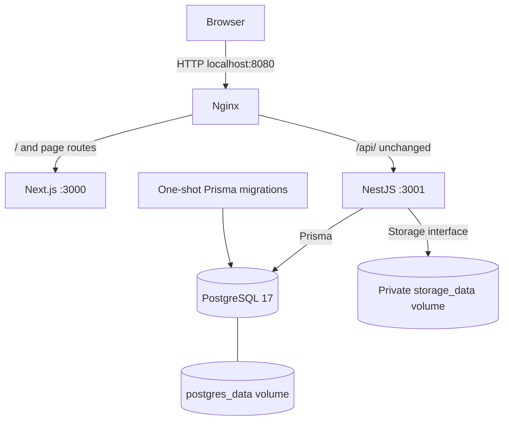

# Brainless architecture - v1.0.0

[Documentation index](README.md) | [Release snapshot](releases/v1.0.0.md)

## Runtime overview

Brainless is a modular monolith: one NestJS API and one Next.js application, with
PostgreSQL as the system of record and a private filesystem for original binaries.
The local Compose deployment contains four long-running services and a migration task.

Only Nginx publishes a port, bound to loopback. There is no static file mount in
Nginx or Next.js. Downloads pass through API ownership checks. Compose waits for
PostgreSQL health, successful migrations, then API/web health before Nginx starts.
See [Compose](compose.md) for actual HTTP policy and production limitations.

## Backend

[AppModule](../apps/api/src/app.module.ts) composes Auth, Categories, Tags, Documents
and Health modules with Configuration, Storage and Observability providers. Controllers
validate transport inputs; services coordinate owned queries and transactions through
`PrismaService`. Document services also use the injected `STORAGE` interface.

[Application setup](../apps/api/src/configure-application.ts) supplies `/api/v1`,
strict DTO validation, bounded JSON parsing, CORS, security headers, no-store
responses, request correlation, envelopes and Swagger. Unknown input properties
are rejected. Business ownership always comes from session authentication.

Configuration is validated and frozen before the listener opens. `DatabaseModule`
connects and executes `SELECT 1` at startup and disconnects on shutdown. API readiness
checks lifecycle state and PostgreSQL; liveness performs no dependency I/O. Compose
adds a storage-root access check to its API healthcheck, but API readiness does not
check qpdf or storage. Upload failures can therefore coexist with healthy metadata reads.

`ObservabilityModule` provides AsyncLocalStorage request context and JSON stdout
logging. Correlation UUIDs survive asynchronous calls. Logs omit raw request bodies,
headers, URLs and query strings and redact credentials and sensitive fields. Use
stable event names and safe fields; redaction is not permission to log document content.

## Frontend and API communication

[Next.js App Router](../apps/web/app) composes routes; `features` contains behavior,
`components/ui` contains shadcn/Base UI primitives, and `lib/api` owns HTTP clients.
TanStack Query holds server state in memory; React Hook Form/Zod supports forms.
Tailwind CSS and next-themes supply responsive styling and Light/Dark/System themes.

Private data is currently fetched by the browser. The authentication provider checks
`/auth/me` before displaying protected content. This client gate is navigation/UI
protection; NestJS authorizes every private request. It does not protect future
private React Server Component payloads automatically.

Compose builds the web client with `/api/v1`, giving same-origin cookie requests
through Nginx. Host development uses `NEXT_PUBLIC_API_BASE_URL` and credentialed CORS;
Next.js has no automatic API proxy. Fetch uses credentials and no-store; multipart
XHR uses credentials, upload progress and cancellation. See [authentication](features/authentication.md)
for refresh synchronization and [web notes](../apps/web/README.md) for UI details.

## File storage and consistency

[Shared storage](../packages/storage/README.md) exports streaming save/open/metadata/
exists/delete operations and neutral errors. Only the local adapter is implemented.
Generated keys are private references; original filenames are display metadata.
Create-only publication preserves originals; see [ADR-001](decisions/ADR-001-create-only-file-publication.md).

Busboy receives bounded multipart streams while calculating SHA-256. After storage
staging, the infrastructure inspector streams a temporary copy for qpdf/Sharp checks.
A short database transaction commits metadata, immutable version and idempotency
receipt. No SQL transaction is held while receiving bytes. Failed SQL triggers
compensating deletion; uncertain commits are read back before deleting. If the outcome
cannot be determined, the object is preserved for reconciliation and the API fails safely.

Storage and SQL are not one atomic transaction. Crashes can leave orphan objects or
private pending files; automatic reconciliation is **Not Implemented**. Metadata
soft deletion preserves binaries. Download selects the highest version number,
checks size, pre-reads a bounded chunk and streams with backpressure. Early failures
produce safe JSON; failures after binary headers terminate the connection.

## Related boundaries and future scope

[Database](database.md) owns model/constraint details; [API](api.md) owns HTTP
conventions; [feature guides](README.md#features) explain user workflows and tests.
The [specification](specification.md) retains the **Planned** worker/search/AI/identity
architecture. No workers, broker, cache, search indexes or AI providers run in v1.0.0.
