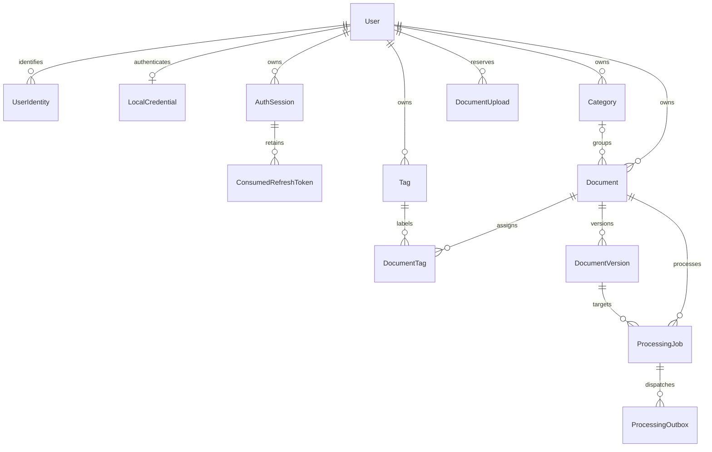
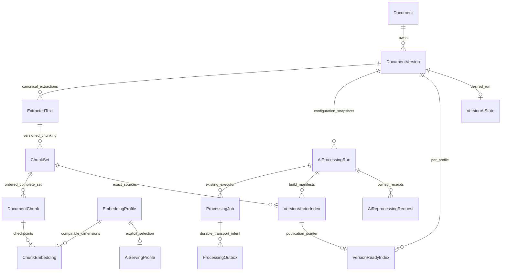

# QYVRA database and storage model — Phase 4 / v1.3.0 release candidate

**Phase 4 T03 orchestration, T04 PDF extraction and T05 chunking are implemented:** [durable stage contracts and lifecycle](phase-4-processing.md)
cover atomic successor scheduling, v2 transport, shared retry/recovery, worker routing,
lifecycle fencing and the owned status extension. [Durable PDF text extraction](phase-4-pdf-extraction.md)
is implemented. [Deterministic chunks and citation provenance](phase-4-chunk-generation.md)
are implemented. [T06 embedding generation and durable checkpoints](phase-4-embedding-generation.md) are implemented. [T07 Qdrant indexing, activation and cleanup](phase-4-vector-indexing.md) are implemented. [T10 grounded answers and validated citations](phase-4-rag-answers.md) are implemented and opt-in. [T11 AI Search and authorized citation navigation](phase-4-ai-frontend.md) are implemented. OCR remains **Planned**. [T09 authorized semantic retrieval and search API](phase-4-semantic-search.md) are implemented and opt-in. [T08 upload/reprocess/restore enrollment and bounded backfill](phase-4-ingestion.md) are implemented and opt-in.

[Documentation index](README.md) | [Architecture](architecture.md)

T10 adds no tables or migrations. Standalone answers and request-local citation tokens
are not persisted as conversations. Citation IDs map to existing owned canonical
chunks/version/document provenance; SQL checks the serving profile, current version,
READY index and lifecycle both before provider dispatch and response publication.
See [RAG citation/data boundaries](phase-4-rag-answers.md).

T06 uses the existing T02 `ChunkEmbedding` table for actual immutable PostgreSQL vectors,
unique chunk/profile identity, exact transformed-input SHA-256, dimensions and timestamp.
No T06 migration is needed. [Batch checkpoint and recovery rules](phase-4-embedding-generation.md#durability-concurrency-and-recovery)
enforce current-run ownership and live leases before writes. Qdrant is the implemented T07 derived index; [verified manifests, activation and artifact-only rebuild](phase-4-vector-indexing.md) use existing T02 tables without a new migration.

The [Prisma schema](../packages/database/prisma/schema.prisma) and
[SQL migration chain](../packages/database/prisma/migrations) is authoritative
(15 migrations verified in T12, including the additive T02 and T08 migrations).
SQL-only checks, expression indexes and triggers are not fully represented by Prisma.
Implemented models: User, UserIdentity, LocalCredential, AuthSession,
ConsumedRefreshToken, Category, Tag, Document, DocumentTag, DocumentVersion and
DocumentUpload, ProcessingJob and ProcessingOutbox. Binaries live only in
private storage. Other future entities in the
[specification](specification.md) are **Planned**, not existing tables.

This diagram shows relationships, not a column catalog. Upload receipts intentionally
do not have a cascading document foreign key. Sections below retain migration-specific
rationale and constraints; statements about what a migration introduces are scoped
to that migration, not the whole release.

## v1.1.0 description migration and query design

The additive `20260924010000_document_description` migration and Prisma nullable
field are checked in. Deployment applies the migration before the updated API starts.
Existing ERD relationships are unchanged; this release adds no new entity or
association.

| Area                                  | v1.0.0 schema                                                                          | Implemented v1.1.0 change                                                                                          |
| ------------------------------------- | -------------------------------------------------------------------------------------- | ------------------------------------------------------------------------------------------------------------------ |
| `documents`                           | Required metadata with no `description` column.                                        | Add nullable `description VARCHAR(2000)` and its CHECK constraint; retain existing rows and all other constraints. |
| `document_versions`                   | Owned immutable rows with filename, MIME, size, version number and creation timestamp. | No column or ownership change. Highest `version_number` supplies the current-file summary and file filters/sort.   |
| `categories`, `tags`, `document_tags` | Owner-composite foreign keys, owned category and many-to-many tag joins.               | No relationship or uniqueness change. All-of tag filtering uses the existing join.                                 |
| `document_uploads`                    | Completed idempotency receipts and fingerprints, independent of live detail.           | No table change. Old receipt/fingerprint behavior is retained when description is absent.                          |

Description is trusted owner-entered plain text, distinct from `verified_summary`
and future AI suggestions. The API trims it, rejects controls and allows at most
2,000 characters; empty becomes null. The new migration adds a matching
database CHECK for nonempty, trimmed text without controls when non-null; VARCHAR
enforces the length bound. Existing rows become null without a rewrite or default.
PATCH
omission preserves description and null clears it. A metadata update keeps the
existing owned row lock and atomic association replacement. No arbitrary JSON
metadata column, custom-field schema or duplicated current-file columns are added.

The existing `(id,user_id)` document/category/tag keys and composite foreign keys
continue to enforce ownership. Version rows retain the composite document/owner
foreign key and immutable-original trigger. A deleted document remains in storage
with its category, tag joins and versions; ordinary list/detail queries retain
`deleted_at IS NULL`. Archived rows stay available unless the caller filters them
out. Category deletion remains restricted while any document, even a soft-deleted
one, references it; deleting a tag removes joins only. `documents.created_at`
means catalog creation. `documents.updated_at` means document-row changes and is
not a full activity timestamp. `document_versions.created_at` means that version's
upload time; the highest version number selects the current file.

### Index review and migration

Existing `(user_id, created_at, id)` supports default/newest/oldest pages;
`(user_id, status, document_date)`, `(user_id, category_id)` and
`(user_id, tag_id, document_id)` on joins support common existing predicates.
The unique `(document_id, version_number)` index permits descending latest-version
lookup. Keep all existing SQL-only expression indexes, foreign keys and triggers.

The description migration requires no index. The bounded owner-scoped query uses
existing indexes for created-date pages, tag membership and latest-version lookup.
The release adds no speculative index. A production-sized workload may justify
future indexes such as
`(user_id, updated_at, id)` for recently updated pages and
`(user_id, title COLLATE "C", id)` for title pages. Evaluate representative owner-scoped
`EXPLAIN (ANALYZE, BUFFERS)` plans with isolated, populated active/archived test data before
adding either; the current local database has no document rows, so it cannot establish
a meaningful workload plan. Use the API's exact predicates and page sizes. Created-date filters
can initially use the existing created index. Test category/status/archive
combinations before considering a compound or partial index; avoid duplicating
existing indexes without evidence. Filename substring matching is not accelerated
by a normal B-tree index, and latest-version file-size sorting crosses a relation;
measure both before considering a specialized index or projection. No copied
file-size field or search-index dependency is authorized by this plan. The
description column/check are in one forward-only migration; if measurement later
justifies indexes, add them in another forward-only migration. Upgrade tests
must prove existing data, foreign keys, archive/soft-delete state and upload
receipts survive. There is no automatic down migration: returning to a schema
without `description` would discard newly entered values and requires a deliberate
backup/restore or reviewed data migration.

## Implemented PostgreSQL foundation

### First immutable upload version and idempotency

Migration `20260915010000_document_upload` adds `document_versions` and
`document_uploads`. Follow-up `20260915020000_upload_completed_invariant` explicitly
forbids null completed fingerprints (PostgreSQL CHECK otherwise accepts UNKNOWN).
Existing migration history and developer databases are preserved.

DocumentVersion stores UUID id/documentId/userId, positive versionNumber, sanitized
originalFilename (255), unique relative storageKey (512), MIME (100), positive
fileSize in bytes (integer, hard ceiling 200 MiB), SHA-256 lowercase hex (64),
nullable positive pageCount, extractionStatus (default PENDING), and createdAt.
PDF requires pageCount; images require null. Initial document creation writes version 1.
Additional uploads allocate highest versionNumber + 1 under a document row lock.
Composite document/owner FK prevents cross-owner versions. Document deletion CASCADE
is intentional for future purge/isolated fixtures; current API deletion remains soft.
Unique document/version and owner/checksum constraints protect version numbering and
concurrent duplicate upload; checksum and document/createdAt/id indexes support lookup.
A trigger forbids changing original identity, ownership, file metadata, checksum,
version, page count or creation timestamp. Only extractionStatus can change later;
T07 scheduling leaves it `PENDING`, and actual extraction is not implemented.
Binary bytes are never stored in PostgreSQL.

DocumentUpload uses `(user_id,scope,key UUID)` as its primary key and an attempt UUID,
RECEIVING/COMPLETED state, nullable fingerprint/documentId/JSON response receipt,
createdAt/updatedAt/expiresAt and expiry index. Its owner FK restricts user deletion.
Null receipt fields are required while receiving; completed rows require all receipt
fields. The receipt document ID is not a cascading foreign key so maintenance can
retain a completed creation receipt independently. Rows are operation-specific,
contain safe response metadata only; completed receipts last 24 hours. Receiving
leases last receive timeout + three inspection timeouts + 120 seconds. Expired keys
can be replaced on reuse; no automated receipt cleanup exists.
Advisory locks serialize key reservations and completion; the entire document,
first version, tag joins and completed receipt commit in one short transaction.
Storage is staged before SQL, never while receiving inside a transaction. Failed
SQL is compensated by deletion; uncertain commits are read back under the same
lock, and files are preserved if the outcome cannot be established. Crash or cleanup
failure can leave an orphan; future reconciliation must compare server-generated
version keys with committed rows after a grace period and must not delete active uploads.

Migration `20260915030000_version_upload_scope` adds scope with default `create`,
preserving existing receipts, and expands the receipt primary key. A CHECK permits
only `create` or `versions:<document UUID>`. Additional uploads take the scoped
advisory lock and owned document FOR UPDATE lock during completion, recheck lifecycle,
allocate the next number and commit the new immutable version, UPLOADED document
state and receipt together. Receiving/inspection never holds the database transaction.
The original immutability trigger and owner/checksum unique constraint are unchanged.
Deploy this migration and regenerate the client before restarting the updated API;
do not run old and new API versions concurrently across this primary-key change.

### Document metadata migration

Migration `20260914050000_document_metadata` adds `documents` and `document_tags`.
Document uses a UUID internal owner, nullable owned category, title (1–300), flexible
uppercase `document_type` (1–50) and `status` (1–32) string columns, nullable issuer
and reference number (1–200), nullable date-only document/expiration dates, nullable
read-only verified summary (up to 10,000), archive flag and creation/update/deletion
timestamps. Defaults are OTHER and UPLOADED. No version, storage or processing tables
are introduced. Nullable fields represent absent metadata; null deletion means active.

Composite `(id, user_id)` keys on documents/categories/tags allow PostgreSQL to enforce
same-owner associations. `document_tags` has `(document_id, tag_id)` as its primary key,
an internal `user_id` for both owner-composite foreign keys, and `created_at`.
Deleting a tag or permanently deleting an isolated document fixture cascades only its
join rows. API deletion is soft and preserves joins. Categories referenced by any
document, including a soft-deleted document, cannot be deleted (RESTRICT; API 409).
There is no reassignment or permanent document purge endpoint.

Indexes cover `(user_id, created_at, id)`, `(user_id, status, document_date)`,
`(user_id, category_id)` and join `(user_id, tag_id, document_id)`. SQL checks enforce
archive/status consistency, valid date ordering, title hygiene and uppercase string
identifiers. They complement DTO validation; no PostgreSQL enums are introduced.
Metadata updates lock the owned document row and atomically validate associations,
update metadata and replace joins. Reads select safe fields and batch associations.
See [document workflows](features/documents.md) for null/omission semantics and lifecycle transitions.

### Tags migration

Migration 20260914030000_tags adds tags with UUID id, required user_id, name
(varchar 100), created_at and updated_at. The owner foreign key references users.id
with RESTRICT; an index on (user_id, id) supports owned cursor pages. Like Categories,
a custom SQL expression unique index on (user_id, lower(name)) enforces case-insensitive
name uniqueness. Prisma cannot describe the expression index; preserve its migration
SQL. No alternate citext, normalized-name column or normalization strategy is added.

Categories and Tags share normalizeOwnedName (NFKC, trim and collapsed whitespace,
display case preserved). Name length is 1-100 Unicode code points. Database CHECK
constraints reject empty/padded/double-space/control-character names; direct writers
must submit normalized names too. Database locale defines case conversion, not accent
folding. Search escapes SQL LIKE metacharacters and applies the owner predicate.

Tags use permanent deletion, with no deleted_at field. The later document metadata
migration supplies owner-checked DocumentTag joins and tests cascade cleanup without
deleting documents. Tag writes remain
single atomic owner-filtered Prisma statements; no multi-record transaction is needed.

### Categories migration

Migration 20260914010000_categories adds categories with UUID id, required user_id
foreign key, name (varchar 100), nullable color (varchar 7), nullable icon (varchar
50), and required created_at/updated_at timestamps. The API preserves display case,
normalizes names with NFKC and collapsed/trimmed whitespace, and validates safe
styling. Null color/icon means no custom style; no other nullable fields are needed.
An owner/UUID index supports bounded list pagination. A unique SQL expression index
on (user_id, lower(name)) enforces case-insensitive uniqueness under PostgreSQL's
database locale; it is not accent folding. Prisma cannot represent this expression
index, so keep its SQL migration when evolving the schema. Do not replace it with
a case-sensitive Prisma compound unique declaration.

Database CHECK constraints reject empty/padded/double-space/control-character names,
non-lowercase six-digit hex colors and malformed icon slugs. API normalization runs
before persistence; direct database writers must submit normalized values too.
Ownership references users.id with RESTRICT on update/delete. Category writes and
deletions include both id and user_id in the SQL predicate. Categories are permanently
deleted when unused; no deleted_at column is added because only document recoverable
deletion is currently specified. Document foreign keys now restrict deletion of used
categories, including references preserved for recovery. Documents never cascade
from category deletion.

`packages/database` owns the Prisma 7 schema and generated client. It is a local
npm package linked from the API; the existing independent npm application layout
is preserved. `DatabaseModule` exports an injectable `PrismaService` with a reusable
`client`. The provider connects and executes `SELECT 1` before API startup completes,
then disconnects on application shutdown. Failures are reported without connection
details. The first authentication migration creates only the four tables described
below; the rest of the entity catalog remains planned work.

## Profile and password persistence

Profile updates select only public fields and filter by the authenticated users.id.
Password changes require the local identity (provider LOCAL, issuer local, subject
users.id). Argon2id work runs before the transaction. The transaction locks users,
local_credentials, then the current auth_sessions row, rechecks the credential hash
and current session validity, updates password_hash/password_changed_at, resets
failed-login state, and revokes every other owned session. Login uses the same
account/credential lock order and hash recheck, preventing stale verified passwords
from creating sessions after a password change. Logout-all locks the account before
revoking owned sessions, serializing with login. Current-session tokens are unchanged
by password changes. Existing consumed-refresh history remains intact.
There is no password-version column; no migration is added or modified.

## Phase 1 authentication schema

Migration `20260910160000_refresh_rotation` adds `consumed_refresh_tokens` with a
SHA-256 hex `token_hash` primary key, required session UUID foreign key, consumption
timestamp and session lookup index. No raw token is stored. Rows are retained for
the session lifetime and cascade only when that session is explicitly deleted.
There is no automated session/history cleanup job in this phase. Keep consumed
hashes while a session can still be used, including after later rotations.
Refresh locks the session row, archives the old refresh hash and replaces both
current token hashes in one transaction. A consumed or concurrently replaced hash
revokes the entire session and commits that revocation before returning 401.
The original `refresh_expires_at` remains the absolute session renewal deadline.
Logout performs an idempotent conditional revocation; it never deletes a session.
Session management uses the existing session columns and indexes without a new
migration. It lists unrevoked sessions with access or refresh eligibility, and uses
owner-filtered conditional updates for revocation. Consumed refresh history remains
intact. No device descriptions are fabricated or collected by these endpoints.

Migration `20260910090000_login_metadata` adds nullable `users.last_login_at`
(null until the first successful login) and required `auth_sessions.authentication_method`
(currently `LOCAL_PASSWORD`). No earlier migration was edited. Login stores session
creation/expiration timestamps and the authentication method as non-sensitive metadata;
it deliberately does not collect IP addresses, user-agent strings or device fingerprints.
Migration `20260910150000_session_last_seen` renames `last_used_at` to `last_seen_at`
and renames its CHECK constraint while preserving data and prior migrations.
Session authentication updates this nullable activity timestamp on first use and
at most once per minute thereafter, without extending session lifetime. Conditional
updates avoid duplicate writes across API processes. Null means not yet observed.
Login verifies Argon2id outside the transaction, then locks the user and credential
rows and rechecks deletion/password state. Failure counters commit independently
of the returned 401; session creation, failure reset and last-login update commit
atomically on success. Both tokens are independently random and persisted only as hashes.

Local registration now creates `users`, `user_identities` and `local_credentials`
in one transaction after Argon2id hashing. It does not create `auth_sessions`.
The registration integration suite uses an isolated migrated database, commits
registration requests to test concurrency, and cleans up only its randomly named
test accounts. Schema constraint tests continue to roll back their transactions.

The baseline specification previously listed entity responsibilities rather than
individual columns. The following choices make those requirements concrete:

| Table               | Fields and invariants                                                                                                                                                                                                                                                                                                            |
| ------------------- | -------------------------------------------------------------------------------------------------------------------------------------------------------------------------------------------------------------------------------------------------------------------------------------------------------------------------------- |
| `users`             | Database-generated UUID `id`, unique normalized lowercase/trimmed `email`, optional `display_name`, required `locale` (`en`) and `timezone` (`UTC`), `created_at`, `updated_at`, optional `deleted_at`. Deleted users retain their unique email reservation.                                                                     |
| `user_identities`   | UUID `id`, required `user_id`, `provider` (`LOCAL`, `KEYCLOAK`, `OIDC`), `issuer`, `subject`, creation/update timestamps. `(provider, issuer, subject)` is globally unique. Local identities require `issuer=local` and `subject=user_id`; external values come from the provider's stable issuer/subject, never email matching. |
| `local_credentials` | UUID `id`, unique required `user_id`, required Argon2id PHC `password_hash`, `password_changed_at`, nonnegative `failed_login_attempts` (zero initially), optional `last_failed_login_at`, optional `locked_until`, creation/update timestamps. A positive failed count requires a failure timestamp.                            |
| `auth_sessions`     | UUID `id`, required `user_id`, unique SHA-256 lowercase hex `token_hash`, required `expires_at`, optional paired `refresh_token_hash`/`refresh_expires_at`, optional `revoked_at` and `last_seen_at`, creation/update timestamps. Refresh hashes are unique when present.                                                        |

All timestamps are `timestamptz(3)`. Creation/update timestamps have database insert
defaults; Prisma `@updatedAt` updates modification timestamps for Prisma writes.
Direct SQL writers must maintain `updated_at` explicitly. Nullable fields represent
unprovided profile names, lifecycle events that have not occurred, or sessions with
no separate refresh token; no password data is nullable or stored on `users`.

Session expiration must follow creation. Refresh expiration cannot precede session
expiration. Revocation and last use cannot precede creation. Session state is derived
from revocation/expiration rather than stored in a stale status column: revoked
takes precedence, then expired, otherwise active. Failed-attempt and lockout fields
store policy state; local login now enforces the policy documented in `docs/api.md`.

SQL CHECK constraints enforce PHC/hash shapes, not cryptographic correctness.
Application authentication code must actually hash passwords with Argon2id and
random session/refresh tokens with SHA-256 before persistence. There are no plaintext
token/password columns. Never log hash values. All foreign keys reference the stable
internal UUID, with RESTRICT on delete/update to prevent silent credential/session
loss; normal user deletion uses `deleted_at`. Indexes support user identity lookup,
active-session lookup/revocation, and expiration cleanup. Email is not a domain
ownership key and can change without relinking identities or sessions.

Migration: `20260910080000_authentication_schema`. It includes the SQL-only CHECK
constraints in addition to the generated Prisma DDL, wrapped in a transaction.
No previously applied history was edited. Inject the target `DATABASE_URL` and run
`npm --prefix packages/database run migrate:deploy` before using these models.

Docker Compose provides PostgreSQL 17 with a named `postgres_data` volume. Only the development override publishes a
loopback host port; canonical Compose keeps PostgreSQL private. Set the placeholder initialization variables in root `.env`.
Initialization values apply only to an empty volume; changing them does not change
an existing database. Do not remove the volume to change credentials or apply schema.

The API validates `DATABASE_URL`, `DATABASE_CONNECT_TIMEOUT_MS` (1–1000, default 500),
`DATABASE_QUERY_TIMEOUT_MS` (1–1000, default 500), and `DATABASE_POOL_SIZE` (1–20,
default 5). PostgreSQL statement timeouts and driver query timeouts bound SQL work;
pool connection acquisition also has a timeout. Readiness executes only `SELECT 1`.
Timeout/pool overrides in connection URL query parameters are rejected; configure
these values through the dedicated typed settings instead.
Integration tests use `TEST_DATABASE_URL`. Connectivity checks are read-only;
authentication constraint tests insert/update rows inside transactions that always
roll back. Apply the migration to an isolated test database before running them.
Tests never reset, truncate, or drop existing tables.

## v1.2.0 processing persistence — Implemented in T02

Migration `20260927010000_processing_persistence` adds `processing_jobs` and
`processing_outbox` without changing existing document columns or applied
migrations. Follow-up migration `20260927020000_processing_index_names` gives
two long indexes stable names that match Prisma without PostgreSQL truncation.
The [Phase 3 processing contract](phase-3-processing.md#job-record-and-lifecycle--implemented)
and [ADR-002](decisions/ADR-002-durable-processing-outbox-worker.md) describe the
implemented runtime boundaries.

`processing_jobs` links `document_id`/`user_id` to the existing owned document
and `(document_version_id, document_id, user_id)` to the exact owned immutable
version. The latter uses a new unique composite version index; no original
version fields change. Jobs store type, generation, status, attempts,
`max_attempts`, `available_at`, optional execution lease/heartbeat, start and
completion timestamps, safe `last_failure_code`, correlation ID, and timestamps.
SQL checks enforce the seven implemented statuses, attempt bounds, lease and terminal
timestamp consistency, and safe failure-code shape. The initial helper creates
only `VERIFY_STORED_FILE`; the type column uses the existing extensible
uppercase-string convention for future reviewed types. Unique
`(document_version_id, job_type, generation)` prevents duplicate generations;
a SQL-only partial unique index additionally prevents two active equivalent
jobs across different generations. Indexes cover owned version reads, due jobs,
and expired leases. Hard deletion cascades these records; soft deletion changes
neither table automatically in T02.

`processing_outbox` links to a job and stores message ID, event type, schema
version, dispatch sequence, a compact JSON envelope, correlation ID, due time,
publication attempts/status, optional claim lease, safe failure code, and
timestamps. Checks require a valid envelope identity, nonnegative publication
attempts, and consistent `PENDING`/`PUBLISHED` timestamp state. Unique
`(processing_job_id, event_type, dispatch_sequence)` prevents duplicate
dispatch intents. Indexes cover due unpublished entries and expired claims.

`createStoredFileVerificationIntent(tx, input)` in the shared database package
creates both rows within a **caller-supplied Prisma transaction**. Rolling back
that transaction removes both. **Implemented in T07:** both initial and later
version uploads call T03 `ProcessingRepository.createInTransaction` from their
shared commit transaction. Version, job, outbox and completed receipt therefore
commit or roll back together; an upload-key replay adds no new job. T03 takes
the document row lock before the processing advisory lock, matching the upload
transaction's lock order to avoid cross-path deadlock. `document_uploads` remains the
upload-idempotency receipt table. `documents.status` remains a business lifecycle
field, and `document_versions.extraction_status` stays `PENDING` after upload.
RabbitMQ transport and T05 outbox dispatch are implemented, but neither owns
processing-job retry state; T11 Redis progress is disposable and introduces no
database fields or retry authority. Outbox publication failures
retain `PENDING`, increment `publication_attempts` on each claim, and move
`available_at` by capped backoff. Expired leases can be reclaimed by another
dispatcher. The schema has no terminal publication-failure status or automatic
outbox deletion; committed intent remains inspectable until confirmed.
Existing versions
need a later resumable backfill policy rather than migration-time job creation.

**Implemented in T03, with no new migration:** the shared processing repository
serializes equivalent creation, checks owned active version membership, and uses
conditional updates with lease tokens for claims, outcomes, and outbox publication
state. Query operations use the T02 due-time and expired-lease indexes. Each
successful claim increments `attempts`; retry delay and safe failure codes are
stored in PostgreSQL. Archive and soft-delete handlers call the transaction-scoped
cancellation operation, clearing unfinished jobs' leases atomically with the document
change. Restore creates a new job generation and outbox intent only when the current
version's latest integrity job was cancelled. Completed work and historical versions
are not automatically reprocessed. No additional migration is required for this rule.

## Phase 4 artifact persistence and future entities

The implemented Prisma models are `EmbeddingProfile`, `AiProcessingRun`,
`ExtractedText`, `ChunkSet`, `DocumentChunk`, `ChunkEmbedding`, `VersionVectorIndex`,
`VersionAiState`, `VersionReadyIndex`, `AiServingProfile` and `AiReprocessingRequest`.
The first ten come from T02; T08 adds reprocessing receipts. Existing `Document`,
`DocumentVersion`, `ProcessingJob` and `ProcessingOutbox` remain the business/job
foundation. This is the actual data model, not a separate AI executor or tenant policy.

Ownership-consistent composite foreign keys enforce exact document/version/run/set
lineage. Unique extraction/chunk fingerprints, chunk ordinals, chunk/profile
checkpoints and version/profile pointers prevent uncontrolled duplicates. Complete
chunk sets and validated embedding batches are committed before downstream intent;
SQL constraints/triggers plus lease-fenced repository transactions protect ready
publication. Job prerequisites and artifact references extend existing jobs, with
nullable fields preserving Phase 3 integrity-only work.

Manifest states and the per-version/profile pointer, not Qdrant payload flags,
determine serving eligibility. Cleanup uses existing removal jobs and retained
manifest metadata; lifecycle exclusion precedes remote deletion. Derived records
are subordinate to document/version ownership, and deleting derived rows cannot
delete originals. Historical retained artifacts preserve provenance. Full fields,
checks and statuses are authoritative in the schema/migrations and
[data foundation](phase-4-data-foundation.md), [index lifecycle](phase-4-vector-indexing.md)
and [processing contract](phase-4-processing.md).

**Phase 4 T02 persistence is implemented:** the [data foundation](phase-4-data-foundation.md)
records ten additive AI artifact/profile/run/index/pointer tables, PostgreSQL
embedding checkpoints, owned composite FKs and nullable existing-job dependencies.
The migration seeds no profiles/artifacts/jobs and leaves extraction status and
original version metadata unchanged. SQL validates provenance, immutable identities,
complete stage outputs and ready index mappings. PDF extraction and deterministic
chunk publication are implemented in T04/T05. Embedding checkpoints and Qdrant activation/cleanup are implemented in T06/T07; T09 retrieval and T10 RAG use these authoritative artifacts.

The [Phase 4 proposed data model](phase-4-ai-rag.md#proposed-authoritative-data-model--planned)
is canonical for v1.3.0; its persistence is implemented in T02. T04–T07 implement the worker pipeline through indexing; T09/T10 implement retrieval/RAG. T01 added no migrations. It defines
owned immutable extraction artifacts, chunk sets/chunks, embedding profiles,
durable per-chunk embedding checkpoints, processing-run metadata and vector-index
manifests/pointers. Composite ownership constraints extend existing version/job
constraints. PostgreSQL initially stores derived text and vectors for resumable
index rebuilding; uploaded binaries remain in private storage. New extraction
status values require additive checks/DTO updates before use. Runs coordinate
existing jobs rather than provide another executor. No tenant entity is introduced.

Reminders, persistent chat and public permanent purge are **Not Implemented**.
Phase 4 provider calls and derived vector integration are implemented in the
linked slices. The broader catalog remains in the
[planned specification](specification.md). The current status vocabulary anticipates
processing, but new uploads remain UPLOADED/PENDING. See [feature guides](README.md#features),
[local migration setup](development/getting-started.md) and [storage contract](../packages/storage/README.md).

## T08 ingestion integration — Implemented

T08 adds ai_reprocessing_requests: unique (documentVersionId,key), mode constraint, timestamp and an owner/version-consistent composite run foreign key. It stores request receipts only; existing jobs, artifacts and manifests remain authoritative. See [ingestion persistence](phase-4-ingestion.md#owned-reprocessing-contract).

## Phase 4 T09 retrieval reads — Implemented

T09 needs no migration. `AiServingProfile` selects an immutable profile; `VersionReadyIndex` and READY manifests plus current active owned versions define scope. Bounded candidate-tuple joins hydrate canonical `DocumentChunk` text and source provenance only after lifecycle/ownership/profile checks. Query embeddings are ephemeral. [Serving selection and SQL authority](phase-4-semantic-search.md).

## T11 source navigation and readiness — Implemented, no schema change

The owned source endpoint joins `DocumentChunk → DocumentVersion → Document`, checks complete `ChunkSet` and active lifecycle, and can resolve retained historical provenance. Readiness derives from `VersionReadyIndex → VersionVectorIndex → ChunkSet`, the current owned active version and `AiServingProfile → EmbeddingProfile` compatibility. A successful run without a serving pointer is unavailable. No new tables, vectors, ownership model, transcript persistence or migration is added. [T11 contracts](phase-4-ai-frontend.md).
