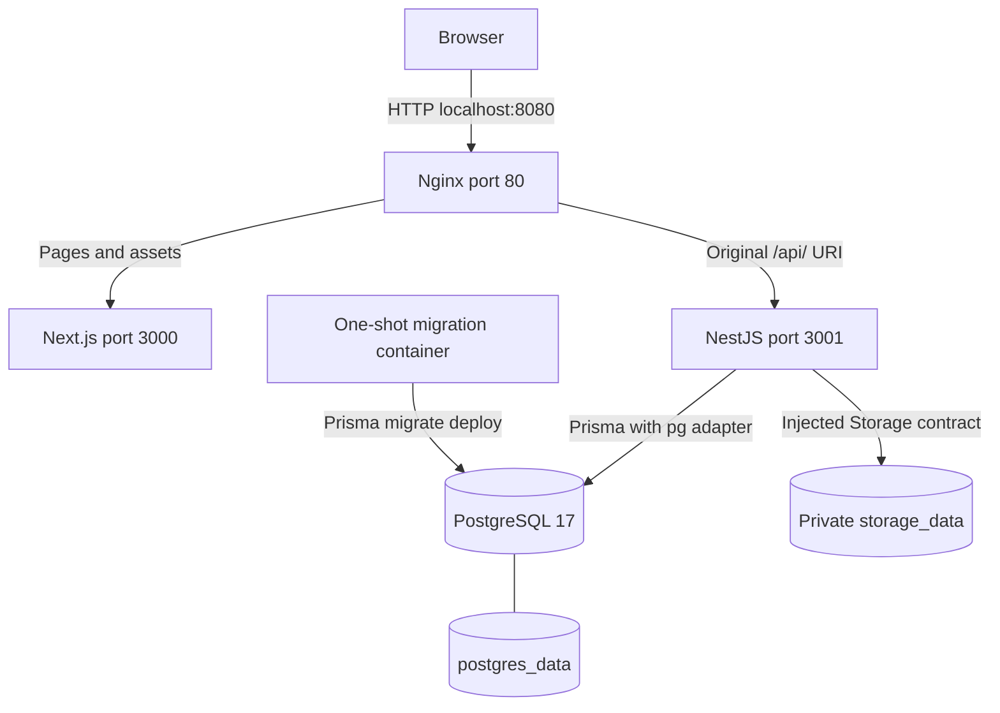
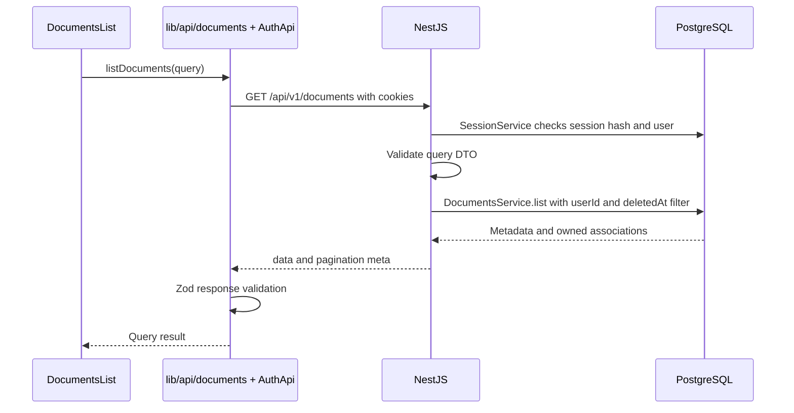

# 02 · Architecture and request flow

[Guide index](README.md) · [Backend](04-backend.md) · [Frontend](05-frontend.md)

The implemented architecture is a modular monolith API with a separate Next.js frontend. PostgreSQL stores records; file storage stores bytes. These are parallel API dependencies: PostgreSQL does not send files to storage.

Source: [docker-compose.yml](../../docker-compose.yml), [Nginx template](../../infrastructure/nginx/default.conf.template), [database factory](../../packages/database/src/index.ts), [storage module](../../apps/api/src/infrastructure/storage/storage.module.ts).

Only Nginx publishes a port in the canonical stack, bound to loopback. Next.js and Nginx have no mount for uploaded originals. Downloads must reach the API. The host development override publishes PostgreSQL so host-run API/web watchers can use it.

## Frontend → API

Pages compose feature components; browser components call [lib/api](../../apps/web/lib/api). The production web image embeds `/api/v1`, so cookies travel on same-origin requests through Nginx. Host watchers use an absolute `NEXT_PUBLIC_API_BASE_URL`, with credentialed CORS configured on the API. Next.js has no automatic API rewrite or backend-for-frontend route layer here.

`AuthApi` uses credentialed, no-store `fetch` for JSON and XMLHttpRequest for upload progress/cancellation. Zod validates returned shapes. TanStack Query stores safe response data in memory; session tokens stay in HttpOnly cookies. Client layouts control what is displayed, while NestJS decides whether access is authorized.

## Typical metadata read

Follow [documents-list.tsx](../../apps/web/features/documents/documents-list.tsx), [documents client](../../apps/web/lib/api/documents.ts), [DocumentsController](../../apps/api/src/modules/documents/documents.controller.ts), and [DocumentsService](../../apps/api/src/modules/documents/documents.service.ts). Reads batch category/tag hydration instead of querying each document separately. The cursor bounds records within an owner-filtered query; it never identifies an owner.

## HTTP processing boundaries

[configureApplication](../../apps/api/src/configure-application.ts) installs correlation context, structured completion logs, Helmet, no-store headers, CORS, authentication throttling, bounded body parsing, strict validation, response wrapping, and error mapping. Protected handlers explicitly apply `SessionAuthGuard`; there is no assumption that all controllers are globally authenticated.

Within Nest's handler pipeline, guards establish authentication and mutation security, DTO pipes validate input, and the controller invokes a service. Services either use `PrismaService.client` directly or delegate transactional work to a focused repository. Returned values become `{data, meta}`. Errors become a generic safe envelope. Binary downloads write directly to Express rather than becoming JSON.

## Consistency and abstraction choices

- **Storage interface:** business orchestration depends on streaming operations and neutral errors, not filesystem APIs. Only `LocalFileStorage` is implemented. [ADR-001](../decisions/ADR-001-create-only-file-publication.md) documents why hard-link publication preserves immutable originals.
- **Focused repositories:** login, registration, and uploads isolate transaction-heavy persistence. Simpler category/tag and document services use Prisma directly. There is no universal repository framework or separate entity layer.
- **Short SQL transactions:** upload receive and inspection occur before the completion transaction. This avoids holding database locks while a client sends bytes. A scoped receipt lock and document row lock protect idempotency and version numbering.
- **Compensating file deletion:** SQL and filesystem writes cannot commit atomically. Known database failure removes staged files; an uncertain commit is read back before deletion. If that cannot be resolved, the object is preserved. No automatic reconciliation worker exists.

See [document walkthroughs](08-document-lifecycle.md) and [storage](09-file-storage.md) for exact ordering and failure cases.

## Observability and readiness

[RequestContext](../../apps/api/src/common/request-context.ts) propagates UUID correlation through AsyncLocalStorage. [StructuredLogger](../../apps/api/src/common/structured-logger.ts) writes JSON events with safe fields. API responses expose both `X-Correlation-Id` and `X-Request-Id`.

[HealthService](../../apps/api/src/modules/health/health.service.ts) implements dependency-free liveness and PostgreSQL readiness. `PrismaService` connects and probes before startup and disconnects on shutdown. Readiness does not prove migrations are current, qpdf is installed, or a particular file is readable. Compose adds a storage-root access check to its API healthcheck.

No worker, queue, cache, search index, or AI provider participates in these diagrams. Future architectural guidance in AGENTS/specification files does not change this runtime topology.
