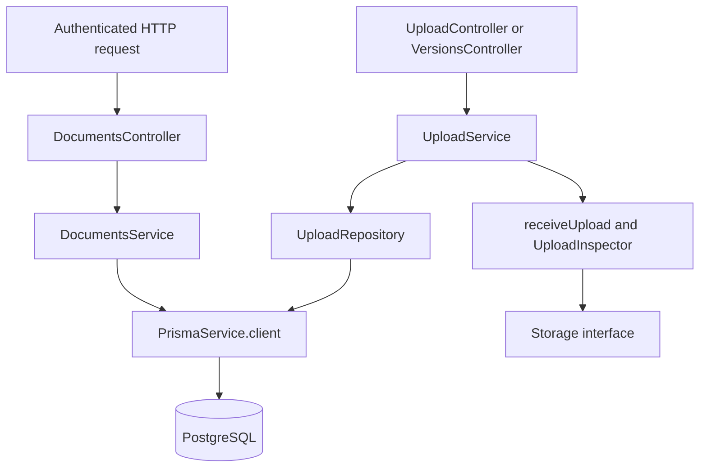

# 04 · Backend guide

[Guide index](README.md) · [API route map](10-api-reference.md)

The API owns synchronous application operations. Controllers establish transport contracts; services enforce use-case rules and trusted ownership. PostgreSQL access uses the shared Prisma client. Files pass through an injected storage interface.

## Bootstrap and dependency injection

1. [main.ts](../../apps/api/src/main.ts) creates `AppModule` with `StructuredLogger`, obtains validated configuration, calls `configureApplication`, then opens the configured host/port. Startup failure emits a safe `application.startup.failed` event.
2. [ConfigurationModule](../../apps/api/src/configuration/configuration.module.ts) loads the root `.env` except when process `NODE_ENV=test`. `validateEnvironment` validates values and cross-setting rules and freezes configuration groups. `ConfigurationService` exposes typed accessors.
3. [DatabaseModule](../../apps/api/src/database/database.module.ts) provides `PRISMA_CLIENT`; [PrismaService](../../apps/api/src/database/prisma.service.ts) connects and runs `SELECT 1` before startup completes, then disconnects on application shutdown.
4. [StorageModule](../../apps/api/src/infrastructure/storage/storage.module.ts) binds the shared `STORAGE` symbol to `LocalFileStorage` and provides `UploadInspector`.
5. [configure-application.ts](../../apps/api/src/configure-application.ts) installs HTTP policy and shutdown hooks. [configure-swagger.ts](../../apps/api/src/configure-swagger.ts) publishes generated documentation.

Nest modules explicitly import the providers they use. TypeScript interfaces disappear at runtime, which is why the storage/client boundaries use injection tokens. Tests can replace those boundaries without replacing application logic.

## Module map

| Module                                                                         | Main collaborators and responsibility                                                                                                                                                        |
| ------------------------------------------------------------------------------ | -------------------------------------------------------------------------------------------------------------------------------------------------------------------------------------------- |
| [AuthModule](../../apps/api/src/modules/auth/auth.module.ts)                   | Separate registration/login repositories; `PasswordService`; session authentication, refresh/logout, session management and profile services/controllers. Also exports trusted auth helpers. |
| [CategoriesModule](../../apps/api/src/modules/categories/categories.module.ts) | `CategoriesController`, DTOs, `CategoryMutationGuard`, and `CategoriesService`; owned CRUD and normalized uniqueness.                                                                        |
| [TagsModule](../../apps/api/src/modules/tags/tags.module.ts)                   | `TagsController`, DTOs, `TagsService`; owned CRUD and literal substring search.                                                                                                              |
| [DocumentsModule](../../apps/api/src/modules/documents/documents.module.ts)    | Separate controllers/services for metadata/lifecycle, upload, versions, download; upload repository and parser.                                                                              |
| [HealthModule](../../apps/api/src/modules/health/health.module.ts)             | Process liveness and bounded database readiness; no file inspection probe.                                                                                                                   |
| [ObservabilityModule](../../apps/api/src/common/observability.module.ts)       | Request context and structured logger providers.                                                                                                                                             |

Account/profile operations live in `auth`; there is no separate implemented users module. [AppController](../../apps/api/src/app.controller.ts) returns public name/API version information.

## Representative service paths



[DocumentsService](../../apps/api/src/modules/documents/documents.service.ts) owns metadata reads, writes, association hydration, and lifecycle transaction coordination. `update` locks the owned document, validates same-owner associations, and commits metadata plus tag changes together. `transitionDocument` holds the small pure lifecycle rule set. Controller `result` maps its specific errors to HTTP status codes.

[UploadService](../../apps/api/src/modules/documents/upload.service.ts) owns receive/inspection admission, storage compensation and uncertain-commit handling; [UploadRepository](../../apps/api/src/modules/documents/upload.repository.ts) owns durable reservations and completion transactions. Category/tag services use Prisma directly for simpler operations. There is no generic repository hierarchy, CQRS bus, or entity/model layer parallel to Prisma.

## Input validation and authorization

The global `ValidationPipe` transforms DTO input, permits only decorated properties, rejects unknown properties and invalid values, and omits sensitive targets/values from validation errors. `ParseUUIDPipe` validates route IDs. DTOs explicitly bound list limits and allowed sorts; arbitrary Prisma filters are never accepted.

Session authentication is applied using `@UseGuards(SessionAuthGuard)`. The guard ignores bearer headers and body/query ownership claims, reading only the configured session cookie. `@CurrentUser()` and `@CurrentSession()` read context populated by the guard, using symbols from [authenticated-user.ts](../../apps/api/src/modules/auth/authenticated-user.ts).

[OwnedMutationGuard](../../apps/api/src/common/owned-mutation.guard.ts), its [CategoryMutationGuard compatibility alias](../../apps/api/src/modules/categories/category-mutation.guard.ts), and [auth request-security helpers](../../apps/api/src/modules/auth/request-security.ts) enforce Origin/CSRF and body/query rules at the transport boundary. These guards do not replace service-level ownership queries. A foreign category/document/session ID must remain indistinguishable from a missing resource.

Multipart uploads have their own bounded parser and metadata `ValidationPipe` in [upload-multipart.ts](../../apps/api/src/modules/documents/upload-multipart.ts). This is not a Multer memory-upload implementation. File bytes are streamed while calculating SHA-256.

## HTTP conventions

The fixed global prefix is `/api/v1`; there is no separate Nest URI-version negotiation configuration. JSON requests default to a 16 KiB body limit. [http-security.ts](../../apps/api/src/common/http-security.ts) rejects unsupported/compressed input and limits auth work before parsing/hashing. Only the two multipart upload routes bypass JSON parsing.

[ResponseEnvelopeInterceptor](../../apps/api/src/common/http-envelope.ts) returns:

```json
{ "data": { "example": "value" }, "meta": { "requestId": "<request UUID>" } }
```

`PaginatedData` becomes an array in `data` with `nextCursor` and `hasMore` in `meta`. Session listing uses its own `data.sessions`/`data.nextCursor` shape. The global error filter deliberately replaces exception messages with HTTP reason phrases:

```json
{
  "error": {
    "code": "NOT_FOUND",
    "message": "Not Found",
    "details": {},
    "traceId": "<request UUID>"
  }
}
```

Do not expect field-level validation messages in API error bodies. Unexpected errors become safe 500 responses. Upload/download explicitly translate dependency problems to 503 where implemented; not every database exception maps to 503. [DownloadController](../../apps/api/src/modules/documents/download.controller.ts) uses `@Res()` to send a binary attachment, bypassing JSON wrapping.

## Logging, middleware, and shutdown

The application installs correlation/completion middleware, Helmet, no-store headers, CORS, throttling and body parsing. Authentication rate budgets are in-process maps keyed by socket peer; no Redis or trusted-forwarded-IP setup is present. Proxied users share Nginx's peer budget.

[RequestContext](../../apps/api/src/common/request-context.ts) uses AsyncLocalStorage. [StructuredLogger](../../apps/api/src/common/structured-logger.ts) sanitizes/redacts fields and outputs JSON, with duration/status completion events. Avoid adding raw URLs, query text, bodies, tokens or document contents to logs. Safe errors intentionally reduce diagnostic detail; follow trace IDs and stable event names.

Shutdown hooks mark readiness unavailable and close PostgreSQL connections. For test boundaries, configuration defaults, and debugger commands, see [testing](13-testing.md), [configuration](11-configuration.md), and [workflow](14-development-workflow.md).
