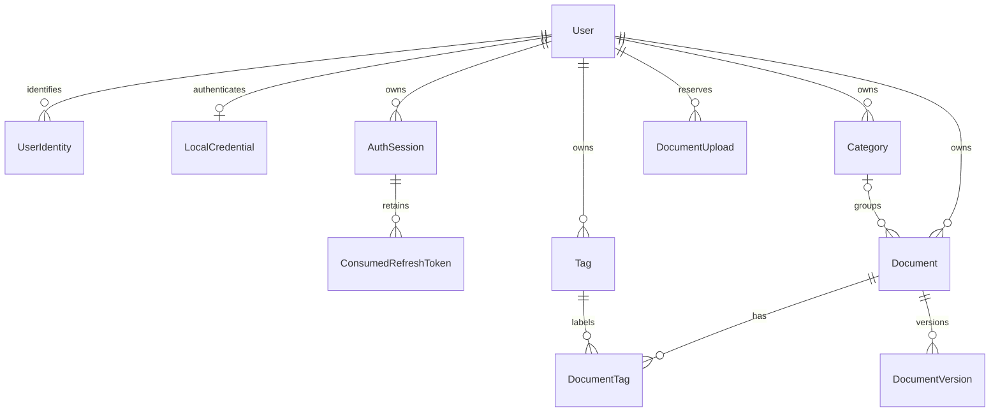

# 06 · Database model and migrations

[Guide index](README.md) · [Detailed database reference](../database.md)

PostgreSQL 17 is the system of record. [packages/database](../../packages/database) owns Prisma 7 configuration, schema, ten SQL migrations, generated-client exports and the `pg` adapter factory. The API does not own a second schema. Binaries are stored outside PostgreSQL.

## Models and relationships

The diagram describes relationships, not every field. [schema.prisma](../../packages/database/prisma/schema.prisma) is the column/type reference. Camel-case model fields map to snake-case SQL tables/columns.

| Model / table                                      | Important data and purpose                                                                                                                                    |
| -------------------------------------------------- | ------------------------------------------------------------------------------------------------------------------------------------------------------------- |
| `User` / `users`                                   | Stable UUID owner, normalized unique email, nullable display name, locale/timezone, timestamps, nullable deletion and last-login timestamps                   |
| `UserIdentity` / `user_identities`                 | Unique `(provider, issuer, subject)` mapping to the internal user; local subject is user UUID                                                                 |
| `LocalCredential` / `local_credentials`            | One per user; Argon2id hash, password-change timestamp, failed-login counter/window and lockout                                                               |
| `AuthSession` / `auth_sessions`                    | Unique SHA-256 access/refresh hashes, expiration/revocation/activity timestamps, `LOCAL_PASSWORD` method                                                      |
| `ConsumedRefreshToken` / `consumed_refresh_tokens` | Previously consumed refresh hash keyed to session; enables replay revocation                                                                                  |
| `Category` / `categories`                          | Owned normalized name, optional safe color/icon, created/updated timestamps                                                                                   |
| `Tag` / `tags`                                     | Owned normalized name and created/updated timestamps                                                                                                          |
| `Document` / `documents`                           | Owned logical metadata, optional category, dates, status/archive/deletion flags, read-only nullable verified summary                                          |
| `DocumentTag` / `document_tags`                    | Document/tag join with owner UUID and creation timestamp; composite primary key                                                                               |
| `DocumentVersion` / `document_versions`            | Immutable original identity and metadata: number, display filename, private key, MIME, bytes, checksum, PDF page count, extraction status, creation timestamp |
| `DocumentUpload` / `document_uploads`              | Durable idempotency reservation/receipt keyed by `(userId, scope, key)`, attempt ID, state, fingerprint, safe response JSON and expiry                        |

A document belongs to one user and at most one category. Tags are many-to-many. A version belongs to one document and the same owner. There is no `currentVersionId`: highest `versionNumber` is current. Upload receipts intentionally have no cascading document foreign key; their safe response can survive independently of a future purge operation.

`KEYCLOAK`/`OIDC` identity enum values and broader status strings do not implement those future workflows. `verifiedSummary` is not generated or editable in Phase 1.

## Invariants beyond Prisma

Read [migration SQL](../../packages/database/prisma/migrations) before changing models. Prisma cannot express every existing invariant:

- Category/tag names use per-owner `lower(name)` unique expression indexes. API NFKC/whitespace normalization preserves display case; SQL rejects malformed names. This is not accent-insensitive uniqueness.
- Composite `(id, user_id)` keys and foreign keys enforce same-owner category, tag joins and versions even for direct database writers.
- Document checks require archive flag/status consistency, expiration not before document date, normalized nonempty title, and uppercase identifier formats. Status/type are strings, not PostgreSQL enums.
- Versions require positive number/bytes, bytes no greater than 200 MiB, lowercase SHA-256 hex, supported MIME, PDF page count and null image page count.
- Unique `(document_id, version_number)` protects numbering; unique `(user_id, checksum_sha256)` forbids duplicate bytes across **all** that owner's versions, including archived/soft-deleted documents. Storage keys are unique.
- An UPDATE trigger prevents changing original version identity, ownership, file metadata, checksum, page count or creation time. Only extraction status is left mutable; no processing implementation exists.
- Upload-state checks enforce empty receipt fields while receiving and complete receipt fields when completed. A follow-up check explicitly requires non-null completed fingerprint because SQL CHECK otherwise accepts UNKNOWN.
- Auth checks enforce normalized emails, local-identity subject, Argon2id hash format, valid expiration pairs and hash formats/distinctness.

## Deletion and timestamps

Documents use `deletedAt`; catalog/detail/download/history hide deleted records. Joins and files remain for API restore. Category/tag deletion is permanent. A category referenced by any document, including a deleted one, is restricted; deleting a tag cascades only its joins. There is no user-deletion or document-purge endpoint.

Sessions are revoked, not deleted by logout. Consumed hashes cascade only on session deletion, and no automatic cleanup job runs. User/metadata records have creation/update timestamps; versions are creation-only immutable records. Document dates are SQL `date` values exposed as `YYYY-MM-DD`; audit/session timestamps are time-zone-aware timestamps exposed as ISO strings. There is no separate general-purpose audit-event table.

## Query and transaction patterns

[PrismaService](../../apps/api/src/database/prisma.service.ts) exposes `client` and owns startup/shutdown. [createPrismaClient](../../packages/database/src/index.ts) configures connection/query/statement limits, pool size and an idle timeout; Prisma query logging is disabled.

Indexes support owned catalog ordering `(user_id, created_at, id)`, status/document date, category, tag membership, and version lookup. Sessions have owner/revocation/expiration and expiration indexes; receipts index expiry.

Document updates/lifecycle lock the owned document row. Upload completion uses a scoped advisory lock; additional versions also lock the document and allocate max number + 1. History reads use Repeatable Read per request, so `isLatest` agrees with that response's rows, but pagination across requests is not a fixed snapshot. Login/password changes share account/credential lock ordering and recheck a previously verified credential hash before committing.

## Migration sequence

| Directory under `prisma/migrations`         | Change                                                        |
| ------------------------------------------- | ------------------------------------------------------------- |
| `20260910080000_authentication_schema`      | Users, identities, credentials, sessions and auth constraints |
| `20260910090000_login_metadata`             | Last login and authentication method                          |
| `20260910150000_session_last_seen`          | Rename activity column/check, preserve data                   |
| `20260910160000_refresh_rotation`           | Consumed refresh history                                      |
| `20260914010000_categories`                 | Owned categories and normalized uniqueness                    |
| `20260914030000_tags`                       | Owned tags and normalized uniqueness                          |
| `20260914050000_document_metadata`          | Documents, joins, same-owner keys and lifecycle checks        |
| `20260915010000_document_upload`            | Versions, receipts, checksums and immutability trigger        |
| `20260915020000_upload_completed_invariant` | Explicit completed-fingerprint null check                     |
| `20260915030000_version_upload_scope`       | Operation/target receipt scope and expanded primary key       |

With `DATABASE_URL` injected, run `npm --prefix packages/database run migrate:deploy`. Compose runs it automatically before API startup. [prisma.config.ts](../../packages/database/prisma.config.ts) reads the process environment; it does not load root `.env`. `npm --prefix packages/database run build` generates the client then compiles it. Do not edit applied migrations or use schema push/reset as an upgrade procedure. See [extending](16-extending-brainless.md) for an additive migration example.
