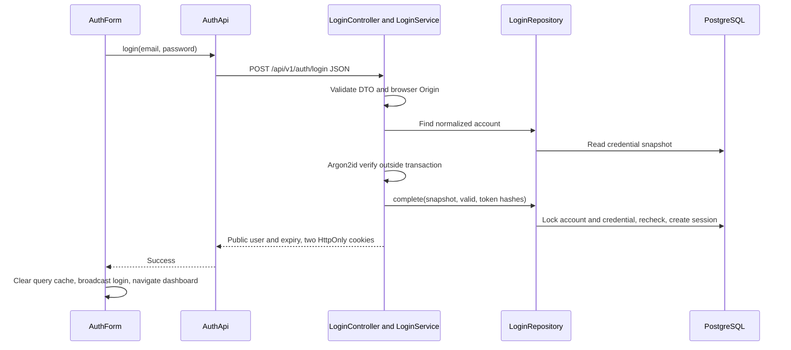

# 07 · Authentication and authorization

[Guide index](README.md) · [API reference](10-api-reference.md) · [Configuration](11-configuration.md)

QYVRA uses local passwords and opaque PostgreSQL-backed sessions. It does not use JWT access tokens. Authentication establishes the stable internal `users.id`; authorization uses that ID in database predicates and association checks.

## Registration

[RegistrationController.register](../../apps/api/src/modules/auth/registration.controller.ts) validates [RegistrationDto](../../apps/api/src/modules/auth/registration.dto.ts) and calls [RegistrationService](../../apps/api/src/modules/auth/registration.service.ts). The service trims/lowercases email, hashes the exact password, and delegates to [RegistrationRepository](../../apps/api/src/modules/auth/registration.repository.ts).

The repository creates user, `LOCAL` identity (`issuer=local`, `subject=user.id`) and local credential in one transaction. Duplicate registration returns generic 409. Success is 201 with public ID/email, **without cookies or a session**. The [registration UI](../../apps/web/features/auth/auth-form.tsx) directs the user to log in afterward.

[PasswordService](../../apps/api/src/modules/auth/password.service.ts) defaults to 15–128 Unicode code points, rejects whitespace-only passwords, and does not trim/normalize them. Argon2id uses 64 MiB memory, three iterations, one lane and 32-byte output. A dummy Argon2id hash is initialized for unknown-account verification; unknown users do not simply bypass hashing.

## Login code walkthrough

1. `/login` composes [AuthForm](../../apps/web/features/auth/auth-form.tsx). React Hook Form/Zod validates email and nonempty password before `submit` calls `AuthApi.login`.
2. [AuthApi.login](../../apps/web/lib/api/client.ts) serializes the operation through the available Web Lock and posts JSON with `credentials: include`.
3. [LoginController.login](../../apps/api/src/modules/auth/login.controller.ts) checks JSON content type and browser Origin, then calls [LoginService.login](../../apps/api/src/modules/auth/login.service.ts).
4. The service normalizes email, fetches a credential snapshot through [LoginRepository.find](../../apps/api/src/modules/auth/login.repository.ts), and verifies with `PasswordService`. It generates independent 32-byte random access/refresh values encoded as canonical base64url; only SHA-256 hex digests go to persistence.
5. `LoginRepository.complete` locks user then credential, checks deletion/lockout and that the verified hash is still current, and commits either failure counters or a new session. Success resets failures and updates `lastLoginAt`. Unknown, deleted, locked and incorrect-password accounts share 401.
6. [AuthenticationCookies](../../apps/api/src/modules/auth/authentication-cookies.ts) sets both cookies. The JSON body contains public user and access expiry, never raw tokens.
7. The form clears query state, broadcasts login and routes to `/dashboard`. `DashboardShell` checks `/auth/me` before displaying private content.

Hashing outside the transaction avoids holding row locks during expensive work. The hash recheck prevents a password verified before a concurrent password change from issuing a new session afterward.

## Cookies and authenticated requests

| Setting                   | Default behavior                                           |
| ------------------------- | ---------------------------------------------------------- |
| Access cookie             | `document_tracker_session`, `Path=/`                       |
| Refresh cookie            | `document_tracker_refresh`, `Path=/api/v1/auth`            |
| HttpOnly                  | Always true                                                |
| Domain                    | Omitted: host-only                                         |
| SameSite                  | `lax`                                                      |
| Secure                    | False for development; required true in production         |
| Access lifetime           | 604800 seconds (7 days)                                    |
| Absolute refresh lifetime | 2592000 seconds (30 days), never less than access lifetime |

Cookie expiration derives from database expiration. Names remain compatible with pre-branding data. Secure prefixes and SameSite=None require Secure; `__Host-` additionally requires `/` and no Domain. See [environment validation](../../apps/api/src/configuration/environment.ts).

[SessionAuthGuard](../../apps/api/src/modules/auth/session-auth.guard.ts) removes any preexisting auth context, parses exactly one canonical configured access cookie, and calls [SessionService.authenticateSession](../../apps/api/src/modules/auth/session.service.ts). That service hashes it and reads PostgreSQL on every private request, checking expiration, revocation and user deletion. It writes `lastSeenAt` at most once per minute without extending expiry. A refresh cookie or bearer header is not an access credential.

The guard installs immutable user/session context. [CurrentUser/CurrentSession decorators](../../apps/api/src/modules/auth/authenticated-user.ts) expose it to handlers. Service queries include owner IDs; composite SQL foreign keys protect association ownership. There is no role/admin/sharing model in Phase 1. Missing and foreign owned resources generally both return 404.

## CSRF, Origin and throttling

Login validates supplied browser Origin against `CORS_ORIGINS`, even for same-origin UI. Cookie-authenticated mutations require `X-CSRF-Protection: 1`; the API does not expose a CSRF-token endpoint. Supplied Origin must be allowlisted. An absent Origin is accepted by these helpers unless `Sec-Fetch-Site` says `cross-site`, supporting non-browser clients. Registration has DTO/body/throttle handling and does not create cookies; it does not apply the login Origin helper.

Auth mutation helpers reject query input; body-free session operations allow no body or an empty JSON object. Resource guards enforce corresponding CSRF/Origin/query rules. See [request-security.ts](../../apps/api/src/modules/auth/request-security.ts) and [OwnedMutationGuard](../../apps/api/src/common/owned-mutation.guard.ts).

[Authentication rate middleware](../../apps/api/src/common/http-security.ts) uses per-process fixed windows and socket-peer budgets for registration/login/refresh. Password changes share the login/global budget. Defaults are 10/30/60 endpoint requests per 60 seconds, global 300. Separately, persisted login failures default to lockout after five attempts with a 900-second window and lockout duration. Proxied clients share the proxy peer budget; forwarding headers are not trusted for this purpose.

## Refresh, expiry and replay

[SessionLifecycleService.refresh](../../apps/api/src/modules/auth/session-lifecycle.service.ts) finds the current or previously consumed refresh hash, locks the session, then rechecks validity. Success archives the old refresh hash in `ConsumedRefreshToken` and atomically replaces both token hashes. Access expiry is the earlier of a fresh access TTL and the original refresh deadline. The refresh deadline itself does not slide.

Reuse of a consumed or concurrently replaced refresh token revokes the whole session. Revocation commits before 401 is returned. Expired/missing/revoked credentials return 401; the controller clears cookies. No background cleanup of sessions or consumed hashes exists. Keep replay history while the session could still be used.

### Frontend session synchronization

[AuthApi.currentUser](../../apps/web/lib/api/client.ts) deduplicates work with an in-flight promise and a Web Lock named `document-tracker-auth:<api-base>`. Within the lock it first rechecks `/auth/me`, and only after 401 attempts refresh. It then fetches the profile again. This prevents different tabs from rotating the same refresh credential concurrently.

Without Web Locks it does not automatically refresh after access expiry; the user must log in again. An ambiguous refresh/network outcome sets an in-memory uncertainty flag so the client does not blindly reuse a possibly consumed credential. Use one canonical browser origin. [AuthProvider](../../apps/web/features/auth/provider.tsx) uses `document-tracker-auth` BroadcastChannel to announce login/logout without transmitting tokens, and polls on protected pages every minute/focus.

## Logout and account/session management

- `POST /auth/logout` is idempotent for absent/invalid/expired cookies. It revokes the identified session and clears both cookies. Access identification takes precedence, with current/consumed refresh fallback. Client logout clears query state after confirmed success.
- `GET /me/sessions` lists owned unrevoked sessions with eligible access or refresh expiry. Only safe IDs/timestamps/current status are exposed; no IP/user-agent/device fingerprints are collected.
- `DELETE /me/sessions/:sessionId` revokes one owned session, clearing cookies when it is current. Repeating an owned revocation succeeds while the caller remains authenticated. `DELETE /me/sessions/others` preserves the caller's session.
- [ProfileService.changePassword](../../apps/api/src/modules/auth/profile.service.ts) requires the current local password, hashes outside the transaction, locks/rechecks account/credential/current session, changes the hash and revokes other sessions. Current tokens remain unchanged.
- `POST /auth/logout-all` requires authentication, serializes with login using an account lock, revokes all owned sessions and clears current cookies. A later request with revoked credentials returns 401.

Profile updates allow display name, supported timezone and canonical locale; email is read-only. Individual-session APIs have no dedicated frontend management UI. Password reset, MFA, email verification and Keycloak/OIDC login are not implemented.
