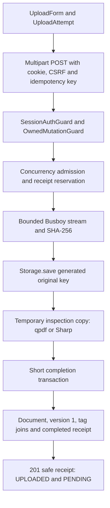

# 08 · Document lifecycle and code walkthroughs

[Guide index](README.md) · [Storage](09-file-storage.md) · [API contracts](10-api-reference.md)

A `Document` is mutable catalog metadata. A `DocumentVersion` is one immutable original. Metadata updates, lifecycle actions and new-file uploads are different operations; only uploads create versions.

## Initial upload: UI to durable record

1. [UploadForm](../../apps/web/features/documents/upload-form.tsx) collects a file and metadata, checks browser-side constraints, loads owned category/tag options and creates an abort controller. Its mutation calls [uploadDocument](../../apps/web/lib/api/upload.ts).
2. `uploadBody` builds FormData: required `title`, optional metadata, `tagIds` encoded as a JSON UUID array, and exactly one `file`. `UploadAttempt.key` retains one UUID for the same File object and normalized metadata, generating a new key for changed input.
3. [AuthApi.upload](../../apps/web/lib/api/client.ts) sends credentialed XHR with `X-CSRF-Protection: 1` and `Idempotency-Key`. The browser sets the multipart boundary. Progress measures sending bytes, not database completion.
4. [UploadController.create](../../apps/api/src/modules/documents/upload.controller.ts) receives trusted owner context and validates the UUID key. [UploadService.create](../../apps/api/src/modules/documents/upload.service.ts) applies a shared per-process concurrent-upload budget and reserves `(userId, create, key)` through `UploadRepository.reserve`.
5. [receiveUpload](../../apps/api/src/modules/documents/upload-multipart.ts) checks multipart structure, field allowlist/count/size, one nonempty file, sanitized display filename, extension, signature and MIME agreement. It streams to storage under generated owner/document/version IDs while hashing and limiting bytes. After parsing it validates metadata using `UpdateDocumentDto`, requires title and checks date order.
6. [UploadInspector.inspect](../../apps/api/src/infrastructure/storage/upload-inspector.ts) streams a private temporary copy from storage. qpdf rejects encrypted/malformed PDFs and checks page count. Sharp checks JPEG/PNG metadata and pixel bounds; explicit tail checks detect truncated endings. This is not malware scanning or full pixel-stream validation.
7. [UploadRepository.complete](../../apps/api/src/modules/documents/upload.repository.ts) takes the scoped advisory lock, verifies the reservation and request fingerprint, checks owned category/tags, creates document/version/joins and completes the receipt in one transaction. It does not hold that transaction during receive/inspection.
8. The API returns a safe creation receipt with version 1, document `UPLOADED`, extraction `PENDING`. The UI invalidates the catalog, stores an upload-success notice and navigates to documents. No job is queued.

Defaults are 50 MiB, 500 PDF pages, 40 million image pixels, a 120-second receive timeout, 15 seconds per PDF inspection command, and two concurrent receiving/inspecting uploads. See [configuration](11-configuration.md) for limits and [storage](09-file-storage.md) for failure compensation.

## Idempotency and duplicates

Reservations have an attempt UUID and a lease of receive timeout + three inspection timeouts + **120 seconds**. Completed receipts last 24 hours. Receiving conflicts return 409. A completed-key replay still receives/inspects bytes and checks a fingerprint of normalized metadata and file attributes/checksum; equal input returns the original receipt and removes the newly staged replay file. Different input conflicts. Expired keys can be replaced on reuse; no automatic cleanup job exists.

Database `(userId, checksumSha256)` uniqueness covers all versions under the owner, including soft-deleted/archived documents. Different users may upload identical content. A new key does not bypass duplicate detection.

Cancellation/network failure may happen after commit. The UI preserves the unchanged in-memory attempt for explicit retry, but reload loses it. Check the catalog after ambiguous outcomes. A receipt is a record of the original operation, not current detail metadata.

## Catalog and metadata

[DocumentsService.list](../../apps/api/src/modules/documents/documents.service.ts) filters by owner and `deletedAt=null`, applies supported filters, and paginates by `(createdAt, id)` with an opaque order-aware cursor. Without `archived`, both archive states can appear. Search is a literal case-insensitive substring of title, issuer or reference number. It never reads file text.

The API additionally filters document/expiration date ranges; the current UI does not expose those controls. [DocumentListQuery](../../apps/api/src/modules/documents/documents.dto.ts) bounds limit to 1–100 (default 25), allows `createdAt`/`-createdAt` ordering and rejects unknown query fields. Keep filters/order fixed when using a cursor.

Editable fields are title, documentType, issuer, referenceNumber, documentDate, expirationDate, categoryId and tagIds. Titles are trimmed/nonempty/max 300; types are uppercase identifiers/max 50; issuer/reference max 200. Dates are real `YYYY-MM-DD`, expiration cannot precede document date, and up to 100 distinct tag UUIDs are accepted. Category/tags must be owned.

PATCH omission preserves values; null clears nullable metadata/category; `[]` clears tags; null tags/title/type are invalid. `verifiedSummary`, status, owner, file properties and storage keys are not editable metadata. `DocumentsService.update` row-locks the owned record and updates fields/joins atomically. There is no ETag or optimistic version check.

## Organization and lifecycle

The [category DTOs](../../apps/api/src/modules/categories/categories.dto.ts) and [tag DTOs](../../apps/api/src/modules/tags/tags.dto.ts) normalize names through [normalizeOwnedName](../../apps/api/src/common/normalize-owned-name.ts), using NFKC and collapsed/trimmed whitespace. Services persist those normalized values and map per-owner case-insensitive duplicates to 409. Category color/icon are safe display values. A category may be removed only when unused, including by deleted documents. Removing a tag permanently removes its joins, preserving documents.

Lifecycle decisions live in [transitionDocument](../../apps/api/src/modules/documents/document-lifecycle.ts), executed under a document lock:

| Operation                                             | Result and repeat behavior                                                                                                 |
| ----------------------------------------------------- | -------------------------------------------------------------------------------------------------------------------------- |
| Archive                                               | Set `status=ARCHIVED`, `isArchived=true`; repeat leaves eligible archived state unchanged; a deleted record is unavailable |
| Soft delete                                           | Set `deletedAt`; metadata, flags, joins and bytes remain; repeat on an eligible owned row is unchanged                     |
| Restore                                               | Clear deletion/archive and set `UPLOADED`; active records remain unchanged                                                 |
| Mutation of PROCESSING/DELETING or inconsistent state | 409; vocabulary does not mean a processing worker exists                                                                   |

Ordinary reads hide deleted records. The API can restore an owned deleted ID, but there is no Trash UI or permanent purge. Archived documents remain readable/downloadable. The UI disables archived metadata editing; the API allows it for non-deleted records. New-version upload rejects archive/PROCESSING/DELETING state.

## Additional version code walkthrough

1. [VersionHistory](../../apps/web/features/documents/version-history.tsx) loads owned document/history and opens [VersionUpload](../../apps/web/features/documents/version-upload.tsx).
2. [uploadVersion](../../apps/web/lib/api/versions.ts) posts only one file to `/documents/:documentId/versions`, using the shared credentialed XHR and a retained UUID attempt key. Text metadata is rejected by the API on this operation.
3. [VersionsController.upload](../../apps/api/src/modules/documents/versions.controller.ts) passes authenticated user, validated target ID and key to `UploadService.create`.
4. `UploadRepository.assertVersionTarget` checks owner/lifecycle before receive; scope becomes `versions:<document UUID>`. The same key used for initial creation or another target is independent.
5. At completion, `UploadRepository.complete` takes the receipt lock and the owned document row lock, rechecks lifecycle even for replay, allocates highest version number + 1, writes the immutable version, sets document status `UPLOADED`, and commits the safe receipt. Logical metadata and previous originals remain intact.
6. The response contains documentId/status/version with `isLatest=true` as of creation. Replay can later be stale, so the UI refreshes history/detail instead of treating receipt `isLatest` as current truth.

[VersionsService](../../apps/api/src/modules/documents/versions.service.ts) reads safe list/detail metadata in Repeatable Read transactions. History sorts descending version number, takes a UUID cursor and returns `isLatest`. Archived history is available; deleted/DELETING history is hidden. Foreign target/version pairs return 404; an unavailable history cursor returns 400. There is no version promotion, edit, deletion, or historical binary download endpoint.

## Current download code walkthrough

1. [DocumentDetailPage.download](../../apps/web/features/documents/document-detail.tsx) calls [prepareDocumentDownload](../../apps/web/lib/api/documents.ts), which calls `AuthApi.prepareDownload`.
2. The client performs a credentialed **GET**, checks status/MIME and cancels the response body. It can renew authentication on 401, then returns the URL. The component uses `window.location.assign` for the native browser download: these are two separately authorized requests, not a HEAD check.
3. [DownloadController.download](../../apps/api/src/modules/documents/download.controller.ts) applies session auth, validates document UUID and rejects request query/body input. It calls [DownloadService.send](../../apps/api/src/modules/documents/download.service.ts) with the trusted owner.
4. The service selects the owned, non-deleted/non-DELETING document's highest version number. Archived downloads are permitted. No current version returns 409; missing/unowned document returns 404.
5. It checks stored metadata and storage size, opens the object and pre-reads a bounded chunk before sending binary headers. It returns trusted MIME, checked Content-Length, sanitized ASCII/UTF-8 Content-Disposition, `private, no-store`, `nosniff`, and `Accept-Ranges: none`.
6. Stream piping applies backpressure and verifies total byte length; disconnect aborts work. Early storage/database/read failure becomes safe 503 JSON. After headers, failure terminates the stream. No fallback to an older version or Range support exists.

Ownership is checked at admission; a later deletion/revocation cannot retrieve bytes already sent. The UI reports download initiation, not confirmed completion. A state/session change between the probe and native request may still cause failure.
