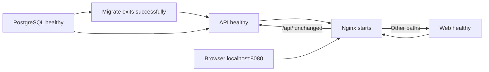

# 12 · Docker and Nginx operations

[Guide index](README.md) · [Complete Compose runbook](../compose.md) · [Configuration](11-configuration.md)

The canonical local deployment is [docker-compose.yml](../../docker-compose.yml). It runs compiled servers through one loopback HTTP origin. Use host watchers for immediate source reloads.

## Services, startup and persistence



| Service  | Image/build and port                    | Health/dependencies                                                                | Persistence                                 |
| -------- | --------------------------------------- | ---------------------------------------------------------------------------------- | ------------------------------------------- |
| postgres | postgres:17-alpine; internal 5432       | `pg_isready`, 5s interval                                                          | `postgres_data` at /var/lib/postgresql/data |
| migrate  | API Dockerfile `migration` target       | Starts after database healthy; exit 0 gates API                                    | SQL migrations on database; no file mount   |
| api      | Node 24 `runtime` target; internal 3001 | PostgreSQL healthy + migration success; readiness fetch and root read/write access | API-only `storage_data` at /data/qyvra  |
| web      | Node 24 Next standalone; internal 3000  | `/login` health fetch; no database dependency                                      | No private document files                   |
| nginx    | nginx:1.28-alpine; internal 80          | Waits for API/web health; probes both routed endpoints                             | No private file mount                       |

Only `127.0.0.1:${NGINX_PORT:-8080}:80` is published. The default project bridge network provides Docker service-name DNS. [docker-compose.dev.yml](../../docker-compose.dev.yml) optionally publishes PostgreSQL to loopback for a host API; it is not a source-watch override. API/web use `init: true` and non-root `node`; migration also runs as `node`.

## Image layout

[api.Dockerfile](../../infrastructure/docker/api.Dockerfile) installs qpdf/OpenSSL/certificates, installs API and shared-package dependencies in their relative layout, builds API/shared packages, and separates migration CLI dependencies from pruned runtime dependencies. Runtime copies compiled API and shared outputs; it has no TypeScript compiler/test suite. The root storage directory is created for UID 1000 with private permissions.

[web.Dockerfile](../../infrastructure/docker/web.Dockerfile) builds with `/api/v1` and the public upload limit, then copies standalone output, `.next/static` and public assets into a non-root runtime. [next.config.ts](../../apps/web/next.config.ts) enables standalone output. Existing Google font loading can require network access during build.

[.dockerignore](../../.dockerignore) excludes environment files, local tooling, node_modules, generated output and tests. Secrets are provided at runtime. The [database launcher](../../infrastructure/docker/database-command.cjs) builds a URL from POSTGRES variables for both migrations and API, always targeting the Compose database.

## Nginx routing and streaming

[default.conf.template](../../infrastructure/nginx/default.conf.template) routes `/api/` to `api:3001` with the original URI, including `/api/v1`, query and encoded path; every other path reaches `web:3000`. Docker DNS at 127.0.0.11 is resolved dynamically with 10-second validity, allowing replaced upstream containers without proxy restart.

API request/response buffering and proxy cache are disabled. [19-upload-limit.envsh](../../infrastructure/nginx/19-upload-limit.envsh) bounds UPLOAD_MAX_BYTES to 1–209715200 and adds 1 MiB multipart overhead before template rendering. API receive logic has its own tighter overhead bound and byte checks. Nginx connection timeout is 5 seconds; body/send/proxy read/send timeouts are 650 seconds. These do not override API/XHR timeouts.

The proxy supplies Host and forwarding headers, sets nosniff/referrer policy, and disables access logs to avoid query metadata logging. API correlation logs are the main request trace. Nginx error logs may still include paths. The API does not globally trust forwarded client IPs; users behind Nginx share socket-peer rate budgets.

## Build, start, inspect, stop

Commands run from the repository root. On a new checkout, copy `.env.example` to `.env`, replace POSTGRES_PASSWORD and preserve existing values/project name on later runs.

```sh
docker compose config --quiet
docker compose build
docker compose up -d
docker compose ps --all
docker compose logs -f migrate api
docker compose logs -f nginx web
docker compose exec nginx nginx -t
docker compose down
```

`migrate` should exit successfully; the other four services should be healthy. `config --quiet` validates without printing resolved secrets. The combined build/start command is:

```sh
docker compose up --build -d
```

After source/dependency/public build-setting changes, use that command again. For an intentional base-image refresh:

```sh
docker compose build --pull
docker compose up -d
```

Reapply pending migrations explicitly, when needed:

```sh
docker compose run --rm migrate
```

## Safe development container reset

To recreate containers while retaining data, keep the same project name and volumes:

```sh
docker compose down
docker compose up --build -d
docker compose ps --all
```

For the focused persistence check used by the runbook:

```sh
docker compose up -d --force-recreate postgres
docker compose up -d --force-recreate api web nginx
docker compose ps --all
```

There is no non-destructive command that also empties the database/files. Do not add `--volumes` to routine down/reset commands: it deletes both persistence volumes. A new Compose project name selects different volumes and can make existing documents appear missing. The isolated browser runner is the provided disposable testing path.

## Runtime diagnostics and host database

```sh
docker compose exec api node --version
docker compose exec api qpdf --version
docker compose exec api node -e "fetch('http://127.0.0.1:3001/api/v1/health/ready').then(r=>console.log(r.status))"
docker compose exec api node -e "require('node:fs').accessSync('/data/qyvra',6); console.log('Storage root is readable and writable')"
```

For host-run source watchers:

```sh
docker compose -f docker-compose.yml -f docker-compose.dev.yml up -d --wait postgres
```

Follow [host onboarding](14-development-workflow.md) for migrations, qpdf and private host storage. Host files are independent of storage_data. Preserve database initialization credentials; they do not automatically update roles in a populated volume. Existing file-volume ownership is not forcibly repaired at startup.

## Deployment limits and backups

The API deliberately defaults to development mode here for local HTTP cookies while both application servers are compiled and web runs production mode. This is not a public TLS deployment. Production requires HTTPS origins, Secure cookies and reviewed proxy forwarding/TLS configuration; changing NODE_ENV alone is insufficient.

Back up SQL and files together with writers stopped; see [manual backups](../compose.md#persistence-and-manual-backups). No automated backups, restore workflow, deployment CI, distributed throttling or cleanup worker are included.
