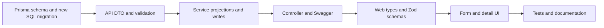

# 16 · Extending QYVRA consistently

[Guide index](README.md) · [Where do I change...?](03-repository-structure.md#where-do-i-change) · [Testing](13-testing.md)

This chapter is a **hypothetical extension walkthrough**, not a claim that a new feature exists. It follows the current boundaries and does not authorize Phase 2 infrastructure.

## Example: add an optional document note

Suppose a future task requests a short user-editable `note` on the logical document. First define maximum length, null/omission semantics, display behavior, and whether initial upload accepts it. Confirm that it belongs to mutable document metadata, not immutable file versions. Existing `verifiedSummary` is read-only and should not be repurposed without an explicit contract change.

### 1. Evolve persistence

Edit [schema.prisma](../../packages/database/prisma/schema.prisma) with a nullable bounded string on `Document`. Add a new timestamped migration under [prisma/migrations](../../packages/database/prisma/migrations), including any SQL hygiene constraint needed for direct writers. Never change one of the ten applied migrations to make an existing database look newly initialized.

There is no repository `migrate:dev` script. Use the locally installed Prisma CLI deliberately against a disposable authoring database if generating a draft migration; review its SQL, then deploy with the existing `migrate:deploy` workflow. Do not use `db push` as a replacement for reviewed migration history. Preserve owner composite keys, expression indexes and immutability checks.

Run shared client generation/build. Prisma is the persistence model; there is no separate Nest entity class to edit. Check a migration against representative existing records, not only an empty schema.

### 2. Update backend transport and use cases

Add the field to [UpdateDocumentDto](../../apps/api/src/modules/documents/documents.dto.ts) with explicit validation and Swagger metadata. Match existing optional/nullable handling: omission preserves, supported null clears, invalid empty/control-heavy values fail. Do not introduce a userId input.

Update [DocumentsService](../../apps/api/src/modules/documents/documents.service.ts): safe metadata projection, update allowlist and response hydration if necessary. Preserve the owned-row lock and association transaction. It is unnecessary to add a controller route just to extend PATCH; update the current route's response schema in [DocumentsController](../../apps/api/src/modules/documents/documents.controller.ts).

If initial upload accepts the field, the work is broader:

- Extend the multipart allowlist and bounded field/part limits in [upload-multipart.ts](../../apps/api/src/modules/documents/upload-multipart.ts); there are currently exactly eight allowed metadata fields.
- Add normalization/defaults to [UploadRepository.complete](../../apps/api/src/modules/documents/upload.repository.ts) and include the new metadata in its idempotency fingerprint.
- Update safe projections and [UploadResponse](../../apps/api/src/modules/documents/upload.dto.ts), plus [UploadController](../../apps/api/src/modules/documents/upload.controller.ts) Swagger.
- Decide how older completed receipts, retained for 24 hours, are accepted by the new client. Blindly requiring a new field can break replays even when new creates work.

Additional-version uploads remain file-only unless the requested contract explicitly changes. They must not accidentally reset the document note when selecting/updating metadata during version completion.

### 3. Update frontend contracts and forms

Extend [documents.ts](../../apps/web/lib/api/documents.ts) response schema, `DocumentPatch`, and explicit outgoing allowlist. Add note rendering to [document-detail.tsx](../../apps/web/features/documents/document-detail.tsx) and input to [document-edit.tsx](../../apps/web/features/documents/document-edit.tsx), updating [edit-metadata.ts](../../apps/web/features/documents/edit-metadata.ts) to generate the correct patch.

For upload support, update [upload.ts](../../apps/web/lib/api/upload.ts) metadata type/normalization/FormData and attempt-key comparison, [upload-validation.ts](../../apps/web/features/documents/upload-validation.ts), and [upload-form.tsx](../../apps/web/features/documents/upload-form.tsx). Reuse UI fields and accessible labels/error messages. A client limit is feedback, not a security boundary.

Preserve owner-specific query keys and invalidate detail/catalog after successful mutations. Render absent notes sensibly. Avoid persisting private form/document data to localStorage merely to retain drafts; the current remote-data architecture is in memory.

### 4. Test the behavior at its boundaries

Add meaningful tests for omitted/present/null/too-long note values, same-owner enforcement and any SQL check. If upload accepts it, test same-key replay with identical note, conflict when note changes, and cleanup on rejected input. Verify version append preserves metadata. Test form clearing/validation, detail display and cache refresh with the existing frontend fixtures.

Run relevant unit, HTTP, migrated-PostgreSQL and frontend tests, then formatting/lint/typechecks/builds. Add a browser scenario only when needed for an actual cross-service behavior; do not duplicate every validator at every layer. Update the developer/API/feature docs and record the change in the appropriate release scope. Do not alter the historical v1.0.0 snapshot to pretend a future field shipped here.

## Conventions for other features

- Keep domain HTTP operations in their existing Nest module; add a new module only for an actual boundary. Controllers parse/map; services enforce business rules; focused repositories are appropriate for complex persistence.
- Use `ConfigurationService` for server settings and explicit Compose mappings. Validate at startup and update examples/docs. Public web settings must never contain secrets.
- Keep binary operations behind `Storage`. A future adapter would need create-only semantics and neutral error/stream behavior; adding an SDK directly to a document controller would bypass the existing contract.
- Keep API calls in `lib/api` and feature behavior in `features`. New private routes need the correct layout and a review of the auth provider's pathname checks; the backend still authorizes every operation.
- Add safe Swagger projections rather than returning Prisma records wholesale. Preserve error envelopes, correlation, bounded lists and generic missing/foreign behavior.
- Keep SQL locks short and do not treat filesystem/SQL work as one atomic transaction. Extend compensation and uncertain-commit tests when changing that sequence.
- Review [ADRs](../decisions/README.md) when making consequential architecture decisions. Workers, messaging, search and AI remain separate future scope, not dependencies to introduce for a metadata field.
