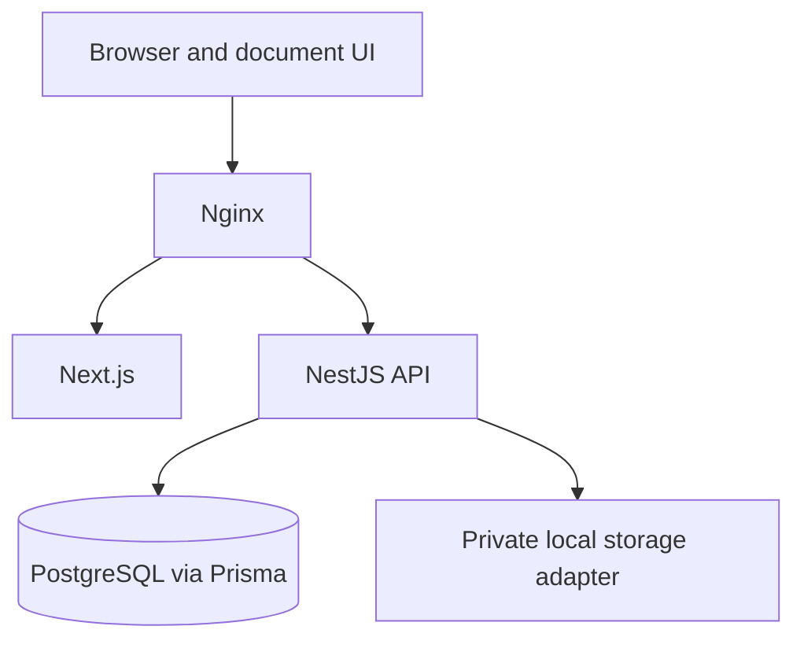
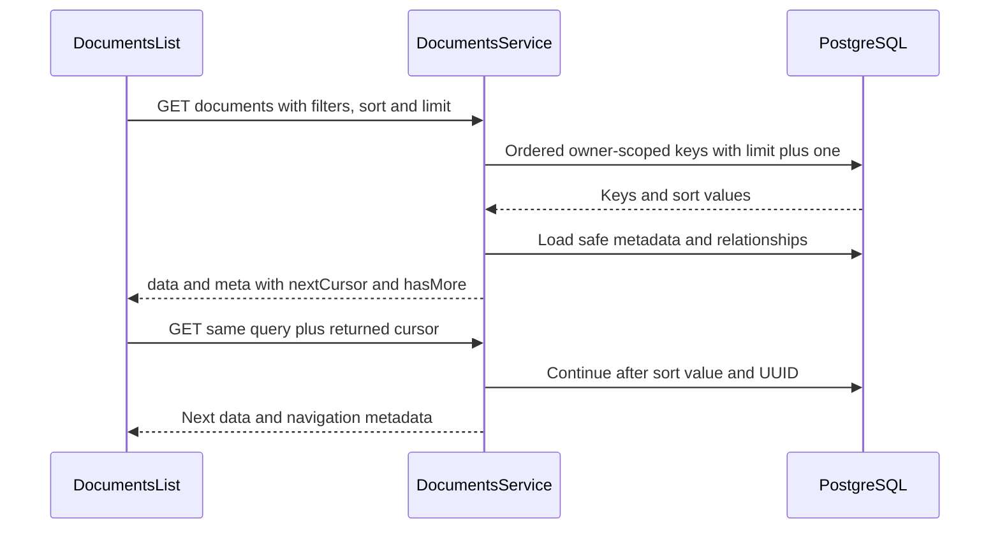

# Brainless v1.1.0 — Developer Changes

This is the incremental guide to Phase 2: document organization and metadata. Read it alongside the [v1.0.0 baseline chapters](../README.md#reading-map). Those chapters remain historical; this guide takes precedence for changed document behavior. Authentication, storage, deployment topology and the rest of the Phase 1 lifecycle remain applicable. OCR, processing workers, queues, full-text/semantic search, AI and reminders are not implemented by this release.

## Version and comparison provenance

| Item                        | Inspected value                                                                                                 |
| --------------------------- | --------------------------------------------------------------------------------------------------------------- |
| Working branch              | `main`                                                                                                          |
| Working commit              | `32f3b918232eab04bcdc540399b1b32b11536378`                                                                      |
| v1.1.0 branch and local tag | Both point to `f55dacf9bb5faecbf54460ce1daf3d4d6ebaf102` (`Release v1.1.0`)                                     |
| Tag on working commit       | None                                                                                                            |
| v1.0.0 comparison base      | `f208e8fa188b0942c16f5c356a7b17bbedc948ba`, the source baseline recorded by the completed developer guide       |
| Available v1.0.0 branch     | `e3a549f19032d8a7e16b904428e95d5dbac18b14`, including the completed baseline documentation; no local v1.0.0 tag |

The tree was clean before this documentation task. The working commit differs from the v1.1.0 tag only in Markdown documentation: the completed baseline guides and their index links. Application, package and infrastructure files match the tag. The implementation comparison used the explicit reference `refs/tags/v1.1.0` to avoid ambiguity with the identically named branch. Local Git establishes the tag; publication on a remote release service was not checked.

## Changes at a glance

| Area              | v1.0.0                                                                       | v1.1.0                                                                                                             |
| ----------------- | ---------------------------------------------------------------------------- | ------------------------------------------------------------------------------------------------------------------ |
| Document metadata | Title and structured metadata                                                | Adds nullable, owner-entered description                                                                           |
| Current file      | Separate version information                                                 | Adds nullable `currentVersion` summary to document reads/mutations                                                 |
| Filtering         | Text, type, status, category, one tag, archive and document/expiration dates | Adds current filename/MIME, all-of tags, created/updated UTC dates                                                 |
| Sorting           | Created time in either direction                                             | Also updated time descending, title both directions, current file size descending                                  |
| Navigation        | Created-time keyset cursor and next-page flow                                | Extends cursor shapes to new sorts and adds client cursor-history Previous navigation                              |
| Document UI       | Catalog, upload, detail and editing                                          | Description editing/preview, current-file summary, staged filter dialog, sort controls and removable filter badges |
| API               | Existing document routes and envelopes                                       | Additive metadata/query fields; no new routes                                                                      |
| Database          | Phase 1 schema                                                               | One nullable column with a database constraint; no new index                                                       |
| Tests             | Phase 1 lifecycle coverage                                                   | Migration, description, query, cursor, UI and real-browser acceptance coverage                                     |

## Architecture and boundaries

The [runtime architecture](../../architecture.md) remains the same. New queries run in PostgreSQL; there is no search engine or browser-side filtering of the returned page.



`DocumentsController` validates HTTP input and delegates metadata operations to `DocumentsService`. Its list method uses parameterized Prisma SQL to find ordered document IDs, then Prisma model queries and `hydrate()` to assemble safe metadata and relationships. Upload persistence stays in `UploadRepository`. There is no new generic repository layer or shared-contract package. See [controller](../../../apps/api/src/modules/documents/documents.controller.ts), [service](../../../apps/api/src/modules/documents/documents.service.ts), and [upload repository](../../../apps/api/src/modules/documents/upload.repository.ts).

## Description: database to editor

The [Prisma schema](../../../packages/database/prisma/schema.prisma) adds `Document.description: String? @db.VarChar(2000)`. Migration [20260924010000_document_description](../../../packages/database/prisma/migrations/20260924010000_document_description/migration.sql) adds nullable `documents.description VARCHAR(2000)` without a default. Existing rows read as `null`. Its CHECK requires non-null values to be nonempty, equal to `btrim(description)`, and free of POSIX control characters. No relation, index, version row or saved upload receipt is rewritten.

1. [UpdateDocumentDto](../../../apps/api/src/modules/documents/documents.dto.ts) trims description strings and converts whitespace-only input to `null`. Omission leaves a PATCH value unchanged; explicit `null` clears it. Non-null values must be strings of at most 2,000 characters without C0/DEL control characters. Internal newlines/tabs are rejected, despite the textarea UI.
2. [receiveUpload](../../../apps/api/src/modules/documents/upload-multipart.ts) accepts `description` as an optional multipart text field on initial upload. Its field/part limits grew to 9/11. Multipart omission or empty text stores `null`; this is not JSON `null` in a form field. Existing file signature, MIME, size and ownership checks remain.
3. [UploadRepository.complete](../../../apps/api/src/modules/documents/upload.repository.ts) stores the normalized value on the new document. A non-null description contributes to the create-operation idempotency fingerprint. Omitting it preserves the earlier fingerprint shape; a changed description with a reused key conflicts. Completed receipts replay their stored response, not freshly hydrated document data.
4. [DocumentsService.update](../../../apps/api/src/modules/documents/documents.service.ts) writes `dto.description` under the existing owner-scoped transaction. Description edits change document metadata, not file versions. Its metadata selection and `hydrate()` include description in document responses.
5. [DocumentItem/DocumentPatch](../../../apps/web/lib/api/documents.ts) and [UploadMetadata/uploadBody](../../../apps/web/lib/api/upload.ts) carry the field. The document Zod schema requires a nullable description property. Upload form data appends it only when supplied.
6. [uploadFormSchema](../../../apps/web/features/documents/upload-validation.ts) validates the text; [upload form](../../../apps/web/features/documents/upload-form.tsx) and [document editor](../../../apps/web/features/documents/document-edit.tsx) use the new [Textarea](../../../apps/web/components/ui/textarea.tsx). [editDefaults/metadataPatch](../../../apps/web/features/documents/edit-metadata.ts) initialize null as empty text and send only changed values, converting a cleared field to `null`.
7. [DocumentsTable](../../../apps/web/features/documents/documents-table.tsx) renders a two-line text preview. [DocumentDetail](../../../apps/web/features/documents/document-detail.tsx) renders the full description or “No description.” These are React text nodes, not interpreted HTML.

An upload still returns its existing `version` receipt shape, not the new `currentVersion` document-read shape, and does not add description to that receipt. Read the document after upload for current metadata. Adding a version does not offer document-description editing; use PATCH.

## Current-version metadata

The document service selects the highest `versionNumber` using `versions` ordered descending with `take: 1`. `hydrate()` maps it to `currentVersion`, or `null` for a metadata-only document. The API exposes exactly these summary fields:

| Field              | Meaning                                                   |
| ------------------ | --------------------------------------------------------- |
| `id`               | Version UUID                                              |
| `versionNumber`    | Immutable version sequence number                         |
| `originalFilename` | Current uploaded filename                                 |
| `mimeType`         | Current file MIME type                                    |
| `fileSize`         | Bytes                                                     |
| `createdAt`        | Version creation/upload timestamp, serialized as ISO text |

Storage keys, checksums, bytes and processing internals are not part of this summary. Document `createdAt`/`updatedAt` describe the document, not the version upload date. See the [service selection and mapper](../../../apps/api/src/modules/documents/documents.service.ts) and [currentVersionSummarySchema](../../../apps/web/lib/api/documents.ts).

The list renders filename, version badge, MIME label and formatted size directly from this summary. The detail page adds upload time and disables current-file download when the summary is null. Separate version history remains available: developers do not need to fetch all versions merely to render the current file. Version creation/download/ownership mechanics remain those in the [baseline lifecycle walkthrough](../08-document-lifecycle.md).

## Filtering contract

All parameters below belong to authenticated `GET /api/v1/documents`. They combine with AND; `q` internally ORs its three text columns. Every query includes trusted `userId` and `deleted_at IS NULL`. No filter allows selecting another owner. Missing `archived` includes both active and archived documents.

Validation lives in [DocumentListQuery](../../../apps/api/src/modules/documents/documents.dto.ts); predicates live in [DocumentsService.list](../../../apps/api/src/modules/documents/documents.service.ts). The list does not separately resolve every category/tag UUID to return a lookup error: foreign or nonexistent IDs produce no matching owned documents.

| Query parameter                  | Accepted value and database behavior                                                                                                             | UI representation                                                |
| -------------------------------- | ------------------------------------------------------------------------------------------------------------------------------------------------ | ---------------------------------------------------------------- |
| `q`                              | Trimmed, nonempty text up to 200 characters, no C0/DEL controls; literal case-insensitive substring of title, issuer or reference number         | Search field, 350 ms debounce                                    |
| `filename` (new)                 | Same text bounds; literal case-insensitive substring of the **current** original filename                                                        | Filter dialog                                                    |
| `mimeType` (new)                 | Exactly `application/pdf`, `image/jpeg`, or `image/png`; current version only                                                                    | Filter dialog file type                                          |
| `documentType`                   | `^[A-Z][A-Z0-9_]{0,49}$`; equality                                                                                                               | Dialog text field with suggestions                               |
| `status`                         | `UPLOADED`, `PROCESSING`, `READY`, `PARTIALLY_READY`, `FAILED`, `ARCHIVED`, `DELETING`; equality                                                 | Dialog select; enum values do not imply processing workers exist |
| `categoryId`                     | UUID; equality on owned document's category                                                                                                      | Dialog owned-category lookup                                     |
| `tagId`                          | UUID; owned association must exist                                                                                                               | Legacy URL input, displayed as selected tag                      |
| `tagIds` (new)                   | One comma-separated string of 1–10 distinct UUIDs, lowercased before uniqueness validation; one owned `EXISTS` predicate per tag (match **all**) | Multi-select tag popover in dialog                               |
| `archived`                       | Literal query `true`/`false`, transformed to boolean; equality on archive flag                                                                   | Dialog three-state choice                                        |
| `dateFrom`, `dateTo`             | Real `YYYY-MM-DD` calendar dates; inclusive bounds on `document_date`                                                                            | URL/API-supported; removable badges, no dialog editor            |
| `expirationFrom`, `expirationTo` | Same calendar validation; inclusive bounds on `expiration_date`                                                                                  | URL/API-supported; removable badges, no dialog editor            |
| `createdFrom`, `createdTo` (new) | Calendar dates; inclusive UTC days on document `created_at`                                                                                      | Dialog date pickers                                              |
| `updatedFrom`, `updatedTo` (new) | Calendar dates; inclusive UTC days on document `updated_at`                                                                                      | Dialog date pickers                                              |

The service rejects reversed date ranges and simultaneous `tagId` plus `tagIds` with 400. CSV tag IDs are not whitespace-trimmed; use comma-separated UUIDs without spaces, not JSON or repeated query keys. This differs from upload metadata's JSON-encoded `tagIds` array and PATCH's JSON array.

Timestamp lower bounds are UTC midnight inclusive; upper bounds are exclusive midnight of the following UTC day. Date-only fields use direct inclusive date comparisons. Literal text matching escapes `%`, `_` and backslash rather than giving callers SQL wildcard syntax. Neither `q` nor `filename` searches description, extracted text or previous filenames.

A lateral join selects the owner's highest-numbered version only when filename, MIME or file-size ordering needs it. Documents without a version cannot match filename/MIME filters. See [database query design](../../database.md#v110-description-migration-and-query-design). The DTO's older comments calling `dateFrom`/`dateTo` creation-date filters are inaccurate; the SQL uses `document_date`.

## Sorting and keyset navigation

The backend [documentSorts](../../../apps/api/src/modules/documents/document-pagination.ts) and frontend [documentSortSchema](../../../apps/web/lib/api/documents.ts) allow exactly:

| `sort`                 | SQL order                                                      |
| ---------------------- | -------------------------------------------------------------- |
| `-createdAt` (default) | Document creation descending, UUID descending                  |
| `createdAt`            | Document creation ascending, UUID ascending                    |
| `-updatedAt`           | Document update descending, UUID descending                    |
| `title`                | Title using PostgreSQL `COLLATE "C"` ascending, UUID ascending |
| `-title`               | Same title collation descending, UUID descending               |
| `-fileSize`            | Current version bytes descending, nulls last, UUID descending  |

Title order is database C collation, not locale-aware natural-language sorting. Updated time and file size do not support ascending order. [DocumentsList](../../../apps/web/features/documents/documents-list.tsx) maps separate field/direction controls onto these exact strings and offers only valid directions.

`limit` defaults to 25 and accepts integers 1–100. The response remains `{ data: [...], meta: { requestId, nextCursor, hasMore } }`. The service requests `limit + 1` keys to determine `hasMore`, hydrates at most `limit` documents, and generates `nextCursor` from the last returned key when more exist. There is no total count, page-number API or reverse cursor endpoint.

`documentCursor()` serializes base64url JSON. Created-time cursors retain `{ id, createdAt, sort }`; new sorts use `{ id, value, sort }`, where value is an ISO update timestamp, title string, or byte count/null. Treat this as opaque in clients. `parseDocumentCursor()` validates canonical base64url, UTF-8, exact object keys, UUID, matching requested sort, and bounded typed values. The maximum cursor length increased from 512 to 4,096 characters. Malformed or wrong-sort cursors produce 400.

Continuation predicates compare the sort value, then UUID in the same direction. Size pagination explicitly continues into null sizes after non-null sizes and continues null entries by descending UUID. This handles tied values deterministically without an offset or requiring the cursor row still to exist. Cursors are not signed or bound to the filter set; authorization still comes from the session and owner predicate. Clients must reuse the same filters/order, and the UI resets traversal when they change. Stable ordering does not provide a frozen snapshot across requests when documents are edited concurrently.



### Walkthrough: Next and Previous

`DocumentsList.nextPage()` checks `hasMore`, `nextCursor` and fetching state, saves the cursor in a local `trail`, and calls `navigate()` with the current query plus that cursor. `navigate()` normalizes query input and updates the Next.js URL without scrolling. The changed owner/query TanStack Query key loads the next server page.

Previous reuses an earlier cursor from this in-memory trail. The context key excludes only `cursor`, so changed filters, sort or limit invalidate the trail. A reloaded/deep-linked cursor does not reconstruct previous pages; Previous is disabled until local history permits it. First page removes the cursor. The page number shown while history is known is a traversal label, not a server page count. Buttons are disabled while fetching, and Next also requires successful results and a next cursor.

## Query serialization and filter walkthrough

[readDocumentQuery](../../../apps/web/features/documents/query.ts) reads untrusted URL state into `DocumentQuery`: it defaults sort/limit, validates supported values and drops invalid individual inputs. It preserves valid dates as calendar strings, accepts bounded opaque cursors, and prefers legacy `tagId` if both tag forms occur in a URL. This permissive URL normalization differs from API validation, which rejects invalid HTTP input and contradictory tag forms.

[queryString](../../../apps/web/lib/api/documents.ts) serializes only its explicit allowlist with `URLSearchParams`. It omits undefined, null, empty strings and empty arrays; arrays become comma-separated strings. Dates remain `YYYY-MM-DD` strings, not `Date` objects. Sort, limit and cursor serialize like other scalar values; provided defaults are included, not stripped. `listDocuments()` uses the same serializer for the HTTP request, so UI URLs, query cache keys and API query parameters share an implementation. Calling `listDocuments()` with no parameters lets the backend supply defaults.

### Walkthrough: filtering documents

1. [DocumentsList](../../../apps/web/features/documents/documents-list.tsx) obtains the current owner from the auth provider and reads `useSearchParams()` through `readDocumentQuery()`. Its cache key is `['documents', owner, queryString(query)]`; document loading waits for an owner.
2. Opening [DocumentFilterDialog](../../../apps/web/features/documents/document-filter-dialog.tsx) runs `fromQuery()` to reset a React Hook Form draft. Category/tag options come from owner-scoped infinite queries, with explicit Load more and retry controls. The tag popover uses checkboxes and caps selection at ten.
3. Changing the draft does not request new documents. Apply checks document type and date order, creates a `Partial<DocumentQuery>`, replaces legacy `tagId` with `tagIds`, and calls `changeFields()`. Cancel/close discards draft changes on reopening. Dialog Clear resets only the staged advanced fields and takes effect after Apply; it does not clear the separate search or URL-only date filters.
4. `changeFields()` merges the patch, removes the cursor and resets history. `navigate()` round-trips it through `queryString()` and `readDocumentQuery()`, then `router.push()` updates the URL.
5. The changed TanStack Query key calls `listDocuments()` through the existing authenticated [AuthApi client](../../../apps/web/lib/api/client.ts). Normal same-origin `/api/v1` routing, session cookies and refresh handling still apply.
6. [DocumentsController](../../../apps/api/src/modules/documents/documents.controller.ts) passes trusted authenticated user ID and the validated `DocumentListQuery` to `DocumentsService.list()`. DTO transforms/validators and service checks reject invalid contracts; the service builds parameterized SQL predicates, never accepts an owner from a query string, and combines filters before ordering/limiting.
7. PostgreSQL returns matching keys. The service loads document metadata, current versions, categories and tags, restores key order, and returns the existing paginated envelope. The frontend Zod page schema validates the response before displaying it.
8. `DocumentsTable` displays the server page without client reordering or pagination. Active badges remove individual fields/tags or date-range pairs. List-level Clear all keeps sort and limit while clearing every filter and cursor.

The filter trigger counts advanced filter groups (a tag set or a date range counts once), not search/sort or every selected tag. The list separately displays active-filter badges, including URL-only dates. [DocumentFilterSelect](../../../apps/web/features/documents/document-filter-select.tsx) supplies reusable selects; the dialog uses local shadcn/Base UI Dialog, Popover, Checkbox, Badge, Field, Button and shared DatePickerControl components.

The table retains its column visibility controls and required Document, Status, Category and Created columns; optional columns include Tags, Issuer, Document date and Expiration. Loading uses `aria-busy` and LoadingPanel; errors have retry and a cursor recovery option; empty states distinguish no documents, no matches and exhausted navigation. Lookup failures do not replace document results. An authenticated request that remains unauthorized clears the cached current user. See [list](../../../apps/web/features/documents/documents-list.tsx) and [table](../../../apps/web/features/documents/documents-table.tsx).

## API Changes: v1.0.0 → v1.1.0

All paths include the unchanged `/api/v1` prefix. All document routes require a session; mutations retain their origin/CSRF protection. See [baseline endpoint reference](../10-api-reference.md) for unchanged routes, common errors and upload limits, and [current API contract](../../api.md#v110-document-contract) for OpenAPI guidance.

| Endpoint                                                                                                   | Added or changed                                                                                                               | Unchanged                                                                                     |
| ---------------------------------------------------------------------------------------------------------- | ------------------------------------------------------------------------------------------------------------------------------ | --------------------------------------------------------------------------------------------- |
| `GET /api/v1/documents`                                                                                    | New filters, expanded sort allowlist/cursor formats and length; each item includes nullable `description` and `currentVersion` | Default sort/limit, owned/nondeleted scope, existing filters, `data` and `meta` envelope      |
| `GET /api/v1/documents/:id`                                                                                | Nullable description/current-version summary                                                                                   | Owned lookup, 404 for unavailable document                                                    |
| `PATCH /api/v1/documents/:id`                                                                              | Optional nullable description request field; description/current-version fields in response                                    | Existing metadata fields, transaction, owner/association checks                               |
| `POST /api/v1/documents`                                                                                   | Optional multipart description, validation and create fingerprint contribution                                                 | Required file/title, upload receipt `version`, original receipt replay, duplicate/file checks |
| `POST /api/v1/documents/:id/archive`, `POST /api/v1/documents/:id/restore`, `DELETE /api/v1/documents/:id` | Shared document hydration also includes description/currentVersion in their responses                                          | Lifecycle transitions and soft-delete semantics                                               |

No version, download, auth, account, category or tag endpoint was added. Description validation and malformed/conflicting queries return 400; the existing authentication/CSRF, ownership, lifecycle and infrastructure errors remain applicable. Controller Swagger annotations describe the new list filters and upload description, but actual DTO/service response mapping is the source of truth.

## Tests and recorded acceptance

| Source                                                                                                                                                                                     | What the v1.1.0 coverage establishes                                                                                                   |
| ------------------------------------------------------------------------------------------------------------------------------------------------------------------------------------------ | -------------------------------------------------------------------------------------------------------------------------------------- |
| [Migration test](../../../packages/database/test/description-migration.test.cjs)                                                                                                           | Applies Phase 1 then upgrades a disposable database, checks old rows and description constraints                                       |
| [Description integration](../../../apps/api/test/description.integration-spec.ts)                                                                                                          | Nullable/text persistence and preservation of required fields/owned associations                                                       |
| [Document integration](../../../apps/api/test/documents.integration-spec.ts)                                                                                                               | Description omission/update/clearing, highest owned current version, combined filters, ordering and keyset behavior against PostgreSQL |
| [Upload integration](../../../apps/api/test/upload.integration-spec.ts)                                                                                                                    | Description persistence and upload/idempotency compatibility                                                                           |
| [Document HTTP contracts](../../../apps/api/test/documents.e2e-spec.ts)                                                                                                                    | Query transformation/rejection, ownership context, CSRF, response envelopes and OpenAPI                                                |
| [Document service unit tests](../../../apps/api/src/modules/documents/documents.service.spec.ts) and [lifecycle tests](../../../apps/api/src/modules/documents/document-lifecycle.spec.ts) | Service/mapper and lifecycle regression behavior                                                                                       |
| [Documents client tests](../../../apps/web/tests/documents-client.test.ts)                                                                                                                 | Query serialization, URL parsing, schemas and supported query values                                                                   |
| [Documents UI tests](../../../apps/web/tests/documents.integration.test.tsx)                                                                                                               | Staged dialog, reset/cancel, badges, sort directions, Next/Previous history, loading/error/empty states and lookups                    |
| [Detail client tests](../../../apps/web/tests/detail-client.test.ts) and [detail UI tests](../../../apps/web/tests/detail.integration.test.tsx)                                            | Description changes/clears, retained failed drafts, current-version display and metadata-only documents                                |
| [Upload client tests](../../../apps/web/tests/upload-client.test.ts) and [upload UI tests](../../../apps/web/tests/upload.integration.test.tsx)                                            | Description form validation and multipart behavior                                                                                     |
| [Phase 2 browser tests](../../../apps/web/e2e/phase-two.spec.ts)                                                                                                                           | Real upload/description and catalog filtering/sorting/cursors/ownership through Nginx                                                  |

The [release acceptance snapshot](../../releases/v1.1.0.md#acceptance-evidence) records six Chromium tests through isolated Compose/Nginx on 2026-09-25, including the new Phase 2 workflows and Phase 1 regressions, plus PostgreSQL, HTTP, frontend and build checks. This is historical repository evidence, not a claim that this documentation task reran them. `phase-two.spec.ts` adds two browser tests; the six-test acceptance count includes the existing suite.

The browser traverses the real Nginx → Next.js/API → PostgreSQL/private storage topology above. [infrastructure/e2e/run.cjs](../../../infrastructure/e2e/run.cjs) adds configurable project naming, not a new product service. For isolation use `E2E_PROJECT_NAME=brainless-e2e-v11` and the same value for cleanup; the test endpoint still needs port 18080. Shell-specific setup, database requirements and all commands are in [testing](../../development/testing.md).

```sh
npm --prefix packages/database run test:migration
npm --prefix apps/api run test:integration
npm --prefix apps/api run test:e2e -- --runInBand
npm --prefix apps/web test -- --maxWorkers=1
npm --prefix apps/web run test:e2e
```

The migration test requires `TEST_MIGRATION_DATABASE_URL` targeting an empty, disposable database whose name contains `test`. API integration needs its documented test database configuration; browser testing requires Docker. These are test settings, not new application environment variables.

## Where do I change...?

Start with the [baseline code-navigation map](../03-repository-structure.md) for unchanged domains.

| Question                             | Files and responsibilities                                                                                                                                                                                                                                                                                                                                                                                                                                                                                                             |
| ------------------------------------ | -------------------------------------------------------------------------------------------------------------------------------------------------------------------------------------------------------------------------------------------------------------------------------------------------------------------------------------------------------------------------------------------------------------------------------------------------------------------------------------------------------------------------------------- |
| Add a document filter?               | [documents.dto.ts](../../../apps/api/src/modules/documents/documents.dto.ts) validation → [documents.service.ts](../../../apps/api/src/modules/documents/documents.service.ts) owner-scoped SQL → [web documents API](../../../apps/web/lib/api/documents.ts) type/serializer → [query.ts](../../../apps/web/features/documents/query.ts) URL validation → [filter dialog](../../../apps/web/features/documents/document-filter-dialog.tsx) draft/apply → [list](../../../apps/web/features/documents/documents-list.tsx) badges/reset |
| Add a sortable field?                | [document-pagination.ts](../../../apps/api/src/modules/documents/document-pagination.ts) allowlist/cursor validation, service sort and continuation predicates, frontend sort schema and list `sortFields`; test ties/nulls and both traversal boundaries                                                                                                                                                                                                                                                                              |
| Change query serialization?          | `queryString()` and `listDocuments()` in [lib/api/documents.ts](../../../apps/web/lib/api/documents.ts), paired with URL parsing in [query.ts](../../../apps/web/features/documents/query.ts)                                                                                                                                                                                                                                                                                                                                          |
| Change cursor navigation?            | Backend [document-pagination.ts](../../../apps/api/src/modules/documents/document-pagination.ts) and `DocumentsService.list()`; frontend `trail`, `nextPage()` and `navigate()` in [documents-list.tsx](../../../apps/web/features/documents/documents-list.tsx)                                                                                                                                                                                                                                                                       |
| Change list filters?                 | [document-filter-dialog.tsx](../../../apps/web/features/documents/document-filter-dialog.tsx), [document-filter-select.tsx](../../../apps/web/features/documents/document-filter-select.tsx) and list active badges                                                                                                                                                                                                                                                                                                                    |
| Modify current-version metadata?     | Service `metadata.versions` and `hydrate()`, [currentVersionSummarySchema](../../../apps/web/lib/api/documents.ts), [table](../../../apps/web/features/documents/documents-table.tsx) and [detail](../../../apps/web/features/documents/document-detail.tsx); preserve the safe-field boundary                                                                                                                                                                                                                                         |
| Add another document metadata field? | Prisma schema/new migration → DTO normalization → upload allowlist/repository if supported on creation → service selection/update → web schema/patch allowlist → form validation/defaults/patch builder → upload/editor/detail/table → contract, database and UI tests                                                                                                                                                                                                                                                                 |

When extending filters, update both the URL reader and serializer: adding only a control or TypeScript property silently loses the field during navigation. When extending current-version fields, keep them separate from document metadata and saved upload receipt compatibility. Use the existing focused tests above as behavioral examples, and the [baseline extension workflow](../16-extending-brainless.md) for migration and module conventions.

## Compatibility and upgrading v1.0.0 → v1.1.0

The schema migration is required **before the new API starts**. It is additive, but an unmigrated database lacks the column now selected by document reads. There is no checked-in down migration. Back up according to the [Compose guide](../../compose.md) and prefer forward migrations; removing the column would discard descriptions.

No application environment variable, Dockerfile, Compose service/volume/port, Nginx rule, authentication mechanism or storage adapter changed in this implementation delta. Dependency versions and lockfiles did not change; the database package only adds the `test:migration` script. The E2E runner's optional project name is a test-orchestration change. No dependency upgrade is required merely for this release.

Existing API requests, omission-based uploads, created-time cursors and response envelopes remain supported. Additive response properties can affect clients that reject unknown fields. Conversely, the v1.1.0 frontend requires the new nullable properties in its Zod document schema, so deploy it with the matching API; it is not compatible with an old API that omits them. New sorts/filters cannot be used against the old API. Exact counts, cursor snapshot isolation and server-side previous-page navigation are not provided.

For an existing Compose installation, from the repository root after selecting the v1.1.0 checkout:

```sh
git checkout refs/tags/v1.1.0
docker compose up --build -d
docker compose ps --all
docker compose logs -f migrate api
```

The [Compose file](../../../docker-compose.yml) gates API startup on the migration service completing and PostgreSQL health. Rebuild uses the existing lockfiles and includes the new migration/generated Prisma client. Preserve the database and storage volumes; do not use `down --volumes` to upgrade. Confirm readiness at `/api/v1/health/ready` through the configured Nginx address and verify description edit, catalog filtering, next-page navigation and a current-file download.

For a host setup with existing dependencies, regenerate/build the shared database package and apply migrations using the configured database connection before rebuilding/restarting the API and web:

```sh
npm --prefix packages/database run generate
npm --prefix packages/database run migrate:deploy
npm --prefix packages/database run build
npm --prefix apps/api run build
npm --prefix apps/web run build
```

Use the [existing development startup instructions](../../development/getting-started.md) and [test setup](../../development/testing.md); there is no new server to start. A clean checkout still needs the normal four-package installation procedure.

## Change inventory and documentation discrepancies

The implementation comparison adds the description migration/test, API description integration test, web Textarea/filter dialog/filter select, Phase 2 browser test and v1.1.0 release snapshot. It modifies document DTO/controller/service/pagination and upload parsing/repository, web document schemas/clients/forms/list/detail/query handling, their unit/HTTP/integration tests, the database schema/test script, and E2E project naming. No files are removed. Shared architecture, API, database, feature, development and release docs were already updated in the implementation branch; they are linked here rather than duplicated as a second complete manual.

The checked-in release prose still said “tag pending” despite the local v1.1.0 branch/tag. This documentation update corrects that status while retaining the original acceptance evidence. The roadmap's original audit table is historical planning evidence, not a list of missing shipped functionality. Existing DTO date comments and the upload receipt/read-response distinction require care as explained above. No runtime defect was changed by this documentation task.

The historical chapters 01–16 remain unchanged. Their source links point at the current checkout; use their recorded v1.0.0 commit when inspecting historical code. This delta guide records the implementation at the verified v1.1.0 tag, not future roadmap behavior.

## Documentation verification

Checked on 2026-09-26 against the commits recorded above:

- Resolved 180 local Markdown links across the seven new/updated documentation files, including 21 heading anchors and linked source files.
- Checked all 10 npm command occurrences against the corresponding package scripts.
- Compared all 20 query DTO properties, six allowed sorts and six current-version summary fields with this guide; reviewed description, SQL predicates, cursor encoding/continuation and UI state handling against their implementations.
- Compared controller route decorators with the v1.0.0 source baseline: all 34 routes are unchanged. Checked the Prisma schema/migration and deployment/dependency diff.
- Verified the 16 historical numbered chapters against committed content, and confirmed the final change set is Markdown-only.
- Passed Prettier checking for this new guide and `git diff --check`. Manually checked the two Mermaid diagrams for diagram type, participants/nodes, arrows and fence syntax. A Mermaid renderer was not available, so rendered output was not verified.

No packages were installed, application tests/builds rerun, or Docker services restarted for this documentation-only change. Runtime acceptance remains the historical evidence cited above. Remote release publication and a fresh runtime/browser acceptance run were not independently verified.
