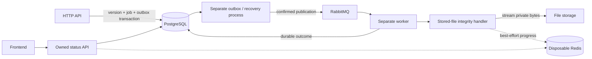

# QYVRA v1.2.0 — Developer Changes

This incremental guide covers the Phase 3 asynchronous processing foundation.
Read it after the [v1.1.0 changes](v1.1.0.md) and alongside the
[v1.0.0 baseline chapters](../README.md#reading-map). Those versions remain
historical; this guide explains the changed processing, runtime and document
lifecycle behavior. Existing authentication, metadata discovery, pagination,
categories/tags, uploads, versions and downloads remain supported.

## Version and inspection provenance

| Item                         | Value                                                                            |
| ---------------------------- | -------------------------------------------------------------------------------- |
| Inspection date              | 1 October 2026                                                                   |
| Branch                       | `v1.2.0`                                                                         |
| Committed HEAD at inspection | `abc3677545f4181aa00bdfafa718d7dc1c5095f2`                                       |
| Implementation inspected     | Current working tree, including uncommitted Phase 3 implementation and T14 fixes |
| Acceptance                   | T01–T14 accepted for the approved scope; see the T14 record and its limitations  |
| Local `v1.2.0` tag           | Not present at inspection                                                        |

This is a developer guide, not a claim that the inspected HEAD alone contains
all Phase 3 changes or that a release was published. Private npm packages still
use `0.0.1`; HTTP routes still use `/api/v1`. Product version, package versions
and API version are separate identifiers. The
[T14 acceptance record](../../phase-3-acceptance.md) owns the release-readiness
matrix, exact checks, dependency findings and upgrade/rollback guidance.

## What changes from v1.1.0

**Implemented:** each new immutable document version schedules a
`VERIFY_STORED_FILE` job and durable outbox intent. A separate dispatcher
publishes the intent through confirmed RabbitMQ transport. An independent
worker streams the stored bytes and compares size and SHA-256 with the existing
upload metadata. PostgreSQL records the result, attempts and retry/recovery state.
The owned status API and frontend expose that state with optional Redis progress.

Processing does not reuse `Document.status`. Document lifecycle, extraction
vocabulary and processing jobs remain separate concepts. Upload responses do not
wait for RabbitMQ, a worker, Redis or integrity verification to complete.

**Planned / Future, outside v1.2.0:** OCR, text extraction, chunking, Elasticsearch,
Qdrant, embeddings, semantic/hybrid retrieval, RAG, LLM providers, chat, agents,
MCP, WebSockets and SSE. Phase 3 creates a processing boundary for future handlers;
it does not implement content search or AI.

## Runtime and source navigation



The worker is a separate entry point in `apps/api`, not a copied API application
or an `apps/worker` directory. It shares domain/persistence infrastructure without
starting the public HTTP API. The outbox runtime also runs processing recovery;
the worker consumes RabbitMQ rather than polling the outbox.

| Area                                         | Start reading here                                                                                                                                                                                                                                    |
| -------------------------------------------- | ----------------------------------------------------------------------------------------------------------------------------------------------------------------------------------------------------------------------------------------------------- |
| Models and constraints                       | [Prisma schema](../../../packages/database/prisma/schema.prisma), [database guide](../../database.md)                                                                                                                                                 |
| Job creation and versioned intent            | [Processing contract](../../../packages/database/src/processing.ts)                                                                                                                                                                                   |
| Lifecycle, retry and lease-fenced operations | [Rules](../../../packages/database/src/processing-rules.ts), [repository](../../../packages/database/src/processing-repository.ts)                                                                                                                    |
| Upload transaction and compensation          | [Upload service](../../../apps/api/src/modules/documents/upload.service.ts), [upload repository](../../../apps/api/src/modules/documents/upload.repository.ts)                                                                                        |
| Archive/delete/restore integration           | [Documents service](../../../apps/api/src/modules/documents/documents.service.ts)                                                                                                                                                                     |
| Message validation and topology              | [Message contract](../../../apps/api/src/infrastructure/messaging/processing-message.ts), [RabbitMQ topology](../../../apps/api/src/infrastructure/messaging/rabbitmq-topology.ts)                                                                    |
| Dispatcher and recovery                      | [Outbox entry point](../../../apps/api/src/outbox-main.ts), [dispatcher](../../../apps/api/src/infrastructure/outbox/outbox-dispatcher.service.ts), [recovery](../../../apps/api/src/infrastructure/outbox/processing-recovery.service.ts)            |
| Worker and execution boundary                | [Worker entry point](../../../apps/api/src/worker-main.ts), [consumer](../../../apps/api/src/infrastructure/messaging/rabbitmq.consumer.ts), [message handler](../../../apps/api/src/infrastructure/worker/processing-message-handler.ts)             |
| Actual file verification                     | [Integrity handler](../../../apps/api/src/infrastructure/worker/stored-file-integrity.handler.ts)                                                                                                                                                     |
| Optional progress                            | [Progress interface](../../../apps/api/src/infrastructure/progress/processing-progress.ts), [Redis adapter](../../../apps/api/src/infrastructure/progress/redis-processing-progress.store.ts)                                                         |
| Owned HTTP status                            | [Controller](../../../apps/api/src/modules/documents/processing-status.controller.ts), [query service](../../../apps/api/src/modules/documents/processing-status.service.ts), [DTO](../../../apps/api/src/modules/documents/processing-status.dto.ts) |
| Client and display                           | [API client](../../../apps/web/lib/api/processing.ts), [status view](../../../apps/web/features/documents/processing-status.tsx), [presentation rules](../../../apps/web/features/documents/processing-presentation.ts)                               |

Detailed contracts and operational settings remain canonical in the
[processing guide](../../phase-3-processing.md) and
[ADR-002](../../decisions/ADR-002-durable-processing-outbox-worker.md).

## Walkthrough: upload to completion

1. The existing authenticated upload path validates and stores the file through
   the storage abstraction. The shared commit operation writes the immutable
   version, processing job, outbox intent and completed upload receipt in one
   PostgreSQL transaction. File storage uses compensation outside that transaction;
   it is not part of a distributed atomic commit. Upload-key replay adds no new job.
2. The outbox process claims eligible intent, uses the messaging abstraction and
   records publication only after broker confirmation. A crash after confirmation
   but before recording it may publish the same message ID again.
3. The worker validates the envelope, resolves authoritative job/version data,
   checks eligibility and obtains a conditional PostgreSQL claim. A successful
   claim increments the attempt counter. Terminal or stale duplicate deliveries
   do not automatically restart completed work.
4. The integrity handler streams private storage and checks size/digest. Its
   outcome is persisted through job operations before acknowledgement. Retryable
   failures and expired leases use PostgreSQL-backed recovery and new outbox intent;
   RabbitMQ redelivery is not the authoritative job retry counter.
5. The frontend polls the owned status API. Redis may enrich a processing job with
   current-attempt progress, but missing/unavailable Redis yields durable status
   with `progress: null`. PostgreSQL completion/failure wins over stale progress.

Delivery is **at least once**. Lease fencing protects durable outcomes; repeated
I/O around a crash remains possible. Neither exactly-once execution nor global
ordering is promised.

## Document lifecycle and compatibility

Archive and soft delete cancel unfinished jobs and clear their leases in the
document transaction. A worker already reading may finish I/O but cannot commit
an outcome with an invalidated execution token. Restore schedules a new generation
and outbox intent only for cancelled integrity work on the current version.
Completed work stays completed; historical versions are not automatically backfilled.
Permanent deletion remains **Not Implemented**.

Each additional version gets its own job. Existing upload/version response bodies
are preserved. Clients cannot supply job status, attempts, routing or outbox fields.

The read-only route is:

```text
GET /api/v1/documents/:documentId/versions/:versionId/processing
```

It returns the newest job generation per type in the existing success envelope.
An existing version with no job returns `jobs: []`, not an invented completion.
Statuses are `PENDING`, `QUEUED`, `PROCESSING`, `RETRYING`, `COMPLETED`, `FAILED`
and `CANCELLED`. Safe failure categories and optional progress are mapped explicitly;
ORM entities, outbox details, broker metadata, leases and storage paths are hidden.
The [API guide](../../api.md) and controller/DTO links above own the exact schema.

Ownership is checked through the authenticated document/version relationship.
Foreign, missing and soft-deleted resources return indistinguishable 404 responses;
unauthenticated requests return 401. Archived status remains readable to its owner.
There is no tenant feature or public manual-retry/status-mutation endpoint.

The document detail and inspected version history display status. Active jobs
poll every five seconds; terminal jobs stop polling. The document catalog does
not perform per-row status requests. Small jobs can complete before an intermediate
progress percentage is visible.

## Run and verify

For the complete stack, configure the existing root environment as described in
[Compose setup](../../compose.md), then run `docker compose up --build -d`.
Services include PostgreSQL, RabbitMQ, optional Redis, migration, API, outbox,
worker, web and Nginx. Preserve the Compose project name and existing credentials;
never use volume deletion as an upgrade step.

For host processes, first configure database/private storage and the required
broker URL using the [environment reference](../../deployment/environment-variables.md).
Build once from the repository root:

```sh
npm --prefix apps/api run build
```

Run these in separate terminals as needed:

```sh
npm --prefix apps/api run start:prod
npm --prefix apps/api run start:outbox
npm --prefix apps/api run start:worker
```

The HTTP API can run without the outbox/worker; asynchronous work remains pending.
The outbox/worker need PostgreSQL and RabbitMQ. Worker storage must be readable;
Compose mounts originals read-only in the worker. Redis is optional. Do not
publish directly from document services or run verification in an HTTP request.

Focused test entry points include
[upload scheduling](../../../apps/api/test/upload-scheduling.integration-spec.ts),
[outbox](../../../apps/api/test/outbox.integration-spec.ts),
[worker](../../../apps/api/test/worker.integration-spec.ts),
[status](../../../apps/api/test/processing-status.integration-spec.ts), and
[browser processing](../../../apps/web/e2e/phase-three.spec.ts).
Use isolated database/broker/Redis settings for integration tests. The
[T13 evidence](../../phase-3-verification.md) and
[T14 acceptance](../../phase-3-acceptance.md) record actual results, skipped cases,
dependency audit findings and unexecuted deployment drills. This documentation
addition does not represent a new execution of those tests.

Upgrade/rollback procedures and genuine limitations remain in
[T14](../../phase-3-acceptance.md#upgrade-and-rollback-guidance). Do not enable
future processing types or exposed framework features without their own contracts,
security review, migrations and verification.
