# QYVRA v1.3.0 — Developer Changes

This version delta explains the implemented Phase 4 AI/RAG foundation. Read it
after [v1.2.0](v1.2.0.md), [v1.1.0](v1.1.0.md) and the preserved
[v1.0.0 baseline](../README.md#reading-map). Authentication, private originals,
immutable document versions and the Phase 3 job system remain the foundation.
The task guides supply deeper contracts; this guide connects those contracts to
code, developer workflows and operations rather than replacing them.

## Inspection and release identity

| Item                              | Value                                                                                  |
| --------------------------------- | -------------------------------------------------------------------------------------- |
| Documentation correction          | 9 October 2026                                                                         |
| Branch / HEAD inspected           | `main` / `4e6bc02` (`Initial V3`)                                                      |
| Working tree at inspection        | Clean; Phase 4 implementation and initial T13 docs already committed by the maintainer |
| Product designation               | v1.3.0 / Phase 4, prepared candidate, not a published release                          |
| Local release tags                | v1.1.0 only; no v1.3.0 tag                                                             |
| T12 acceptance                    | READY WITH KNOWN NON-BLOCKING LIMITATIONS, 8 October 2026                              |
| Private packages / HTTP / OpenAPI | `0.0.1` / `/api/v1` / `1`, intentionally independent of product version                |

The [versioning policy](../../development/conventions.md#versioning) uses Git
release tags for product identity. There is no root or separate worker manifest,
application release-version constant, release-tagged image or release automation
to bump. API and worker share `apps/api`; the four private package manifests and
lock roots retain `0.0.1`. No dependencies or transport/schema/profile identities
change for this documentation correction. [Release notes](../../releases/v1.3.0.md)
describe included scope; [T12](../../phase-4-verification.md) owns runtime evidence.

## Architecture and complete data flow

```mermaid
flowchart LR
    Upload[Owned upload / new version] --> SQL[(PostgreSQL)]
    SQL --> Outbox[Outbox and recovery runtime]
    Outbox --> MQ[RabbitMQ identifiers]
    MQ --> Worker[Independent worker]
    Worker --> Verify[Integrity verification]
    Verify --> Extract[Isolated PDF extraction]
    Extract --> Chunks[Deterministic chunking]
    Chunks --> Embed[Embedding provider]
    Embed --> Index[Qdrant indexing and verification]
    Index --> Activate[Atomic SQL ready pointer]
    Question[Owned question] --> API[Search / RAG API]
    API --> SQL
    API --> Query[Compatible query embedding]
    Query --> Qdrant[(Derived Qdrant index)]
    Qdrant --> Authorize[Canonical SQL revalidation]
    Authorize --> Context[Authorized untrusted context]
    Context --> Generate[Independent generation provider]
    Generate --> Publish[Reauthorize and validate citations]
    Publish --> Frontend[Plain text and authorized source navigation]
```



Arrows between worker stages represent separate durable jobs, not chained work
inside one handler. PostgreSQL stores jobs, prerequisites, attempts, leases,
artifacts, desired runs, index manifests and serving pointers. The outbox publishes
after commit; RabbitMQ is transport with at-least-once delivery. Redis progress is
optional and disposable. Original bytes remain behind `packages/storage`; workers
read through that contract, not public upload paths. Qdrant is a rebuildable index.
Interactive retrieval and answers are bounded API operations, independent of the
ingestion queue. Embedding and generation providers have separate configuration.

| Responsibility                            | Source entry point                                                                                                                                                                                                                                                                                       |
| ----------------------------------------- | -------------------------------------------------------------------------------------------------------------------------------------------------------------------------------------------------------------------------------------------------------------------------------------------------------- |
| Authoritative data / artifact publication | [Prisma schema](../../../packages/database/prisma/schema.prisma), [AI contracts](../../../packages/database/src/ai.ts), [scheduling](../../../packages/database/src/ai-scheduling.ts)                                                                                                                    |
| Jobs, leases, completion and checkpoints  | [Processing repository](../../../packages/database/src/processing-repository.ts), [pipeline](../../../packages/database/src/processing-pipeline.ts)                                                                                                                                                      |
| Worker routing and handlers               | [Worker module](../../../apps/api/src/infrastructure/worker/worker.module.ts), [message handler](../../../apps/api/src/infrastructure/worker/processing-message-handler.ts)                                                                                                                              |
| Durable publication and recovery          | [Outbox dispatcher](../../../apps/api/src/infrastructure/outbox/outbox-dispatcher.service.ts), [recovery](../../../apps/api/src/infrastructure/outbox/processing-recovery.service.ts)                                                                                                                    |
| Native provider and vector adapters       | [Embedding HTTP adapter](../../../apps/api/src/infrastructure/embeddings/openai-compatible.provider.ts), [generation HTTP adapter](../../../apps/api/src/infrastructure/generation/openai-compatible.provider.ts), [Qdrant adapter](../../../apps/api/src/infrastructure/vectors/qdrant-vector-store.ts) |
| Retrieval / answers                       | [Search service](../../../apps/api/src/modules/search/semantic-search.service.ts), [RAG service](../../../apps/api/src/modules/ai/rag-answer.service.ts)                                                                                                                                                 |

For changing behavior, follow the relevant application interface before touching
an SDK adapter. Never add another queue/job table or put text/vectors in messages.
See [architecture](../../architecture.md) and [processing](../../phase-4-processing.md).

## Database, immutable generations and provenance

The 15-migration chain includes two additive Phase 4 migrations:
`20261004010000_ai_data_foundation` and `20261006010000_ai_reprocessing_requests`.
No migration automatically seeds a model/profile or enrolls existing documents.

| Model                       | Durable responsibility                                                                                      |
| --------------------------- | ----------------------------------------------------------------------------------------------------------- |
| `EmbeddingProfile`          | Immutable provider/model/revision/dimension/configuration identity and fingerprint; no credentials          |
| `AiProcessingRun`           | Version-specific configuration snapshot and generation coordinating existing jobs                           |
| `ExtractedText`             | Immutable canonical text, extractor/normalizer identity, source/content hashes, page count and scalar spans |
| `ChunkSet`, `DocumentChunk` | Complete immutable ordered set, stable chunk identity, exact source substring/hash and page intersections   |
| `ChunkEmbedding`            | Actual SQL vectors and input hash, unique per chunk/profile, allowing provider-free index reconstruction    |
| `VersionVectorIndex`        | Manifest for a particular chunk set/profile/run, remote progress and verified publication state             |
| `VersionReadyIndex`         | Authoritative version/profile ready-manifest pointer; remote payload flags cannot publish a generation      |
| `VersionAiState`            | Desired current processing run; stale writers cannot publish replacements                                   |
| `AiServingProfile`          | Explicit SQL selection of the compatible interactive embedding profile                                      |
| `AiReprocessingRequest`     | Owned idempotent request receipt, not another job system                                                    |

Owned composite foreign keys maintain `DocumentChunk → ChunkSet → ExtractedText →
DocumentVersion → Document` lineage. Unique fingerprints, ordinals and checkpoint
identities prevent uncontrolled duplicates. SQL-only checks/triggers complement
Prisma: complete outputs and exact lineage are required before downstream success.
Use migrations and repository transactions as well as the ORM when reviewing an
invariant. [Data foundation](../../phase-4-data-foundation.md) and
[database guide](../../database.md) describe constraints in detail.

Chunks use deterministic Qyvra UUIDv5 identities; Qdrant point IDs are manifest-scoped
and are not canonical chunk identity. Source offsets are half-open Unicode scalar
positions in canonical extracted text, not JavaScript UTF-16 indices or bytes.
Page numbers are one-based, chunk ordinals zero-based. Multi-page chunks retain
truthful source spans. Historical owned retained text can be inspected after a newer
version appears; retrieval only serves eligible current versions.

## Worker stages and failure boundaries

1. `VERIFY_STORED_FILE`: stream original bytes, compare size/hash, and durably satisfy
   the prerequisite before extraction.
2. `EXTRACT_TEXT`: the [handler](../../../apps/api/src/infrastructure/worker/pdf-text-extraction.handler.ts)
   uses isolated PDF.js `6.4.299`, extractor `6.4.299-qyvra-layout-v1`, normalization
   `nfc-lf-v1`. Pages stay ordered; Unicode NFC, control/space normalization and LF
   preserve useful line boundaries. Pages join with two LF characters. Canonical
   content/page spans commit with stage completion and successor intent.
3. `GENERATE_CHUNKS`: the [local deterministic chunker](../../../apps/api/src/modules/ai/deterministic-chunker.ts)
   implements `qyvra-structural` / `v1`, pinned `cl100k_base` / `tiktoken-1.0.22`.
   Default maximum is 512 actual tokens, suffix overlap budget 64; overlap must be
   smaller than size. Paragraph, line, sentence and word boundaries precede a
   whole-scalar hard fallback. A terminal overlap-only chunk is not emitted. The
   complete chunk set, success and embedding intent commit atomically.
4. `GENERATE_EMBEDDINGS`: bounded ordered batches use the immutable profile. Response
   count, indices, model, dimensions and finite nonzero vectors all validate before
   any batch checkpoint. Compatible saved rows are reused after interruption; no
   SQL transaction spans a provider call. Invalid output cannot become complete.
5. `INDEX_VECTORS`: SQL checkpoints are loaded without an embedding call. Collection
   `qyvra_chunks_<profile UUID without hyphens>_v1` uses fixed-dimensional Cosine
   vectors. Idempotent manifest/chunk points are verified after upsert; all expected
   points and exact manifest count must verify before atomic SQL READY activation.

Lifecycle, desired-run and live lease fences apply before expensive work and again
before publication. Failed upstream stages never enable downstream stages. Shared
PostgreSQL retry/backoff/recovery handles retryable infrastructure failures; malformed,
encrypted, unsupported/limit-exceeding PDFs and no usable text are terminal controlled
outcomes. No OCR, placeholder text, empty chunk or fabricated embedding is produced.
Parser diagnostics and document contents are not logged. Production PDF parsing
requires the Linux socket-denying launcher; Windows development does not provide
equivalent kernel isolation. [Extraction](../../phase-4-pdf-extraction.md),
[chunking](../../phase-4-chunk-generation.md), [embeddings](../../phase-4-embedding-generation.md)
and [indexing](../../phase-4-vector-indexing.md) specify exact limits and failure codes.

An old eligible same-version/profile ready generation remains usable during a
replacement build. New-version upload immediately excludes the old version from
retrieval. Archive/soft delete revoke SQL readiness and schedule exact-manifest
cleanup; retained artifacts support provenance and restore. Restore reuses verified
compatible extraction/chunks/embeddings but creates a new indexing manifest. Cleanup
cannot target another manifest or owner. Hard purge has no public endpoint; remote
cleanup, writer fencing and absence reconciliation precede dropping tombstones.

## API requests, responses and errors

All paths below use `/api/v1`, authenticated sessions, owned SQL lookups and no-store
responses. POST requests require `X-CSRF-Protection: 1` and the established Origin
policy. Unknown DTO properties are rejected; clients cannot select owner, model,
profile, prompt, vector or provider URL. Generated Swagger remains the full transport
reference at `/api/v1/docs/` and `/api/v1/docs-json`.

| Operation                                                           | Contract                                                                                                                                                                                                                     |
| ------------------------------------------------------------------- | ---------------------------------------------------------------------------------------------------------------------------------------------------------------------------------------------------------------------------- |
| `POST /search/semantic`                                             | `{query, limit?, documentIds?}`; trimmed query 1–4000 UTF-16 units, limit 1–20 (default 8), optional 1–50 unique owned document UUIDs. Returns `data:{results:[...]}`.                                                       |
| `POST /rag/answers`                                                 | `{question, documentIds?}` with the same question/document bounds; returns answered or insufficient-evidence data, never a persisted conversation.                                                                           |
| `GET /documents/{documentId}/versions/{versionId}/processing`       | Existing owned status plus pipeline and `aiReadiness`; successful integrity alone is not search readiness.                                                                                                                   |
| `POST /documents/{documentId}/versions/{versionId}/ai/reprocess`    | Current active supported version, UUIDv4 `Idempotency-Key`, body `{mode?}` default `repair`; extraction/chunking/embedding/index modes are also explicit backend contracts. Returns a 202 scheduling receipt, not readiness. |
| `GET /documents/{documentId}/versions/{versionId}/chunks/{chunkId}` | Exact owned canonical source, no query/body; retained historical complete chunks are allowed while document lifecycle is active.                                                                                             |

Search results contain `chunkId`, `documentId`, `documentVersionId`, `chunkSetId`,
`indexManifestId`, `embeddingProfileId`, `chunkOrdinal`, `versionNumber`, `title`,
`originalFilename`, `excerpt`, `excerptHash`, `startOffset`, `endOffset`, `pageSpans`
and finite `score`. Scores are similarity, not probability; all content/metadata is
hydrated and authorized from SQL, never accepted from Qdrant payload text.

Success uses `{data,meta:{requestId}}`. Answered RAG data is
`{outcome:"answered",answer,requestId,claims:[{text,citationIds}],citations}`.
Citation fields are `citationId`, document/version/chunk identifiers and ordinal,
title/filename/version number, `pageSpans`, `excerptStart`, `excerptEnd`,
`excerptHash`, `excerpt`. Request-local `S1` tokens map to SQL-owned sources, not
model-authored URLs or identifiers. The server builds answer markers from validated
claim references; validation establishes provenance, not semantic entailment.

Insufficient evidence returns 200 with
`{outcome:"insufficient_evidence",answer:null,requestId,citations:[],reason}`.
Reasons are `no_authorized_evidence`, `context_budget`, `model_insufficient_evidence`
or `evidence_changed`. With insufficient authorized context, unnecessary generation
is avoided. The source endpoint returns citation provenance without `citationId`.

Common failures: 400 invalid input, 401 no session, 403 CSRF/Origin, 404 inaccessible
document/source, 409 conflicting reprocessing, 429 admission/provider rate limit,
503 disabled/unavailable provider/index, 504 deadline. Malformed/uncited/fabricated
generation output becomes safe 502 `AI_OUTPUT_INVALID`, never a published answer.
Error envelopes use `error:{code,message,details,traceId}` and safe generic messages.
Read the [search controller](../../../apps/api/src/modules/search/semantic-search.controller.ts),
[RAG controller](../../../apps/api/src/modules/ai/rag-answer.controller.ts),
[source controller](../../../apps/api/src/modules/documents/citation-source.controller.ts)
and [API guide](../../api.md) before changing transport contracts.

## Frontend navigation and developer entry points

The protected `/ai` page offers **Semantic search** and **Ask documents**. Submission
is explicit; changing modes clears results. Cancellation ignores late responses,
and state clears across owner changes. Questions/answers remain local component
state, not URLs, browser storage or conversation tables.

- [AI page](../../../apps/web/features/ai/ai-page.tsx): form, modes, results, loading,
  empty/insufficient-evidence states and safe operational errors.
- [Typed HTTP/Zod client](../../../apps/web/lib/api/ai.ts): credentialed requests,
  cancellation/deadlines, response shape and source provenance checks.
- [Source components](../../../apps/web/features/ai/source-components.tsx): validated
  citation tokens, source Sheet, exact excerpt checks and canonical navigation.
- [Processing UI](../../../apps/web/features/documents/processing-status.tsx): shared
  status/readiness polling and AI preparation, with owned reprocessing confirmation.

Only server-validated citation tokens become buttons; HTML, unknown tokens and URLs
remain literal text. Opening a source issues a fresh authenticated request before
showing text/navigation. The protected route
`/documents/:documentId/versions/:versionId/sources/:chunkId` retains exact version
identity and links to document details/history. Historical PDF download and direct
page viewing are not implemented. Readiness values are READY, PROCESSING, FAILED,
UNSUPPORTED and UNAVAILABLE; READY reflects SQL eligibility, not current remote
Qdrant/provider health. See [frontend contracts](../../phase-4-ai-frontend.md).

## Security boundaries

There is user ownership, **no independent tenant entity**. Do not claim multi-tenant
isolation tests for a tenant model that does not exist. Sessions supply internal
`userId`; request and RabbitMQ identifiers never grant authority. Every Qdrant query
uses owner/profile/ready-manifest filters, followed by PostgreSQL lifecycle, current
version, complete artifact and ownership revalidation before content disclosure.
Stale/malicious payloads cannot override SQL authorization.

RAG serializes authorized document text as untrusted evidence, separate from system
instructions. Reauthorization occurs before generation and before publication.
Documents cannot authorize actions or override policy; no tools/actions execute.
Citation membership/coverage is validated server-side, but model accuracy and all
prompt-injection variants are not proven. Never log questions, text, vectors, prompts,
provider bodies or credentials by default. Provider errors are sanitized; credentials
remain server-side, never `NEXT_PUBLIC_*`, SQL profiles, prompts or vector payloads.
Qdrant stays on the private service network; externally hosted provider disclosure
requires operator retention/residency review. [T12 security evidence](../../phase-4-verification.md)
distinguishes tested attack cases from universal security claims.

## Development, deployment and operations

Use Node 24+ and install the four packages independently following
[getting started](../../development/getting-started.md). Host services and Compose
use different connection addresses; do not copy container hostnames into host config.
Preserve existing `.env`, initialization credentials and volume mappings. Local
Compose runs Nginx, web, API, migration task, worker, outbox, PostgreSQL, RabbitMQ,
Redis and private Qdrant. Elasticsearch is not installed. For a new environment,
copy `.env.example`, replace placeholders, then:

```sh
docker compose --env-file .env.example config --quiet
docker compose up --build -d
docker compose ps --all
docker compose logs --tail 100 migrate api worker outbox
```

The first command validates example syntax only; actual startup reads `.env`.
Migration deploy runs before API/worker startup. Never destroy volumes to resolve a
configuration error; an external volume must exist or map to the intended existing
volume. [Compose](../../compose.md) and [volume compatibility](../../docker-rename.md)
explain safe startup, backups and upgrades. Docker builds the Linux PDF sandbox;
host production extraction additionally requires its compiled launcher.

For host development, API/web run with `npm --prefix apps/api run start:dev` and
`npm --prefix apps/web run dev`. Outbox/worker consume built code; after building
the API, run in separate terminals:

```sh
npm --prefix apps/api run build
npm --prefix apps/api run start:outbox
npm --prefix apps/api run start:worker
```

Load each process's validated configuration and private storage access first. API
absence of a worker does not make pending asynchronous work successful. Redis loss
only removes temporary progress. RabbitMQ loss leaves SQL intent for outbox recovery.

AI defaults disabled. Provision the immutable SQL `EmbeddingProfile`, using the
fingerprint helper in `packages/database/src/ai.ts`, and explicitly select
`AiServingProfile` for retrieval; there is no seeding migration or invented profile
provisioning CLI. Enable worker `EMBEDDING_ENABLED` and `VECTOR_INDEX_ENABLED`, with
matching `EMBEDDING_PROFILE_FINGERPRINT`, provider/model/revision/dimensions and
private endpoint credentials. Then enable `AI_INGESTION_ENABLED` with
`AI_INGESTION_PROFILE_FINGERPRINT`, compatible chunk settings on API/worker, and
`SEMANTIC_SEARCH_ENABLED` with `SEMANTIC_SEARCH_PROFILE_FINGERPRINT` where configured.
Enable `RAG_ENABLED` only after search, explicit score-floor calibration and separate
`GENERATION_*` configuration. RAG startup requirements fail closed.

`PDF_EXTRACTION_*` bounds bytes/pages/text/heap/time; `CHUNK_*` bounds tokens/overlap,
count/output/time; `EMBEDDING_*` bounds input/batch/deadline; `VECTOR_INDEX_*` controls
batches; `SEMANTIC_SEARCH_*` and `RAG_*` bound interactive work and admission. Settings
and ceilings are authoritative in [environment validation](../../../apps/api/src/configuration/environment.ts)
and the [environment guide](../../deployment/environment-variables.md). Never copy
fixture-only HTTP/trust settings into production. Model changes require a new
compatible immutable profile/generation, not editing an existing profile in place.

Backfill is an operator scan, not orchestration replacement. After enabling a
provisioned profile, inspect a bounded dry-run:

```sh
docker compose exec api node /app/infrastructure/docker/database-command.cjs node scripts/ai-backfill.cjs --batch 25 --max 100
```

Host equivalent from `apps/api`: `npm run ai:backfill -- --batch 25 --max 100`.
`--apply` enrolls durable work; resume with `--after <last-version-uuid>`. Repeating
an ambiguous batch is safe. The cursor is an exclusive UUID keyset, not a snapshot;
another sweep includes concurrently created/restored earlier UUIDs. Scheduling chooses
the earliest missing valid stage and reuses compatible artifacts, without resetting
exhausted equivalent work. Explicit reprocessing distinguishes a new generation from
retry/redelivery. See [ingestion/backfill](../../phase-4-ingestion.md).

After Qdrant loss, preserve PostgreSQL/files and durable embeddings, restore Qdrant
connectivity, and request owned **index** reprocessing. Ordinary backfill trusts SQL
readiness and does not detect remote collection loss. Rebuild verifies saved vectors,
recreates/upserts expected points and atomically activates a new ready generation,
without calling the embedding provider. Replay failed cleanup through the documented
operator procedures before hard purge. Never manually mark partial manifests READY.
See [operational recovery](../../phase-4-verification.md#operational-recovery).

| Symptom                           | Inspect first                                                                                                                    |
| --------------------------------- | -------------------------------------------------------------------------------------------------------------------------------- |
| Integrity complete, AI absent     | Ingestion enabled/provisioned profile, supported PDF, desired-run/status; integrity-only success is expected when AI is disabled |
| Processing stalled                | Job prerequisite/status/attempt/lease, worker and outbox logs, broker connectivity; recover via durable state, not Redis edits   |
| Empty/image-only or encrypted PDF | Controlled extraction failure; no OCR/password mechanism is available                                                            |
| No search results                 | Owner/current active version, serving profile compatibility, ready pointer, score floor and remote collection health             |
| 502 on Q&A                        | Sanitized invalid-output category; do not weaken citation validation or log raw generation                                       |
| Source unavailable                | Exact owned version/chunk, complete set and active document; navigation is independently authorized                              |
| External Qdrant volume missing    | Verify intended volume mapping and existence; preserve developer data before changing configuration                              |

## Verification and known limitations

T12's final ledger records **419 API unit, 237 API integration, 281 API HTTP, 214
web and 11 browser cases** passed across saved/continuation runs, not one repeated
monolithic suite. It includes clean 15 migrations and native Phase 3 SQL upgrade,
real infrastructure with deterministic provider fixtures, nine native Linux PDF
fixtures, SQL ownership/stale-point checks, invalid citations/injection examples,
checkpoint/crash recovery, Qdrant loss/rebuild without re-embedding, Redis/broker
outages, lifecycle/reprocessing/backfill and source navigation/theme/keyboard cases.
These are historical T12 results, **not rerun for this documentation correction**.

For development changes, start with the affected scope:

- [Pipeline integration](../../../apps/api/test/ai-processing.integration-spec.ts),
  [chunk publication](../../../apps/api/test/chunk-generation.integration-spec.ts),
  [embedding checkpoints](../../../apps/api/test/embedding-generation.integration-spec.ts),
  [index activation](../../../apps/api/test/vector-indexing.integration-spec.ts).
- [Search isolation](../../../apps/api/test/semantic-search.integration-spec.ts),
  [RAG validation](../../../apps/api/test/rag-answer.integration-spec.ts),
  [ingestion lifecycle](../../../apps/api/test/ai-ingestion.integration-spec.ts),
  [frontend AI](../../../apps/web/tests/ai.integration.test.tsx).

Use `npm --prefix apps/api run test:integration:isolated` for the isolated integration
harness; [testing](../../development/testing.md) documents fixture services and
environment requirements. Unit tests, lint/type checks and builds remain package
scripts; do not treat mocks as live-provider smoke tests or run destructive recovery
against developer volumes.

Known limits: production high/critical audit gates passed but five moderate API
advisories and dev-tooling findings remain; full web formatting has 25 unchanged
baseline warnings. Remote CI, paid/live-model quality, universal prompt-injection
resistance, production load/HA, full accessibility audit, actual older Docker-volume
upgrade and rollback drills remain unexecuted. Repeated pre-checkpoint provider
calls may incur cost; batch resumption avoids recomputing valid saved work but cannot
guarantee exactly-once external billing. Similarity thresholds require calibration.

PDF text only; no OCR, additional AI document formats, persistent chat, streaming,
agents/tools, LangChain/LangGraph, MCP/Hermes, hybrid search or local model
orchestration. Local/Ollama-compatible infrastructure may use a validated compatible
HTTP deployment; no separate local orchestration or unrestricted compatibility is
claimed. Original PDF/JPEG/PNG access remains available when AI fails.

The release status remains **READY WITH KNOWN NON-BLOCKING LIMITATIONS** within
T12's supported tested scope. See [T13 correction and validation](../../phase-4-release-preparation.md#t13-correction--9-october-2026)
for documentation-only checks. Review the exact release commit and run its remote
CI before tagging; no commit, tag, push, deployment or Phase 5 work is part of this correction.
