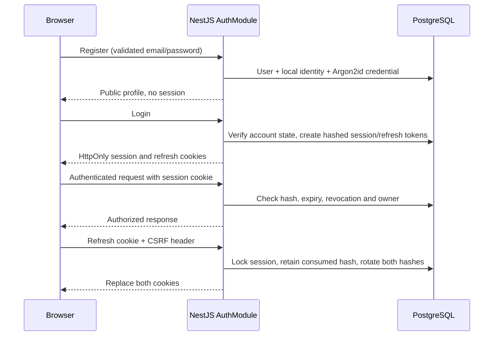

# Authentication and account settings

[Documentation index](../README.md) | [API conventions](../api.md)

## Purpose and workflow

Register at `/register`, then sign in separately at `/login`. The protected shell
opens `/dashboard`; its account menu links to `/settings` and logout. Settings
supports display name, timezone, locale, password change and confirmed logout-all.
Email changes, password reset, email verification, MFA and external login are **Not Implemented**.

The API also exposes owned session listing and single/other-session revocation;
there is no individual-session management UI. A password change requires the current
password, retains the current session and revokes other sessions. Logout-all revokes
this browser too. Profile editing does not change ownership or identity keys.

## Session flow

[AuthModule](../../apps/api/src/modules/auth/auth.module.ts) owns registration,
login, profile, password, session lifecycle and management. `SessionAuthGuard`
provides trusted user/session context; requests cannot choose their owner.
Models are `User`, `UserIdentity`, `LocalCredential`, `AuthSession` and
`ConsumedRefreshToken`; see [database](../database.md). Stable internal `users.id`
remains the ownership key; local identity uses provider LOCAL, issuer `local` and
subject equal to that ID. KEYCLOAK/OIDC enum values do not implement external login.

## Validation, security and edge cases

Email is normalized to lowercase/trimmed form. Passwords default to 15-128 Unicode
code points, reject whitespace-only input and are never trimmed/normalized before
Argon2id hashing (64 MiB, three iterations, one lane). Only SHA-256 hashes of random
session/refresh tokens persist. Session validity is checked in PostgreSQL on every
private request; last-seen writes are limited to once per minute.

Login combines account lockout with process-local request throttling. Errors are
sanitized. Browser Origins must be allowlisted, including same-origin login;
authenticated mutations require `X-CSRF-Protection: 1`. See [API security rules](../api.md#authentication-and-authorization)
for absent-Origin behavior and [environment settings](../deployment/environment-variables.md)
for cookie policy and expiry defaults.

Refresh retains the absolute refresh deadline. Reuse of a consumed refresh hash
revokes that session, so the client serializes refresh through a shared promise and
Web Locks across tabs. BroadcastChannel coordinates login/logout without tokens.
Web Locks require a secure context (localhost or HTTPS); without them the client
requires login again after access expires. Use one canonical frontend origin.
A network ambiguity during rotation is not blindly retried. Tokens never enter
React state or browser storage; safe profile/query data is held in memory.

## Frontend and tests

[Auth provider/forms](../../apps/web/features/auth), [account settings](../../apps/web/features/account)
and [HTTP clients](../../apps/web/lib/api) implement these flows. Client protection
withholds content until `/auth/me` succeeds; the API remains the authorization boundary.

Related tests: AuthModule service specs; API `registration`, `login`, `session`,
`session-lifecycle`, `session-management`, `profile` and `security` suites under
[API tests](../../apps/api/test); frontend [auth integration](../../apps/web/tests/auth.integration.test.tsx),
[account integration](../../apps/web/tests/account.integration.test.tsx) and
[real browser workflows](../../apps/web/e2e/phase-one.spec.ts).
See [testing](../development/testing.md) and [release evidence](../releases/v1.0.0.md#verification-evidence).
