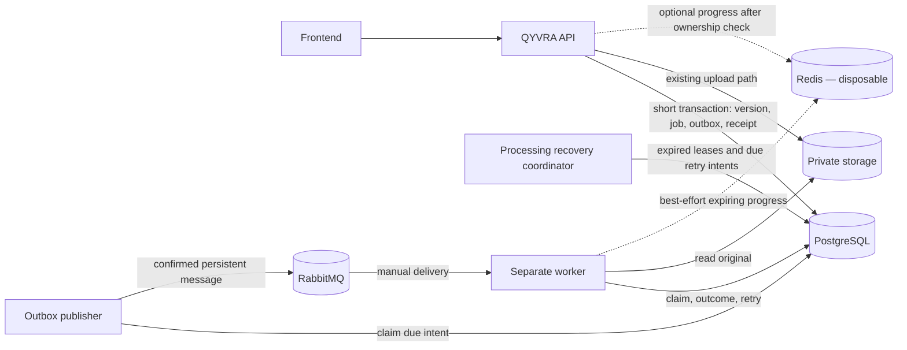

# v1.2.0 Phase 3 processing foundation

**Phase 4 T03 orchestration is implemented:** [durable stage contracts and lifecycle](phase-4-processing.md)
cover atomic successor scheduling, v2 transport, shared retry/recovery, worker routing,
lifecycle fencing and the owned status extension. T04–T11 implement PDF extraction,
chunks, embeddings, Qdrant, semantic retrieval, RAG and source navigation as
extensions of this foundation; see [Phase 4](phase-4-ai-rag.md). T08 automatic AI
enrollment is opt-in and disabled by default. The Phase 3 checkpoint below is preserved.

[Documentation index](README.md) | [Roadmap](roadmap.md) |
[Architecture](architecture.md) | [ADR-002](decisions/ADR-002-durable-processing-outbox-worker.md)

[T13 end-to-end and reliability verification](phase-3-verification.md) records
the isolated full-stack scenarios and their limits. The
[T14 acceptance record](phase-3-acceptance.md) records the final review, fixes,
verification, dependency findings and release-readiness decision.

**Status: Implemented — v1.2.0 release-ready candidate (not tagged).** T02/T03 implement PostgreSQL jobs, outbox
intents, and lifecycle rules. T04/T05 implement RabbitMQ transport and confirmed
outbox delivery. T06 adds an independently runnable worker consumer; T07 adds
upload-triggered scheduling; T08 adds production stored-file integrity verification;
T09 adds PostgreSQL-backed processing retry and expired-lease recovery; T10 adds
the owned processing-status API; T11 adds disposable Redis progress; T12 adds
the frontend status and progress view. This guide records the
implemented foundation and the boundaries for future phases.
The [v1.1.0 release snapshot](releases/v1.1.0.md) remains the latest verified
release. The broader [product specification](specification.md) retains older,
uncommitted Phase 3 ideas; this guide governs the narrower v1.2.0 foundation.

## Implemented baseline and boundary

**Phase 4 T02 persistence extension is implemented:** [the data foundation](phase-4-data-foundation.md)
adds nullable owned run/predecessor/artifact references to existing jobs and declares
the new AI stage names. SQL checks their dependency/output integrity. Existing v1
integrity creation, outbox serialization, worker handlers and upload scheduling are
unchanged. Stage orchestration and dual-version message support are implemented in Phase 4 T03; see its guide.

**Planned Phase 4 extension:** [the v1.3.0 AI/RAG contract](phase-4-ai-rag.md#processing-stages-and-durable-lifecycle--planned)
adds extraction, chunks, embeddings, indexing and vector cleanup to this same
job/outbox/worker system. It requires atomic stage completion plus dependent intent,
versioned artifact/run fencing, dual v1/v2 message rollout and a lifecycle exception
for durable vector cleanup. These are future changes, not Phase 3 capabilities.
RabbitMQ remains transport, PostgreSQL remains recovery authority and Redis remains
disposable. T01 does not change this guide's implemented status or historical scope.

The API validates and stores private PDF/JPEG/PNG originals, computes SHA-256
during upload, inspects file structure, then commits a document, immutable version,
and upload receipt in one PostgreSQL transaction. Later versions use the same
transactional receipt pattern. `documents.status` tracks the document lifecycle;
`document_versions.extraction_status` is written as `PENDING` and no extraction
starts. T02 adds job/outbox tables and an atomic creation function; T07 calls the
T03 repository operation for every newly uploaded version. The T04 RabbitMQ transport and Compose service exist, T05 adds a
separate dispatcher process, and T06 adds a dedicated worker consumer. T10 adds
the owned processing-status API; T11 adds optional, expiring Redis progress.
Metadata-only PostgreSQL discovery is implemented; file-content search and
external indexes are not.

**Implemented in T02:** Processing job state belongs to a version-specific job
in PostgreSQL. It is **not** represented by `Document.status`. In the current
implementation, setting `Document.status` to `PROCESSING` prevents archive and
version upload, so using it for background work would change existing behavior.
`extractionStatus` must not become `COMPLETED` when only file integrity is verified.

| Owner            | Responsibility                                                                                                                             |
| ---------------- | ------------------------------------------------------------------------------------------------------------------------------------------ |
| API              | Authorize a document operation; commit version, job, receipt, and outbox intent; read owned processing state. It does not execute the job. |
| PostgreSQL       | Own versions, jobs, attempts, leases, due times, failure codes, and outbox delivery state.                                                 |
| Outbox publisher | Find due intents, publish with confirmation, and persist delivery outcomes without keeping a database transaction open across broker I/O.  |
| RabbitMQ         | Transport compact commands to workers; it is not a job-history or retry database.                                                          |
| Separate worker  | Claim and execute eligible jobs, update PostgreSQL, and acknowledge only after a durable outcome. It must run independently of HTTP.       |
| Redis            | Hold disposable, expiring progress for the current execution attempt.                                                                      |
| Storage adapter  | Open the private original by a server-generated key obtained from an authorized database row.                                              |



Job and outbox tables and T03 management operations exist. T04–T06 implement the
publisher, RabbitMQ, and consumer edges; T07 implements upload scheduling; T08
implements real file verification; T09 implements recovery; T11 adds disposable
progress. The frontend calls only the QYVRA API; it does not connect to the
broker, worker, or Redis.

## Transactional scheduling and delivery — upload integration implemented in T07

The existing upload flow stores and inspects the file before entering a short
PostgreSQL transaction. **Implemented in T02:**
`createStoredFileVerificationIntent(tx, input)` creates a pending job and its first
outbox record inside a caller-supplied Prisma transaction. Its caller must commit
the transaction; the helper never publishes or changes document state. A failed
transaction rolls back both rows. **Implemented in T07:** the shared
`UploadRepository.complete` transaction calls T03 `createInTransaction` after
creating the immutable version and before committing its upload receipt. Both
initial upload and additional-version upload use this boundary. The document,
version, completed receipt, `PENDING` verification job and `PENDING` outbox
intent commit together. Each new version gets its own job; a completed upload-key
replay returns its original receipt without creating another job or outbox event.
T03's database uniqueness and idempotency rules remain the second guard.

The upload service first stores and inspects the file outside PostgreSQL. If the
database transaction fails, all database rows roll back and the existing upload
compensation deletes the newly stored object when the commit outcome is known.
An uncertain commit outcome preserves the object for reconciliation. File storage
is **not** part of the database transaction. No RabbitMQ or worker call occurs in
the upload request. The job/outbox correlation ID comes from the validated HTTP
request context, or a generated UUID when no request context exists. `maxAttempts`
is 3. No historical version is backfilled or enqueued by T07.

```text
Application transaction → processing job + outbox intent persisted → commit
→ outbox publisher claims due intent → RabbitMQ confirms routed publication
→ publisher records delivery in PostgreSQL → worker claims job → durable outcome
→ consumer acknowledgement
```

PostgreSQL cannot atomically commit with RabbitMQ. A publisher crash after broker
acceptance but before recording delivery may publish the same intent again.
Confirmation loss has the same effect. Stable job and dispatch identifiers let the
worker recognize duplicate or stale deliveries. The publisher must check that a
message is routed; writing to a socket is not proof of delivery. Broker outages
leave committed intents in PostgreSQL for later publication. Due outbox entries
must remain discoverable after API, publisher, or database restarts.
An upload succeeds while RabbitMQ or the worker is offline because its committed
job/outbox intent does not require either process. The T05 dispatcher retries
broker publication later; durable broker messages await a worker. Messages
dead-lettered by the T06 worker before T08 deployment are not replayed
automatically. Operators must inspect and reconcile those messages; a published
outbox row will not be sent again automatically.

## Job record and lifecycle — implemented

**Implemented in T02:** PostgreSQL can store one active `VERIFY_STORED_FILE` job
per immutable version and job type, with a generation for later deliberate replay.
It records owner, document/version IDs, job type, status, attempts,
`maxAttempts`, next due time, job generation, bounded lease/heartbeat,
safe failure code, correlation ID, and timestamps. **Implemented in T07:** schedule a
job for each newly uploaded version. **Implemented in T08:** resolve the exact
version and storage key from PostgreSQL before reading bytes. Constraints prevent a job from
linking another owner's document or version. An explicit new generation may be
used to restart eligible cancelled work; it must not erase earlier outcomes.

| State        | Meaning and entering actor                                                              | Valid next state                               | Retry/persistence rule                                                                                                 |
| ------------ | --------------------------------------------------------------------------------------- | ---------------------------------------------- | ---------------------------------------------------------------------------------------------------------------------- |
| `PENDING`    | API transaction created the job and outbox intent.                                      | `QUEUED`, `PROCESSING`, `CANCELLED`            | Durable; no execution attempt spent. `PROCESSING` permits a fast consumer to race the publisher's queued-state update. |
| `QUEUED`     | Confirmed publication or recovery made work available.                                  | `PROCESSING`, `CANCELLED`                      | Durable; dispatch duplication does not spend an attempt. A stale queued job is discoverable.                           |
| `PROCESSING` | Worker atomically claimed eligible work and a bounded lease.                            | `COMPLETED`, `RETRYING`, `FAILED`, `CANCELLED` | Claim spends one attempt. Heartbeats extend only the matching execution token; expired leases are recovered.           |
| `RETRYING`   | Worker or recovery scheduler recorded a retryable failure and due time.                 | `QUEUED`, `PROCESSING`, `FAILED`, `CANCELLED`  | Durable backoff; no attempt is spent until the next successful claim.                                                  |
| `COMPLETED`  | Worker committed the verified result.                                                   | None for the same execution generation.        | Terminal and durable; duplicate delivery is acknowledged without repeating effects.                                    |
| `FAILED`     | Worker/recovery committed a non-retryable or exhausted failure.                         | None automatically.                            | Terminal and durable, with a safe failure code; any deliberate operator replay needs a new generation.                 |
| `CANCELLED`  | Authorized archive/delete transition or worker eligibility check ended unfinished work. | None for the same generation.                  | Terminal and durable; restore may schedule new eligible work.                                                          |

The SQL migration checks allowed status values, attempts, leases, completion
timestamps, and safe failure-code shape. **Implemented in T03:** the shared
repository enforces the transition graph and uses conditional database updates
to claim, renew, complete, retry, fail, and recover jobs. T06 invokes claim and
outcome operations through its handler boundary; T08 registers the production
integrity handler. The worker must not commit a
result after losing its execution lease or after archive/delete. No stale message
may move a terminal job back to an active state. The authoritative retry count
comes from successful PostgreSQL claims, never RabbitMQ redelivery headers or Redis.
**Implemented in T03:** a successful PostgreSQL claim spends one attempt;
duplicate claims do not. Retryable failure schedules `RETRYING` only while
attempts remain; otherwise it records terminal `FAILED`. Backoff starts at five
seconds, doubles per attempt, adds deterministic 0–20% jitter keyed by job and
attempt, and caps at five minutes. The repository finds due retry IDs and expired
processing leases and can conditionally record an interrupted attempt. It can
create one outbox dispatch intent per due retry. **Implemented in T09:** the
coordinator scans and invokes these operations. The T08 handler classifies transient
storage errors separately from permanent mismatch or invalid persisted input.

Repeated creation of the same active version/type returns its existing job and
initial outbox intent. A transaction advisory lock serializes equivalent creation,
backed by T02 unique constraints. A terminal generation requires explicit replay;
this creates a new generation. Duplicate completion returns the completed row
unchanged. Invalid transitions raise typed errors; conflicting updates fail
instead of overwriting another claimant. Owned document/version queries are
available for future application use. Marking a job `QUEUED` requires the
matching dispatch sequence to be durably marked `PUBLISHED`; duplicate or late
confirmations never move an advanced job backward.

## First task: stored-file integrity verification — Implemented in T08

The production handler receives a claimed job identifier and resolves its exact
owned `DocumentVersion` and generated storage key through PostgreSQL. It opens the
original through the existing [Storage contract](../packages/storage/README.md),
streams bytes with bounded consumer prefetch and a read timeout below the job
lease, then compares observed size and SHA-256 with immutable upload metadata. This is an
additional verification pass; upload-time hashing, MIME/signature checks, and
qpdf/Sharp inspection already exist and continue to protect upload admission.

Successful verification records `COMPLETED` for that version's job. Missing bytes,
checksum mismatch, size mismatch, invalid metadata, and an ineligible parent
return terminal safe failure codes. Storage unavailability, read interruption,
and read timeout return `STORAGE_READ_FAILED`; PostgreSQL schedules retry when
attempts remain. T03 commits the outcome before RabbitMQ acknowledgement. The
handler must not alter immutable version metadata, claim text extraction,
change `extractionStatus` to completed, or make a newer version depend on an older
version's result. Do not put storage keys or bytes in the broker message or client
response. A worker may read only through its private storage adapter, using
database data that passed ownership and lifecycle checks.

## RabbitMQ contract and topology — transport implemented in T04

Start with one durable processing exchange `brainless.processing.v1`, a routing
key `processing.execute.v1`, and a durable primary queue
`brainless.processing.execute.v1`. A dead-letter exchange
`brainless.processing.dead.v1` routes to a durable queue
`brainless.processing.dead.execute.v1`. One worker consumer group reads the primary
queue with bounded prefetch. Publishing uses persistent messages, publisher
confirms, and unroutable-message detection. Consumers use manual acknowledgements.
**Implemented in T04:** `MessagePublisher` is the transport-neutral interface.
The NestJS `MessagingModule` provides a lazy `RabbitMqPublisher` adapter; it is
not imported into the HTTP `AppModule`. One managed confirm channel declares the
direct exchanges, durable classic queues, bindings, and primary-queue dead-letter
arguments idempotently. Publishing uses mandatory routing, persistent JSON,
stable message/correlation IDs, a contract-version header, and a publisher
confirm. An unroutable return, channel closure, confirm failure, or timeout
rejects the call. A later call reconnects and redeclares topology; an ambiguous
failed publication is **not** retried within the adapter because the
outbox dispatcher reconciles it using PostgreSQL. Duplicate publication
remains possible; exactly-once delivery is not claimed. Graceful shutdown waits
for the in-flight publication, then closes the channel and connection.
Quorum queues are deferred; durable classic queues keep the initial local
topology small. Broker high availability is an operational deployment concern.

**Implemented in T06:** worker consumption and acknowledgements.
**Implemented in T09:** job retry/recovery scheduling. **Implemented in T10:**
owned HTTP processing-status reads. **Planned:** poison-message reconciliation.
The transport does not change job state or publish directly from a document
transaction.

The first message contract is a small, validated envelope:

```json
{
  "schemaVersion": 1,
  "messageId": "uuid",
  "type": "processing.execute",
  "occurredAt": "ISO-8601 UTC timestamp",
  "correlationId": "uuid",
  "jobId": "uuid",
  "documentId": "uuid",
  "documentVersionId": "uuid",
  "jobType": "VERIFY_STORED_FILE",
  "dispatchSequence": 1
}
```

Only `jobId` and dispatch identity direct execution; document/version IDs are
cross-checks, not authority. Reject oversized, malformed, unsupported-version,
or inconsistent messages without executing them. A future incompatible envelope
requires a new `schemaVersion` and a rollout that keeps publishers and consumers
compatible until older messages are drained. Messages contain no file bytes,
checksums, storage keys, document text, user-supplied `userId`, credentials, or
sensitive error details.

Retry timing lives in PostgreSQL `availableAt`; the T09 coordinator writes a
new outbox intent when retry becomes due. RabbitMQ immediate requeue is reserved
for an interruption where no durable outcome could be recorded, and must be
bounded by poison-message policy. Acknowledgement follows committed success,
durable retry state, cancellation, or terminal failure. Terminal processing
failures remain in PostgreSQL; no extra dead-letter publication intent is
created for a valid message. A deliberate negative
acknowledgement with no requeue routes a malformed or poison delivery to the
dead-letter queue. Terminal failures remain in PostgreSQL even if dead-letter
publication is delayed.
Dead-lettered messages need reconciliation with their job so a broker delivery
limit cannot leave a job permanently `QUEUED`.

**Implemented in T03:** repository operations find due outbox rows, claim an
unpublished row with a bounded lease, record publication attempts, persist a
safe failure code and next due time, and mark a matching claim published.
T04 implements publisher confirms in the transport adapter and declares
dead-letter resources. **Implemented in T05:** a separate NestJS process uses
the T03 repository to poll up to `OUTBOX_BATCH_SIZE` due records every
`OUTBOX_POLL_INTERVAL_MS`. It claims each with a PostgreSQL token and
`OUTBOX_LEASE_MS` expiry, publishes the immutable JSON envelope through the
transport-neutral publisher, and marks it published only after confirmation.
Only one message is published at a time. A competing dispatcher loses the
conditional claim and moves on. Expired claims become eligible after a process
crash. Shutdown stops new claims and waits for an in-flight publication before
closing database and broker connections.

On publication failure, the record remains `PENDING`, its publication-attempt
counter and safe failure code remain in PostgreSQL, and `availableAt` moves by
deterministic exponential backoff: five seconds initially, 0–20% stable jitter,
maximum five minutes. This is **outbox publication retry**, distinct from the
worker's processing-job attempt count. The T02 schema has no terminal outbox
state or configured maximum publication attempts. The relay therefore keeps
trying with a bounded delay rather than silently dropping a committed intent;
operators can inspect persistently failing rows and broker logs. Malformed
committed payloads remain visible with `INVALID_OUTBOX_PAYLOAD` and retry on the
same schedule until repaired or explicitly addressed. A database failure after
confirmation leaves the lease to expire. Republishing then uses the original
message ID and can create a duplicate. No global message order is promised.

Focused T05 integration tests ran against a disposable migrated PostgreSQL
database and a local RabbitMQ broker. They verified a single concurrent claim,
failure retention and due-time retry, expired-lease replay with the same message
ID after an uncertain database update, and confirmed broker delivery before
`PUBLISHED` state. The Docker image itself was not run because the Docker engine
was unavailable in that verification environment.

RabbitMQ outages do not block document transactions or HTTP startup. The relay
continues polling and records publication failures. There is no job-state or
`Document.status` change in T05. The T03 `markQueued` operation remains available
for a later worker/recovery integration; workers may claim a `PENDING` job if a
delivery arrives before that state transition. Worker dead-letter decisions are
implemented in T06. T09 implements due retry and expired-lease scheduling;
poison-message reconciliation remains **Planned**.

## PostgreSQL processing retry and recovery — Implemented in T09

The existing independent `outbox` runtime also runs a PostgreSQL-only recovery
coordinator. Every `PROCESSING_RECOVERY_POLL_INTERVAL_MS` (default 5000 ms), it
queries at most `PROCESSING_RECOVERY_BATCH_SIZE` (default 10) expired processing
leases and the same bounded number of due retries. Empty polls produce no per-job
log. The HTTP API and worker do not run this coordinator. PostgreSQL outages
leave state untouched; the next poll resumes after the dependency returns.

A successful PostgreSQL claim spends one processing attempt. T03 stores a
retryable failure as `RETRYING` with deterministic capped exponential backoff
in `availableAt`; an exhausted or non-retryable attempt becomes terminal
`FAILED`. For an expired `PROCESSING` lease, T09 invokes T03's fenced
`recoverInterrupted` operation with the stored lease token. This records
`WORKER_INTERRUPTED` and either schedules a retry or fails the exhausted job.
The lease expiry is the stale threshold; there is no second arbitrary age
setting. A live, unexpired lease is excluded. T08 bounds each file read below
the worker lease, but there is no periodic heartbeat during that read.

When a retry becomes due, T09 calls T03's `scheduleRetryDispatch`. An advisory
transaction lock, row lock, and unique `(job, event type, dispatch sequence)`
constraint allow multiple coordinators to ensure one outbox intent for the next
attempt. The job ID and correlation ID stay stable; the new outbox/message ID
and `dispatchSequence = attempts + 1` identify the delivery. The job remains
`RETRYING` until a valid delivery is claimed (or explicitly marked queued after
publication); T09 never marks it queued before RabbitMQ acceptance. Outbox
creation is one PostgreSQL transaction. If it fails, no partial intent remains
and the due job is selected again. Jobs with an existing intent for that attempt
are excluded from later polls, leaving T05 to deliver a pending intent.

T09 never publishes to RabbitMQ. T05 confirms and publishes the new outbox
message; T06 uses T03's conditional claim to spend the next attempt. A worker
crash may also cause broker redelivery. A stale delivery cannot create a parallel
attempt: T03's job state, dispatch sequence and lease token determine whether it
is acknowledged, recovered, or claimed. Terminal and cancelled jobs are never
selected. Archived and soft-deleted documents are excluded from recovery
selection and rechecked before a retry intent is created. Cancellation now runs
inside the document archive/delete transaction; T09 does not
resurrect ineligible work. Messages already in the dead-letter queue, including
pre-T08 unsupported-handler deliveries, still need separate reconciliation.

Recovery timers are disposable; due times, leases, attempts, and outbox intents
survive process restarts. A RabbitMQ outage does not change retry eligibility or
remove the committed intent: T05 retains and republishes it when possible. The
coordinator stops polling on shutdown and lets an in-flight database operation
finish before PostgreSQL disconnects. Processing retry is distinct from T05's
outbox publication retry.

## Dedicated worker and consumer — infrastructure implemented in T06

`npm --prefix apps/api run start:worker` starts a separate NestJS application
context without the HTTP API or outbox dispatcher. Compose runs the same API
runtime image as a distinct `worker` service. Startup validates configuration,
connects to PostgreSQL, declares the T04 topology, applies bounded
`WORKER_PREFETCH` (default 2), and begins manual-ack consumption. A container-local
readiness file exists only while the consumer is connected and a periodic
PostgreSQL probe succeeds. The worker removes it on either dependency failure
and reconnects to RabbitMQ with bounded delay; it does not claim a
job before dependencies are ready. SIGTERM/SIGINT cancel new deliveries, wait up
to `WORKER_SHUTDOWN_TIMEOUT_MS` for in-flight handling, then close RabbitMQ and
PostgreSQL. A delivery left unacknowledged when the channel closes is redelivered.

The RabbitMQ adapter checks JSON content type, payload size, message properties,
all required envelope fields and `schemaVersion: 1`. Invalid JSON, identifiers,
versions, types or metadata are negatively acknowledged without requeue and
reach `brainless.processing.dead.execute.v1`. The application handler loads the
job from PostgreSQL and cross-checks document, version, type and correlation IDs.
Missing or mismatched jobs are dead-lettered. Completed, failed, cancelled, or
stale duplicate deliveries are acknowledged without spending another attempt.
A redelivered message for an active lease is delayed via channel reconnect; once
the lease expires, T03 records an interrupted attempt before acknowledgement.
PostgreSQL remains the retry authority. T09 creates the next dispatch intent
when due; broker redelivery does not do that work.

The production worker registers the `VERIFY_STORED_FILE` handler. Its result is
committed through T03 before the consumer acknowledges. Messages dead-lettered
before T08 deployment require explicit operator reconciliation; there is no
automatic dead-letter replay. Handler
exceptions become safe retryable failure codes, and concurrent claims are
fenced by PostgreSQL lease tokens. Duplicate execution is possible around a
crash; exactly-once execution is not guaranteed.

The worker Compose service mounts private file storage read-only and uses the
shared storage abstraction. The handler checks document eligibility before
opening bytes, while T03 fences completion after archive/delete;
archive and soft-delete cancellation runs in the document transaction. Worker logs contain
stable message/job IDs and sanitized events, never file bytes or credentials.
The worker checks that its private storage root is readable before consuming;
a missing mount fails startup instead of classifying every file as missing.

## Archive, restore, and deletion — implemented processing policy

The [implemented document lifecycle](features/documents.md#lifecycle-and-download)
remains authoritative. Archive retains metadata and files and permits authorized
reads. Soft delete hides ordinary detail, history, and downloads while retaining
rows and binaries. Restore clears archive/deletion and returns `UPLOADED`.
Permanent deletion is **Not Implemented**.

When an owned document is archived or soft-deleted, its unfinished pending, queued,
processing, and retrying jobs are cancelled in the same database transaction as the
lifecycle change.
T03 provides a transaction-scoped cancellation operation; archive/delete handlers
call it in the same transaction as the lifecycle change. Repeated unchanged
actions create no additional processing work.
Running work is invalidated by an execution-generation or lease fence; a worker
may finish I/O already begun but must recheck eligibility before committing a
result. No automatic retry runs while archived or deleted. Completed job results
remain historical records and do not require reprocessing on archive. Restore
creates a new generation and outbox intent for cancelled work on the **current
version** only, in the same transaction; previously completed work stays
completed and historical versions are not backfilled. A later
version's status must not be overwritten by an older version's completion.
Current API behavior for document metadata, version upload, and download remains
unchanged unless separately changed and tested in an implementation task.

## Owned processing-status API — Implemented in T10

`GET /api/v1/documents/:documentId/versions/:versionId/processing` requires an
authenticated session and two UUID path parameters. A single owner-scoped
PostgreSQL query checks the existing document/version relationship and returns
the newest job generation for each job type. Archived documents remain readable;
soft-deleted and `DELETING` documents, missing versions and foreign resources
all return indistinguishable `404` responses. Unauthenticated requests return
`401`. The endpoint rejects query parameters and request bodies, has no side
effects, and uses the existing `Cache-Control: no-store` policy. Clients may
poll it at a reasonable interval without contacting RabbitMQ, Redis or a worker.

The response uses the existing success envelope. For example:

```json
{
  "data": {
    "documentId": "uuid",
    "documentVersionId": "uuid",
    "jobs": [
      {
        "id": "uuid",
        "jobType": "VERIFY_STORED_FILE",
        "status": "RETRYING",
        "attempts": 1,
        "maxAttempts": 3,
        "nextRetryAt": "ISO-8601 UTC timestamp",
        "startedAt": "ISO-8601 UTC timestamp",
        "completedAt": null,
        "createdAt": "ISO-8601 UTC timestamp",
        "updatedAt": "ISO-8601 UTC timestamp",
        "failureCode": "TEMPORARY_PROCESSING_ERROR",
        "progress": null
      }
    ]
  },
  "meta": { "requestId": "uuid" }
}
```

`jobs: []` means this existing version has no scheduled job; `NOT_SCHEDULED` is
therefore a view concept, not a persisted status. Current job statuses are
`PENDING`, `QUEUED`, `PROCESSING`, `RETRYING`, `COMPLETED`, `FAILED`, and
`CANCELLED`. Only `RETRYING` has `nextRetryAt`; attempts increment on successful
worker claim. The API returns a latest-generation job per type, ordered by type,
without exposing older reprocessing generations or unbounded history.
Known raw failure codes map to safe categories (`FILE_INTEGRITY_FAILED`,
`STORED_FILE_MISSING`, `TEMPORARY_PROCESSING_ERROR`); unknown codes map to
`PROCESSING_ERROR`. Only retrying and failed jobs expose a failure category.
No stack trace, storage path, queue, outbox, lease or correlation fields are
public. Swagger documents the exact response schema.

**Implemented in T11 — disposable Redis progress:** After a PostgreSQL claim,
the integrity handler reports `PREPARING`, `READING`, `VERIFYING`, and
`FINALIZING` through a progress interface. Redis keys are
`brainless:processing:progress:{jobId}:{attempt}` and expire after 180 seconds
by default. Values contain only `attempt`, `percent` (0–99), `stage`, and
`updatedAt`. Reading progress is based on streamed bytes divided by immutable
expected file size; updates are coalesced at five percentage points or one second.
No whole-file buffer or artificial delay is introduced. The worker clears progress
after PostgreSQL commits completion, retry, or terminal failure. Old attempt keys
cannot be read as current attempt progress. Redis write/read/clear failure does
not change job results, retries, acknowledgement, or HTTP success.

The owned API adds `progress: null | { attempt, percent, stage, updatedAt }` per
job. It reads Redis only for an owner-authorized `PROCESSING` PostgreSQL job.
Completed, failed, cancelled, and retrying jobs always return `progress: null`,
even if Redis contains stale data. A processing job with no Redis key also returns
`null`. Redis restart, lost keys, or flush remove only this optional display data;
PostgreSQL remains authoritative for job identity, status, attempts, retry time,
completion, and failure. Redis is neither a job store nor a claim lock.

## Frontend processing view — Implemented in T12

The current-version card on document detail displays the owned version's file
integrity status. Version history loads a version's status when its existing
metadata inspection panel is expanded; each panel uses that version's own ID.
The document list makes no per-row processing calls because the list API has no
batch processing summary. Initial upload still returns to the document list with
its upload success notice; opening detail fetches the newly scheduled job.
Uploading a new version refreshes history/detail and invalidates matching
processing queries. Upload confirmation never waits for the worker.

The UI maps `PENDING`/`QUEUED` to waiting, `PROCESSING` to verification in
progress, `RETRYING` to a scheduled retry, `COMPLETED` to **Integrity verified**,
and `FAILED` to a concise failure. `CANCELLED` remains distinct, and `jobs: []`
shows **No processing information for this version**. A percentage and friendly
stage appear only for the current `PROCESSING` attempt. Missing, lost, or malformed
temporary progress simply leaves the durable status visible. Completed or failed
jobs never display stale progress. Only T10's sanitized failure categories are
translated into user-facing text; internal diagnostics are not rendered.

TanStack Query polls an active version every five seconds while it is visible and
has any pending, queued, processing, or retrying job. Polling stops for terminal
jobs or no jobs; normal browser visibility behavior suspends background polling.
Refreshing preserves the last status rather than flashing a loading skeleton.
A status-fetch error shows a small retry action without hiding document content or
pretending the job itself failed. Status and progress use text and the existing
accessible Badge/Progress controls, design tokens, and wrapping layouts. The
frontend calls only the QYVRA-owned processing API and never contacts Redis,
RabbitMQ, workers, or the outbox directly.

## Intended guarantees and operational limits — implemented foundation

**Implemented and verified in T02/T03:** a caller-supplied transaction can create
the job and its outbox intent atomically. SQL ownership constraints, duplicate
protection, allowed states, retry/lease fields, conditional claims, and outbox
claim fencing are tested against PostgreSQL.
**Implemented and verified in T04–T09:** new uploads commit the version, upload
receipt, job, and outbox intent together. Confirmed RabbitMQ publication follows
that commit; the worker validates and conditionally claims the job, then records
its outcome before acknowledgement. Bounded attempts, expired-lease recovery,
and due-retry intents persist in PostgreSQL. Delivery may be duplicated;
exactly-once delivery is not promised.

**Implemented in T10/T11:** the owned processing-status API reads PostgreSQL and
maps durable state without exposing infrastructure internals; T11 optionally
enriches active jobs with disposable progress. Redis loss does not affect durable
processing.

**Operational and best-effort behavior:** prompt dispatch, fine-grained progress,
broker availability, dead-letter inspection, graceful in-flight shutdown, and
timely retry depend on healthy processes and infrastructure. A single-node
RabbitMQ or PostgreSQL installation is not highly available. Poison deliveries
must be visible in a dead-letter queue and reconciled against PostgreSQL.
Terminal `FAILED` jobs remain observable internally with sanitized codes;
operator replay requires an explicit later command and a new generation.
Alerting, retention, and production deployment policy remain future work.

## Security and release boundary — implemented foundation

The API derives ownership from the existing trusted session, not a request field.
Workers are trusted internal processes but must validate message syntax and
resolve every job/version/document association from PostgreSQL. A forged or stale
message cannot grant access to another owner's file. Broker and Redis credentials
remain private runtime configuration, never source-controlled or sent to browsers.
Limit broker/network access to application services. Logs use correlation IDs and
safe event names, without document contents, storage keys, credentials, or raw
exceptions. Public errors remain sanitized. Recheck archive and soft-delete
state before processing and committing an outcome.

The v1.2.0 foundation does **not** include extraction, OCR, chunking, reminders,
permanent purge, WebSockets, SSE, distributed orchestration frameworks, complex
event sourcing, or new metadata search engines. Embeddings, OpenAI, Ollama, LLM
processing, Qdrant, vector/semantic search, RAG, AI chat, AI agents, MCP,
LangChain, LangGraph, and autonomous workflows remain **Planned / Future** outside
this foundation. Elasticsearch keyword and hybrid search also remain later work.

Archive/delete lifecycle integration is covered by an owned PostgreSQL/HTTP
regression test. Poison-message reconciliation remains a later operational task.
T13 verified existing v1.0.0/v1.1.0 workflows; see the
[verification matrix](phase-3-verification.md). The [testing guide](development/testing.md)
describes current verification layers. T02 adds isolated migration-upgrade and
PostgreSQL persistence tests in the [database package](../packages/database/test/).
T03 adds lifecycle/retry unit tests and repository integration tests. T04/T05
verify transport and outbox delivery. T06 verifies message validation, duplicate
handling, dead-letter behavior, independent Nest startup, and broker redelivery
against disposable PostgreSQL and a real RabbitMQ broker. T08 verifies the
production integrity handler and the upload-to-worker path. T09 verifies
PostgreSQL recovery, concurrent retry scheduling, and the transient failure to
successful second attempt path. T07 verifies both HTTP upload paths, replay and
transaction rollback with file cleanup. The live-broker path now uses T08's
production handler. Upload HTTP tests pass without RabbitMQ or a worker running.
T11 tests expiring Redis values, missing or malformed keys, Redis-unavailable
reads and writes, progress throttling during streamed verification, attempt
isolation, cleanup after durable outcomes, and the owned API's PostgreSQL-first
mapping. With `TEST_REDIS_URL` set, the owned HTTP test reads live progress and
then verifies that key loss and stale data after completion do not change status;
the upload-to-worker test exercises production reporting and cleanup. The owned
HTTP contract also runs with an unavailable Redis URL and still returns
PostgreSQL status with `progress: null`. The local Compose Redis service uses
a health check and has persistence disabled; API and
worker do not depend on its health for startup.
