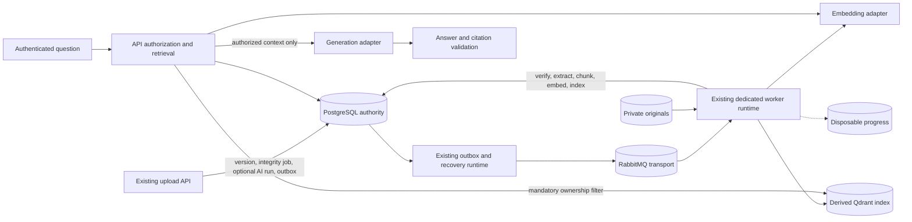

# Phase 4 / v1.3.0 AI/RAG foundation

**Phase 4 T03 orchestration, T04 PDF extraction and T05 chunking are implemented:** [durable stage contracts and lifecycle](phase-4-processing.md)
cover atomic successor scheduling, v2 transport, shared retry/recovery, worker routing,
lifecycle fencing and the owned status extension. [Durable PDF text extraction](phase-4-pdf-extraction.md)
is implemented. [Deterministic chunks and citation provenance](phase-4-chunk-generation.md)
are implemented. [T06 embedding generation and durable checkpoints](phase-4-embedding-generation.md) are implemented. [T07 Qdrant indexing, activation and cleanup](phase-4-vector-indexing.md) are implemented. [T10 grounded answers and validated citations](phase-4-rag-answers.md) are implemented and opt-in. [T11 AI Search and authorized citation navigation](phase-4-ai-frontend.md) are implemented. OCR remains **Planned**. [T09 authorized semantic retrieval and search API](phase-4-semantic-search.md) are implemented and opt-in. [T08 upload/reprocess/restore enrollment and bounded backfill](phase-4-ingestion.md) are implemented and opt-in.

[Documentation index](README.md) | [Architecture](architecture.md) |
[Processing foundation](phase-3-processing.md) | [Roadmap](roadmap.md)

**Current release preparation:** [v1.3.0 snapshot](releases/v1.3.0.md) and
[T13](phase-4-release-preparation.md) finalize the locally verified candidate.
T01's “Planned” headings below preserve original design anchors; implemented
status and exact behavior come from T02–T11 guides and the T12 ledger, not from
the heading suffix. OCR/agents and other exclusions remain undelivered.

**Status: T02 persistence, T03 orchestration, T04 PDF extraction, T05 chunks, T06 embeddings/checkpoints, T07 Qdrant indexing/cleanup, T08 ingestion and T09 authorized retrieval implemented; T10 grounded RAG/validated citations and T11 AI frontend/source navigation implemented.** T01 defines architecture only, dated 4 October 2026.
The [T02 data foundation](phase-4-data-foundation.md) records the implemented
schema, constraints, domain vocabulary and verification. Stage scheduling/transport are implemented in T03; PDF extraction is implemented in T04.
Embedding provider execution and durable checkpoints are implemented in [T06](phase-4-embedding-generation.md). Vector indexing/activation/cleanup are implemented in [T07](phase-4-vector-indexing.md). [T09 authorized semantic retrieval](phase-4-semantic-search.md) is implemented; generation and validated citations are implemented in [T10](phase-4-rag-answers.md).
No embedding, Qdrant, semantic retrieval or RAG runtime is
implemented by T01. This is the canonical Phase 4 contract; it narrows the older
AI feature catalog in the [specification](specification.md). Existing document
workflows and the implemented Phase 3 processing contract remain the baseline.
The repository records v1.2.0 as an accepted release-ready candidate without a
tag or release snapshot; this plan neither changes that evidence nor declares a release.

## Scope and runtime boundaries — Planned

Deliver asynchronous text extraction from text-bearing PDFs, deterministic chunks,
provider-neutral embeddings, a rebuildable Qdrant index, owned semantic retrieval,
and synchronous, bounded document-grounded question answering with validated citations.
JPEG/PNG and scanned PDFs remain valid original documents but need OCR, which is
deferred. AI metadata classification, summaries, persistent chat history and agents
are not acceptance requirements for this foundation.



Domain/application services own extraction orchestration, chunking, retrieval,
context construction and citation validation. Infrastructure adapters own parser
processes, provider SDK/HTTP calls and Qdrant. Extend `apps/api`'s existing non-HTTP
worker/outbox entry points; do not create another queue, scheduler or job service.
HTTP controllers do not extract or index. Interactive RAG has request timeouts and
cancellation, not a durable background job or an agent loop.

## Proposed authoritative data model — Planned

T02 implements the entities below as Prisma models with additive migration
`20261004010000_ai_data_foundation`. Runtime lifecycles remain Planned; the
[implemented data contract](phase-4-data-foundation.md) specifies concrete fields,
checks, immutable identities and nullable job references. Preserve immutable
original version fields and applied migrations.
Every version-derived row includes `userId`, `documentId`, `documentVersionId`
and an owner-consistent composite foreign key. No tenant entity exists today:
`users.id` is the isolation key. A future tenant model must add trusted tenant
membership checks and composite constraints before tenant sharing is enabled.

| Entity                | Required fields and invariants                                                                                                                                                                                                                                                                                                                                                       |
| --------------------- | ------------------------------------------------------------------------------------------------------------------------------------------------------------------------------------------------------------------------------------------------------------------------------------------------------------------------------------------------------------------------------------ |
| `AiProcessingRun`     | UUID, owned version, monotonically increasing run generation, immutable extraction/chunk/profile configuration snapshots, status (`BUILDING`, `READY`, `FAILED`, `CANCELLED`, `SUPERSEDED`), stage job references, timestamps, safe failure category. Metadata and coordination within Phase 3, never a second job engine. One building run per version; serialize profile rebuilds. |
| `ExtractedText`       | UUID, owned version, extractor name/version, source checksum, normalization version, content hash, canonical UTF-8 text and ordered page spans, extraction outcome, character/page counts. Unique `(versionId, extractionFingerprint)`; immutable successful artifact. PostgreSQL stores text, not uploaded binaries. Bound text size.                                               |
| `ChunkSet`            | UUID, owned version, extraction ID/hash, chunking algorithm/version, tokenizer/version, size/overlap, fingerprint, chunk count, completeness. Unique `(versionId, fingerprint)`; an incomplete set is never retrievable.                                                                                                                                                             |
| `DocumentChunk`       | Stable UUID, chunk-set ID, owned version, zero-based ordinal, text/hash, half-open Unicode scalar offsets in canonical text, page spans and optional section label. Unique `(chunkSetId, ordinal)` with owner-consistent extraction/set relations.                                                                                                                                   |
| `EmbeddingProfile`    | Immutable UUID and profile version, provider identity, pinned model/revision, dimensions, distance (`Cosine` initially), input normalization, query/document instructions and tokenizer version. Fingerprint excludes credentials and operational timeout/batch settings.                                                                                                            |
| `ChunkEmbedding`      | Owned chunk, profile ID/version, input hash, finite vector with exact dimensions, completion timestamp. Unique `(chunkId, profileId)`; durable checkpoint so indexing retries need no provider call. PostgreSQL stores generated vectors initially; Qdrant remains the serving index.                                                                                                |
| `VersionVectorIndex`  | Owned version, run, chunk set, profile, collection generation/name, expected and confirmed point counts, state (`BUILDING`, `READY`, `STALE`, `REMOVAL_PENDING`, `REMOVED`, `FAILED`), checkpoint and timestamps. Only confirmed complete builds can become `READY`.                                                                                                                 |
| Version AI pointers   | Desired run and active ready index references, plus last extraction attempt reference. Publication compares the desired run and current document eligibility under the document lock. Old artifacts do not become active by finishing late.                                                                                                                                          |
| Phase 3 job extension | Nullable run reference, predecessor job reference and durable stage input references, owner-consistent and immutable after scheduling. Existing job generation is an execution replay identity, distinct from artifact/profile fingerprints.                                                                                                                                         |

Existing `DocumentVersion.extractionStatus` becomes a compatibility summary of
the latest extraction attempt: `PENDING`, `PROCESSING`, `COMPLETED`, `FAILED`,
or `UNSUPPORTED`. Update only for the matching desired run; integrity,
embedding and indexing do not mark extraction complete. T04 uses the existing string summary/DTO; no new enum migration is required. Run/stage records retain attempts and
unsupported reasons; `Document.status` remains the document lifecycle.

Maintain the ready-index mapping per `(versionId, profileId)`, with one active
manifest per pair, and a separate PostgreSQL serving-profile selection. Publishing
a ready build for a future profile must not replace the old profile's mapping or
change the serving selection. Lifecycle revocation invalidates all profile mappings
for the affected version. The desired-run token fences new build publication;
it does not by itself invalidate a retained ready index during a same-version rebuild.

An extraction/chunk artifact can be reused across deliberate runs if its immutable
fingerprint matches. A repeated run does not create new citation identities.
Changed text, extractor, normalization or chunk settings creates a different set.
Retain superseded artifacts for provenance until an explicit retention cleanup;
no automatic hard deletion of originals or historical citations is introduced.

## Text extraction contract — Implemented for PDF in T04

The [T04 implementation](phase-4-pdf-extraction.md) concretizes this contract with
`PdfParser.parse(bytes, timeoutMs)` behind the durable extraction handler.
The conceptual `TextExtractor.extract(originalReference, extractorConfig, cancellation)` returns
canonical text, page spans, hashes and outcome through a Qyvra-owned interface.
The worker resolves references from PostgreSQL and reads through the storage
abstraction after exact-version integrity verification. No URLs or client storage
keys are accepted. Initial capability registry enables text-bearing PDF only.
Do not broaden PDF/JPEG/PNG upload admission as an incidental extraction change.

Canonical normalization v1 uses Unicode NFC, LF line endings and a versioned rule
for whitespace/page separators. Page spans use one-based original page numbers
and half-open Unicode scalar offsets; empty pages retain spans. Preserve wording
and page provenance; never silently summarize, translate, OCR or infer text.
Store extractor/version, source checksum and normalization with the artifact.
Text hashes cover the canonical representation including page boundaries.

Bound parser time, memory, output characters, pages and temporary disk; run parser
subprocesses without network access and with resource isolation. Delete temporary
copies after each attempt. Malformed/encrypted/unreadable PDFs produce terminal
safe extraction failures; images produce `UNSUPPORTED_FORMAT`, and PDFs without
usable text produce `OCR_REQUIRED`. An empty or unsupported result ends the run
without scheduling chunks; it is not a successful searchable document. Partial
page extraction is not published as complete in the initial implementation.

Transient storage/process interruption can retry under the Phase 3 job policy.
Deterministic malformed input and configured limits do not retry automatically.
An authorized deliberate reprocess creates a new run and job generation, reusing
successful matching artifacts; it does not overwrite immutable original metadata.
Historical backfill is an explicit bounded operation, never a migration side effect.

## Chunk contract and determinism — Implemented in T05

`Chunker.chunk(extraction, chunkingProfile)` is a pure deterministic operation.
The [T05 implementation](phase-4-chunk-generation.md) pins local `cl100k_base`
tokenization with `tiktoken@1.0.22` and the `qyvra-structural/v1` strategy.
Initial algorithm uses a pinned tokenizer and deterministic sentence/paragraph
boundaries, hard-splitting oversized passages at tokenizer boundaries. Defaults
implemented defaults are 512 tokens with up to 64-token overlap, constrained by
the embedding model input limit; validate `0 <= overlap < size`. No random or
LLM-driven chunking. Pin boundary/tie-breaking and normalization tests.

Each chunk contains exact canonical source text, ordinal, offsets, page spans,
token count, text hash and algorithm fingerprint. Overlap is explicit; page lists
can span several pages. Compute a UUIDv5 using a fixed Qyvra namespace and
`versionId + chunkSetFingerprint + ordinal + textHash`. Persist the namespace and
canonical serialization as a versioned contract; UUID collision/hash disagreement
fails instead of overwriting a different chunk. IDs remain stable on identical
reprocessing, but differ between versions and changed chunk configurations.

Build a new immutable chunk set, validate count/ordering/offsets, then publish it
atomically. Never delete a ready set before its replacement succeeds. A new
document version gets separate artifacts; default retrieval immediately selects
only the highest version number, even while its new index is pending. Older
versions remain in history and cannot silently answer for the new current version.
Phase 4 does not provide historical-version search. Retire older index manifests
and durably request vector cleanup; retain their text/chunks for citation provenance.

## AI boundaries and configuration — Planned

| Qyvra-owned interface              | Input and output                                                                                                                                                                                                              |
| ---------------------------------- | ----------------------------------------------------------------------------------------------------------------------------------------------------------------------------------------------------------------------------- |
| `EmbeddingProvider.embed`          | Immutable profile, ordered text inputs with IDs, purpose (`document` or `query`), deadline/cancellation; ordered ID/vector results and sanitized usage. Validate cardinality, ID mapping, finite values and exact dimensions. |
| `VectorIndex.upsert/delete/search` | Explicit collection/profile plus trusted owner scope and point identities; confirmed operation result or normalized candidate IDs/scores. No SDK types in application logic.                                                  |
| `SemanticRetriever.retrieve`       | Trusted authorization scope, question, active profile, bounded top-K and threshold; PostgreSQL-validated chunk references/text and scores.                                                                                    |
| `TextGenerationProvider.generate`  | Qyvra-controlled system instructions, authorized evidence blocks with source tokens, question, output schema, deadline/cancellation; structured answer or sanitized failure.                                                  |
| `RagService.answer`                | Authenticated user context and validated question/document scope; discriminated `answered` or `insufficient_evidence` response with server-built citations.                                                                   |

Generation and embedding providers are independently configured. First concrete
integration is an OpenAI-compatible HTTP/native adapter with explicitly configured
endpoint/model, not a permanent vendor dependency. Local/Ollama embedding or
generation adapters are extension points; local orchestration is excluded. Use
direct SDK/HTTP integrations, never LangChain or LangGraph.

Embedding operational configuration includes provider, allow-listed base URL,
model/revision, dimensions, profile/version, request timeout, batch size, max input
tokens, concurrency, retryable categories and bounded backoff policy. Generation
configuration independently includes provider/model, timeout, max input/output
tokens and output schema version. Secrets are injected separately, never stored
in profile JSON, returned by APIs or included in model requests as content.

An exact profile fingerprint must match both indexed document embeddings and
query embeddings. Equal dimensions or a shared model display name do not prove
compatibility. Query/document instructions may differ only as a pinned compatible
pair in that profile. Provider model drift requires a new profile or suspended
serving; no fallback to another embedding model within the old collection.
Timeout/batch changes alone do not invalidate existing vectors.

Phase 3 owns durable retries. Disable hidden SDK retries by default; any bounded
in-call retry must fit the stage deadline and lease and be included in the cost
budget. Batch checkpoints commit once per chunk/profile; retries resume missing
embeddings. External calls can be repeated after a crash, so duplicate provider
billing is possible. Do not claim exactly-once execution or cost.

## Qdrant index contract — Implemented in T07

Use one collection per immutable embedding profile and index schema generation,
shared across owners: `qyvra_chunks_<profileId>_<indexGeneration>`. Use one dense
vector, fixed profile dimensions and `Cosine`; never mix profiles in one search.
Qdrant supports collection vector configuration, UUID point IDs and payload
filters; these are adapter capabilities, not authorization by themselves.
See [collections](https://qdrant.tech/documentation/manage-data/collections/),
[points](https://qdrant.tech/documentation/manage-data/points/) and
[filtering](https://qdrant.tech/documentation/search/filtering/).

Point UUIDv5 derives from `chunkId + profileId + indexManifestId`; the manifest
isolates competing builds and makes repeat upserts idempotent within a build.
Payload contains only `userId`, `documentId`, `documentVersionId`, `chunkId`,
`chunkSetId`, `indexManifestId`, `embeddingProfileId`, `embeddingProfileVersion`,
`payloadSchemaVersion`, ordinal and page numbers. Index ownership, profile,
document/version and manifest filter fields. Do not copy text, filename, secrets,
storage keys or provider errors into payloads. Read content and display metadata
from authorized PostgreSQL rows.

Build in bounded batches from durable embeddings; record checkpoint only after
confirmed applied writes (`wait=true` or equivalent verified completion).
After all expected points are verified, commit the ready manifest and active
pointer under the document lock and matching lease/run token. PostgreSQL and
Qdrant have no shared transaction. A crash between writes and SQL checkpoint
repeats the same point IDs; a crash before pointer publication leaves an invisible
build. A lease-losing worker may still finish remote writes but cannot activate
them. No payload boolean alone establishes readiness or authorization.

Deletion uses owner + exact manifest IDs, not an unfiltered collection-wide
delete. Archive, soft delete and version supersession immediately remove SQL
eligibility and enqueue durable `REMOVE_VECTOR_INDEX` work in the existing job/
outbox system. Its persisted target list survives manifest retirement. Recheck
eligibility after writes and schedule reconciliation for late writes. A bounded
scan in the existing outbox/recovery runtime finds inactive/abandoned manifests
and creates or redrives Phase 3 cleanup jobs to repeat
cleanup, so deletion-versus-upsert races cannot leave permanent ghosts. Queries
still reject ghosts through SQL. Cleanup jobs must be allowed on archived/deleted
parents; the existing active-document claim/cancellation policy needs a reviewed
exception for this cleanup type. Soft deletion retains original bytes.

Rebuild after Qdrant loss uses durable chunk embeddings and metadata. Model changes
create a new profile/collection and regenerate embeddings; chunk changes create
new sets. Keep the old ready profile serving until an explicit global serving-profile
switch after required coverage checks; never merge scores or query vectors across
profiles. Within a same-version rebuild, keep its prior eligible index until the
replacement is ready. After a switch, unbuilt versions are unavailable rather than
searched with the wrong profile. Retire old collections only after pointer/cleanup
reconciliation and an operator-approved retention window.

## Processing stages and durable lifecycle — Implemented through T08

| Stage / job type                | Dependency                               | Durable success and next action                                                                                                                    |
| ------------------------------- | ---------------------------------------- | -------------------------------------------------------------------------------------------------------------------------------------------------- |
| `VERIFY_STORED_FILE` (existing) | Committed immutable version              | Integrity completion and creation of the run's extraction job/outbox intent in one transaction; existing verified versions can reuse their result. |
| `EXTRACT_TEXT`                  | Successful exact-version verification    | Publish complete extraction artifact, finish job and schedule chunks atomically; unsupported/empty/permanent failure ends run.                     |
| `GENERATE_CHUNKS`               | Complete extraction                      | Publish complete chunk set, finish job and schedule embeddings atomically.                                                                         |
| `GENERATE_EMBEDDINGS`           | Complete chunk set and immutable profile | Checkpoint bounded batches; on full completion finish job and schedule indexing atomically.                                                        |
| `INDEX_VECTORS`                 | Complete matching embeddings             | Confirm all remote points, then finish job and publish ready manifest/pointer atomically if still eligible.                                        |
| `REMOVE_VECTOR_INDEX`           | Durable removal target snapshot          | Confirm idempotent deletion; mark removal complete. Absence is success; no extraction/embedding dependency.                                        |

All stages use the existing `PENDING -> QUEUED -> PROCESSING` states and
`COMPLETED`, `RETRYING`, `FAILED`, `CANCELLED` outcomes. `BLOCKED` is not a new
job status: downstream jobs are created only after prerequisite success.
A failed prerequisite leaves the run failed and later stages absent. An outbox
intent is committed with each new stage. Completion, artifact publication and
next-job creation must be one short lease-fenced transaction; current handler
success followed by a separate repository completion is insufficient for this
atomic chain and must be extended. Never hold a transaction over parser/provider/
Qdrant I/O. Heartbeat long stages and bound each call below remaining lease time.

Keep one active job per version/type and existing generation uniqueness. Serialize
rebuild runs per version rather than weakening those constraints for parallel
profiles. Reprocessing creates new generations only after earlier jobs are terminal;
retries keep the same job/run and resume checkpoints. Archive/delete atomically
cancel unfinished content-processing jobs and invalidate serving pointers. Restore
creates or resumes a desired current-version run through new job generations if
needed, reusing eligible artifacts; valid retained indexes may be reactivated only
after exact remote presence and SQL eligibility validation. Removal/rebuild work
is serialized so old cleanup cannot remove a new manifest's points.

Current v1 messages and parsers hard-code integrity-only jobs. Define a v2 envelope
with the same compact identity fields and the expanded allow-list, keeping stage
inputs/run references in PostgreSQL. Implement dual v1/v2 consumers and publisher
validation first, then enable v2 stage scheduling. Reuse the existing topology;
deploy matching dispatcher/worker before producer activation. Drain/reconcile
incompatible dead letters; rollback disables v2 producers and preserves durable
rows/messages for a compatible worker. No content, vectors, API keys or ownership
authority enters RabbitMQ. Message schema and topology version are distinct.

## Semantic retrieval and authorization — Implemented in T09

Resolve an authorization scope from the trusted session `userId`, never a request
owner ID. Optional document IDs narrow that scope; every supplied ID must be
owned, nondeleted and nonarchived or fail with the existing unavailable-resource
semantics. For owner-wide search, resolve eligible current-version ready manifests
in PostgreSQL for the active serving profile. An empty scope returns no matches
without calling a model. Initial archived-document search is excluded.

Embed the bounded question with that exact profile. Every vector search must have
a mandatory `must` owner equality filter, exact profile/version filter and eligible
manifest constraint. Never replace this with an optional filter or post-filter-only
authorization. A future tenant scope adds a mandatory trusted tenant filter as well
as user authorization; it does not substitute a client tenant ID.

Bound default top-K to 8 (allowed 1–20), candidate overfetch to 100 and total scope/
request sizes. T09 bounds scope to 250 active manifests by default (configurable up to 2000)
and rejects larger scopes without truncation; larger-scope filtered batch merging
remains Planned. See [implemented bounds and threshold policy](phase-4-semantic-search.md#bounds-scores-and-failures). Deterministic tie-break is chunk ID.
Cosine scores are similarity values, not confidence probabilities; threshold is
profile-configured and must be calibrated on an owned test corpus before acceptance.

Qdrant returns candidate identifiers and scores only. Batch join each candidate
to PostgreSQL and verify owner, exact current version, complete chunk set, active
ready manifest and profile. Discard stale/forged/missing candidates before reading
text for context. Return fewer results or no results on bounded refill exhaustion;
never relax filters. Recheck source eligibility before provider dispatch and again
before response publication; archive/delete during generation discards the answer.
Content already sent while authorized cannot be recalled from a remote provider.
No model call decides access. PostgreSQL failure fails closed.

Normalize each result to document/version/chunk IDs, chunk ordinal, page spans,
authorized title/version filename, exact excerpt, score, profile and manifest ID.
No raw vector, storage key, transport identity or remote payload is a public result.

## Grounded RAG and citation contract — Implemented in T10

RAG uses authorization, query embedding, retrieval, context budgeting, one bounded
generation call, then validation. Preserve source offsets when truncating; reserve
tokens for instructions/question/output, deduplicate overlapping context, and cap
per-document contribution. Context includes server-generated source tokens such
as `S1`, exact excerpts and safe metadata. Escape delimiters; render returned text
as safe text/Markdown without executable HTML or fetched document URLs.

System instructions require evidence-only answers, explicit insufficient evidence,
and source-token references. Delimited retrieved documents and the user question
are untrusted data, never system/developer instructions. No tools, network actions,
memory instructions or code execution are exposed to the model. Prompt separation
reduces injection risk but cannot prove grounding; adversarial evaluation is required.

Provider output schema is `{ outcome, claims: [{ text, sourceTokens }] }`, where
outcome is `answered` or `insufficient_evidence`. Qyvra validates syntax, limits,
every token against supplied context and at least one source for each answer claim.
Unknown/free-form citations, malformed output and uncited claims are rejected with
a safe `AI_OUTPUT_INVALID` error, not passed through. The model can abstain even
when retrieval finds results. No suitable chunks, low scores or exhausted context
return `insufficient_evidence` without generation. This verifies provenance, not
the semantic truth of every claim; evaluation must check entailment/hallucinations.

Public response is a discriminated union:

```text
answered: { outcome, answer, claims, citations, requestId }
insufficient_evidence: { outcome, answer: null, citations: [], reason, requestId }
citation: { citationId, documentId, documentVersionId, versionNumber, chunkId,
            chunkOrdinal, title, originalFilename, pageSpans,
            excerptStart, excerptEnd, excerptHash }
```

The server composes answer/claim citation IDs and citation metadata from retrieved
PostgreSQL sources; the LLM supplies only permitted source tokens. Offsets/hash
identify the exact excerpt sent, including truncation. A citation resolves via an
owned citation-source API to document detail and the referenced version history.
Historical download/viewer navigation remains separately deferred; do not invent
a working file/page viewer. Resolution reauthorizes and returns 404 for foreign,
deleted or archived sources. Answers are not persisted as chat history in Phase 4.
Retention cleanup may later make an old reference unavailable and must say so.

## API direction — T01 contract and current slice status

Search, grounded-answer and reprocessing routes are implemented in T09, T10 and
T08 respectively. The owned citation-source resolution route is implemented in [T11](phase-4-ai-frontend.md).
T01 itself introduced no routes; the proposal below records the contract direction.

All planned routes retain `/api/v1`, session authentication, strict DTO validation,
existing envelopes, safe errors, request correlation and no-store behavior.
Proposed route names must be finalized with generated OpenAPI during their slice:

| Proposed route                                           | Contract direction                                                                                                                                                                                         |
| -------------------------------------------------------- | ---------------------------------------------------------------------------------------------------------------------------------------------------------------------------------------------------------- |
| `POST /search/semantic`                                  | Bounded question/query, optional owned document IDs, top-K; owned normalized results. No userId, profile, collection or provider URL accepted.                                                             |
| `POST /rag/answers`                                      | Bounded question and optional owned document IDs; answer union above. Provider outage is safe 503, timeout 504, rate limit 429; unavailable evidence is a successful typed outcome.                        |
| `POST /documents/:id/versions/:versionId/ai/reprocess`   | Authorized explicit current-version reprocessing, CSRF/Origin, bounded idempotency key; 202 safe run receipt, duplicate returns same run, conflicting configuration/run 409. No arbitrary job type/config. |
| `GET /documents/:id/versions/:versionId/chunks/:chunkId` | Reauthorized safe citation source, ordinal/excerpt/page provenance. No storage reference or embeddings.                                                                                                    |

Extend the existing processing-status route with additive safe stage/run/profile,
counts, index readiness and unsupported reason. Preserve existing integrity jobs
and frontend consumers; keep its terminal job semantics. Semantic search/RAG need
per-user quotas, concurrency caps and upstream cost limits. POSTs follow current
CSRF/Origin rules, even when their result is read-only but incurs provider cost.
Original upload responses remain unchanged. No websocket/SSE is required.

## Failure and recovery matrix — Planned

| Event                                          | Required behavior                                                                                                                                                         |
| ---------------------------------------------- | ------------------------------------------------------------------------------------------------------------------------------------------------------------------------- |
| Extraction failure/unsupported/OCR required    | Terminal safe reason for permanent input/limits; transient failure retries. No downstream stages; originals and metadata remain accessible.                               |
| Embedding unavailable, rate limited or timeout | Checkpoint completed batches; Phase 3 bounded retry/backoff, sanitized category, honor bounded retry-after. Exhaustion fails run. No profile fallback.                    |
| Invalid embedding dimensions/model/config      | Terminal configuration/output failure, no invalid vectors published. Operator corrects config with explicit new run/profile.                                              |
| Qdrant unavailable or ambiguous write          | Retry same point IDs, verify application before checkpoint/activation. Retrieval returns safe dependency error, not fabricated absence of evidence.                       |
| LLM unavailable/timeout/invalid output         | Safe 503/504 or output-validation error; no answer/citations fabricated, no background job automatically created. User may retry under quota.                             |
| Worker crash/interruption/lease loss           | Existing recovery spends bounded attempts, issues outbox intent; resume SQL checkpoints. Stale worker cannot publish artifacts/pointers. Orphan remote points reconciled. |
| PostgreSQL unavailable                         | No claim, publication, authorization or answer; unacknowledged delivery is retried under existing policy. Fail closed.                                                    |
| RabbitMQ unavailable                           | Existing outbox retains intent, publishes after recovery; original upload does not wait.                                                                                  |
| Redis unavailable                              | Progress disappears; durable run/stage state and eligibility remain unchanged.                                                                                            |
| Archive/delete                                 | SQL eligibility revoked and processing cancelled atomically; durable removal retries independently. In-flight RAG response discarded on recheck.                          |
| New version                                    | New integrity/run chain; old version immediately excluded from default retrieval. No old-context fallback while new version waits.                                        |
| Profile/model/chunk change                     | Immutable replacement build, explicit serving-profile switch and cleanup. Never combine incompatible vectors/scores.                                                      |

Safe categories include `EXTRACTION_INVALID`, `EXTRACTION_LIMIT`,
`UNSUPPORTED_FORMAT`, `OCR_REQUIRED`, `EMBEDDING_UNAVAILABLE`,
`EMBEDDING_OUTPUT_INVALID`, `VECTOR_UNAVAILABLE`, `AI_CONFIGURATION_INVALID`,
`AI_OUTPUT_INVALID` and `PROCESSING_INTERRUPTED`; finalize allow-lists with tests.
Manual retries create auditable new generations. Never reset failed attempts or
blindly replay DLQ messages. Document archive/delete races and reconciliation
must be verified before enabling retrieval in production.

## Security, deployment and observability — Planned

API and worker alone reach Qdrant on private infrastructure; no Nginx route or
public production port. Workers keep original storage read-only and use bounded
private temporary scratch space. PostgreSQL holds extraction/chunks/vectors, so
no new writable originals mount is needed. Outbox needs PostgreSQL/RabbitMQ, not
provider keys or Qdrant. Web receives no provider/index credentials. Distinct
runtime credentials restrict API to vector read and worker to controlled writes
where deployment capabilities permit; private network isolation is mandatory.

Provider endpoints are operator configured and allow-listed with outbound network
policy; document links and client inputs cannot select them. Production internal
links require authenticated services and TLS where crossing hosts/trust boundaries.
External AI sends authorized text/questions off-host: document this disclosure,
approve provider retention/residency policy operationally, and keep AI disabled
until configured. Do not claim local-only privacy when remote adapters are enabled.
Prompt secrets, session values and API keys are prohibited. Uploaded content can
itself contain sensitive information; authorization does not remove that risk.

Deploy Qdrant as an optional Phase 4 service with pinned image, persistent volume,
private health checks and validated collection dimensions. No Compose/environment
changes are made in T01. Document core health separately from AI readiness so an
AI outage does not block original downloads or catalog use. Back up PostgreSQL
and originals together; Qdrant snapshots accelerate recovery but are not the
authoritative backup. Protect derived text/vectors and backups as private data.

Record job/run/stage IDs, correlation ID, provider identifier, model, profile/version,
duration, status, safe category, attempt/retry count, page/character/chunk counts,
batch completion, expected/confirmed indexed counts, retrieval result count and
generation token usage/cost estimates where available. Metrics use low-cardinality
provider/model/status labels, never document/user/chunk IDs. Logs can carry protected
identifiers but omit questions, excerpts, prompts, answers, filenames, raw provider
errors and vectors by default. Diagnostic content capture requires explicit access,
short retention and a separate approved operational policy. Never include secrets.

## Ordered implementation tasks and acceptance — Planned

| Task | Deliverable and required verification                                                                                                                                                                                                                                                                                                |
| ---- | ------------------------------------------------------------------------------------------------------------------------------------------------------------------------------------------------------------------------------------------------------------------------------------------------------------------------------------ |
| T02  | **Persistence implemented:** additive data/profile/run/artifact migrations and owned constraints; fresh/upgrade/rollback review, duplicate identity and foreign-owner tests. No migration backfill.                                                                                                                                  |
| T03  | **Orchestration implemented:** enable declared Phase 3 AI job types through creation/delivery, v2/dual-version transport, atomic completion/dependency scheduling, desired-run fencing and cleanup eligibility; crash/duplicate/cancellation/concurrent run tests. Producers remain disabled until compatible consumers.             |
| T04  | **PDF extraction implemented:** bounded PDF text extraction and canonical representation; fixtures for pages, encrypted/malformed/scanned PDFs, unsupported images, limits and resumable failures.                                                                                                                                   |
| T05  | **Implemented:** deterministic chunk sets/UUIDv5 IDs and citation provenance; [contracts and verification](phase-4-chunk-generation.md) cover identical reruns, Unicode scalar offsets, overlap, boundaries and changed extraction/configuration.                                                                                    |
| T06  | **Implemented:** [provider-neutral HTTP embeddings and durable checkpoints](phase-4-embedding-generation.md); ordered ID mapping, dimensions/profile validation, bounded timeouts/rate-limit hints, lease-fenced batches and crash/resume tests.                                                                                     |
| T07  | **Implemented:** [private Qdrant indexing/activation/cleanup](phase-4-vector-indexing.md). Private optional Qdrant deployment, index adapter/manifests, confirmed upserts, cleanup and reconciliation; real Qdrant outage/rebuild and late-write/delete race tests.                                                                  |
| T08  | **Implemented:** [canonical ingestion](phase-4-ingestion.md): upload/verified-version chain, explicit idempotent reprocess and bounded operational backfill; integration upload-to-ready, new-version exclusion, archive/delete/restore tests.                                                                                       |
| T09  | **Implemented:** [owned semantic retrieval/API](phase-4-semantic-search.md) and profile-calibrated thresholds; mandatory-filter adapter tests, real two-user leakage tests, forged/stale payloads, scope/limit and profile-switch tests.                                                                                             |
| T10  | **Implemented:** [grounded answers/validated citations](phase-4-rag-answers.md). Generation adapter, context budget, abstention and server citation validation/API; adversarial injection, fabricated citation, uncited claim, no-evidence and provider outage tests.                                                                |
| T11  | **Implemented:** [AI Search and authorized citation navigation](phase-4-ai-frontend.md), safe answers, SQL-derived readiness and confirmed repair; owned source resolution, unavailable/error/empty states, accessibility and real original-document regressions.                                                                    |
| T12  | **Verified:** [security, recovery and release assessment](phase-4-verification.md), including two-user adversarial retrieval, dependency outages, artifact-only rebuild, cleanup and browser regression. Ready with known non-blocking limitations; live-model quality, remote CI and release publication remain separate follow-up. |

Each slice updates its canonical guide and generated OpenAPI when applicable and
runs affected formatting, lint, type checks, meaningful tests and production builds.
Release acceptance requires originals to remain usable through AI outages, no
cross-owner context leakage, deterministic citations, complete stage recovery and
an evaluated evidence-abstention policy. Do not mark partial stages complete.

## Explicit exclusions and remaining risks

**Not part of Phase 4:** autonomous agents, multi-agent orchestration, LangChain,
LangGraph, MCP, Hermes, external tools/actions, autonomous document modification,
voice assistant, city/office agent visualization, local LLM orchestration, OCR,
Elasticsearch/hybrid search, reminders, AI metadata/summaries, persistent chat,
tenant collaboration, permanent original purge and historical-version search/viewer.
Provider and retrieval interfaces leave extension points without an agent framework.

T04 pins PDF.js 6.4.299; T05 pins tiktoken 1.0.22 / cl100k_base. Later implementation must select/pin the first provider/model and
Qdrant release after dependency/license/security review; these choices cannot change
the contracts above. Corpus-derived thresholds, resource/cost quotas, text/vector
retention limits, provider privacy terms and global profile-switch coverage policy
need operational values before release. PostgreSQL vector checkpoints increase
backup/storage costs; measure representative documents before considering an
artifact-storage adapter. Bounded owner-wide manifest filtering needs load testing.
Prompt injection and semantic grounding remain quality/security risks even with
valid citations. The authorization recheck limits lifecycle races but cannot revoke
already-dispatched external content. Existing Phase 3 dependency/production-deployment
limitations remain tracked in its acceptance record.

T01 verification is documentation-only: formatting, internal links/anchors, diff
scope and historical preservation. It supplies no AI implementation/test evidence.
Prettier passed for all 15 changed/new Markdown files; a local path/heading check
validated 190 internal links without errors, and `git diff --check` passed.
Release snapshots and Phase 3 acceptance/verification records have no diff.
Application lint/type checks, runtime tests and production builds were not run:
T01 changes no application, schema, dependency or deployment configuration.
