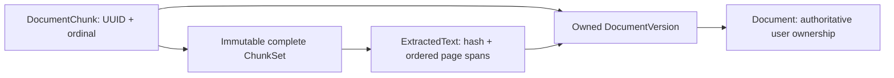

# Phase 4 T05 — Deterministic chunks and citation provenance

**Implemented:** deterministic token-bounded chunk generation, immutable complete
chunk sets, owned page/source provenance, and atomic completion/successor publication.
PDF text extraction is implemented in [T04](phase-4-pdf-extraction.md).
[T06 embeddings/checkpoints](phase-4-embedding-generation.md) and
[T07 Qdrant indexing/activation/cleanup](phase-4-vector-indexing.md) are implemented.
[T09 semantic retrieval](phase-4-semantic-search.md), [T10 grounded answers](phase-4-rag-answers.md) and [T11 citation navigation](phase-4-ai-frontend.md) are implemented.
No new HTTP endpoint, upload-triggered AI
chain, framework, provider call or migration is introduced by T05.

## Boundaries and processing lifecycle

The worker registers `ChunkGenerationHandler` for `GENERATE_CHUNKS` in the existing
[durable processing system](phase-4-processing.md). It loads authoritative job,
owner/version, desired BUILDING run, completed extraction predecessor and exact
`ExtractedText` reference. It checks the current highest document version, archive,
deletion, ownership, lease token/attempt and immutable extraction configuration.
RabbitMQ carries identifiers only; document contents never enter messages.

`DeterministicChunker` is a local application service independent of NestJS,
PostgreSQL, RabbitMQ, Redis and providers. Text segmentation/tokenization happens
before the publication transaction. The handler returns a database-only
`StageCommit`; the existing repository rechecks lifecycle, desired generation
and unexpired lease under its document/job locks.

The transaction creates an incomplete set, inserts bounded batches of all chunks,
then marks it complete with its exact count. SQL enforces contiguous zero-based
ordinals, source substring equality, hashes, page-span intersections and owned FKs.
The same transaction publishes `chunkSetId`, completes the job and creates the
`GENERATE_EMBEDDINGS` job/outbox intent. Any failure rolls everything back. No
chunk is visible as a successfully generated set before this transaction commits.
Embedding execution remains unavailable and cannot fabricate success.

T05 revealed one concrete T03 implementation blocker: the default five-second
Prisma transaction expired while publishing 1,622 chunks from a valid
4.56-million-scalar extraction. Chunk completion now allows up to 60 seconds,
bounded by the remaining claimed lease; existing final lease/lifecycle fences
remain mandatory. Other stages retain five seconds. Inserts use one-row batches
to respect existing per-query database limits; no parsing/provider IO enters the
transaction. This is a bounded publication adjustment, not a new workflow system.

## Versioned algorithm and measurement

Run snapshots must select `qyvra-structural` / `v1`, tokenizer `cl100k_base` /
`tiktoken-1.0.22`. Unsupported snapshots fail explicitly. This initial tokenizer
choice concretizes T01's pinned local token measurement; it is not a provider
integration and does not claim compatibility with every future model's tokenizer.
T06 must separately validate each embedding profile's input limits.

The exact pinned dependency is [tiktoken 1.0.22](https://github.com/dqbd/tiktoken),
which bundles local rank data and a WASM implementation, supports Node without a
native compiler or network call, and exposes byte decoding for Unicode-safe
token boundaries. The encoder is freed after every operation. No AI framework
is added. Token spelling such as `<|endoftext|>` is ordinary untrusted source text.

Chunk size is an actual standalone `cl100k_base` token maximum, default 512.
Overlap is a maximum standalone suffix token budget, default 64; it is not
guaranteed to be exactly that many tokens. Configuration requires
`0 <= overlap < chunkSize <= 16384`.

For each chunk, tokenize a bounded window of at most `min(64000, size * 8)` Unicode
scalars. Find the last whole-scalar token boundary within the token budget. In
the latter half of that window, prefer the last paragraph boundary, then line,
sentence (`. ! ? 。 ！ ？` followed by whitespace/end), then whitespace/word boundary.
If no useful structural boundary exists, use the hard token/scalar boundary.
Re-encode the exact selected substring and shorten at whole scalars if necessary
to enforce the actual token limit. End offsets must strictly advance.

Overlap chooses a whole-scalar suffix within the budget, shortens toward a word
boundary, and rechecks its standalone token count. It can shrink to zero for
an unbroken passage or a very small token budget. A final chunk is emitted only
if it adds new source text; there is no overlap-only terminal chunk. Small useful
documents produce one chunk. Empty/whitespace-only text produces no placeholders.

The chunk text is an exact contiguous substring of canonical extraction. Only
outer document whitespace is excluded through offsets; internal whitespace is
preserved. There is no rewriting, normalization, summarization or metadata injection.
Unicode scalar boundaries preserve emoji and CJK without splitting surrogate pairs.
Grapheme clusters/combining sequences may cross a chunk boundary; scalar-safe
text remains intact, but this is not linguistic or semantic segmentation.

## Identity, ownership and citation provenance

SHA-256 fingerprints use UTF-8 encoding of compact JSON arrays, with the exact order:

```text
["qyvra.chunk-set.v1", extractionId, contentHash, "qyvra-structural", "v1",
 "cl100k_base", "tiktoken-1.0.22", chunkSize, chunkOverlap]
```

The permanent UUIDv5 namespace is `3cca8ba4-a5bd-560d-8e6e-a65cc2ebe1f8`
(`UUIDv5(DNS, "qyvra.document-chunk.v1")`). Chunk UUIDv5 names are compact JSON:

```text
["qyvra.chunk.v1", documentVersionId, chunkSetFingerprint, ordinal, textHash]
```

`textHash` is SHA-256 over exact UTF-8 chunk text. Golden identity tests pin this
format. Algorithm, tokenizer, boundary or serialization changes require a new
strategy/version; never silently change the meaning of existing `v1` artifacts.
UUID collisions or incompatible existing artifacts fail closed; existing content
is never overwritten to resolve a disagreement.

The [T02 schema](phase-4-data-foundation.md) is reused unchanged:



Offsets are half-open `[startOffset, endOffset)` in Unicode scalars in the whole
canonical extraction, matching PostgreSQL `char_length`/`substring`; they are
not UTF-16 units, bytes, token positions or page-local offsets. Each chunk retains
every intersecting source page, clipped to its own range. A chunk spanning pages
truthfully records multiple spans. PDF page separators need not belong to a page.
An empty intervening page can have a zero-length span, matching SQL intersections;
it supplies no textual evidence. No heuristic page numbers or fabricated section
labels are added. Document title/version number are resolved through authoritative
relations rather than copied into canonical chunk text.

This is citation-ready provenance, not a citation API, final citation rendering
or model-generated citation text. Retrieval and RAG must still enforce authorization
and validate cited chunk IDs against their actual supplied context.

## Idempotency, reprocessing and downstream invalidation

Duplicate delivery reuses Phase 3 claiming and lease fences; duplicate completion
does not rerun publication. A complete matching set is checked against deterministic
chunk IDs, text, hashes, offsets, counts and page spans before reuse. Same run
configuration and extraction identity produce one unique complete set.

Intentional reprocessing uses T03's explicit new run generation after a prior run
is terminal. Changed extraction identity/hash, algorithm/tokenizer version, size
or overlap creates a distinct set. Earlier sets remain immutable for historical
provenance; failure never destroys a prior published set. New document versions
have independent artifacts. Permanent document deletion cascades subordinate
artifacts without deleting authoritative documents when chunks are removed.

The new embedding job references exactly the new set, so old chunk/profile
checkpoints cannot be mistaken for new work. T05 does not mutate or manufacture
embeddings/index manifests. Under T01/T03, a prior READY index for the same version
and profile stays eligible during rebuilding until complete replacement publication;
it is not marked STALE merely because replacement chunks exist. T07 publication
will retire replaced indexes. Archive/deletion/version supersession already deny
serving eligibility through authoritative lifecycle state.

## Configuration and limits

Validated defaults are exposed through the existing `ConfigurationService` and
worker Compose environment:

| Setting                  |                Default | Validation/use                                    |
| ------------------------ | ---------------------: | ------------------------------------------------- |
| `CHUNK_SIZE_TOKENS`      |                    512 | 1–16384; default for future run creation          |
| `CHUNK_OVERLAP_TOKENS`   |                     64 | 0 through size minus one; future run default      |
| `CHUNK_MAX_COUNT`        |                  10000 | 1–100000; operational output ceiling              |
| `CHUNK_MAX_OUTPUT_BYTES` |               40000000 | 1–100000000; total UTF-8 output including overlap |
| `CHUNK_TIMEOUT_MS`       | min(30000, half lease) | Positive, at most 75% of job lease                |

Handlers use immutable run size/overlap snapshots, not today's defaults; changing
environment settings never changes already scheduled logical work. Supported
strategy/tokenizer identities are pinned in source. T08 remains responsible for
automatic run/profile selection; T05 does not enable an incomplete upload chain.

Canonical input remains bounded by T04/T02: 5,000,000 scalars, 20,000,000 UTF-8
bytes and 10,000 pages. A chunk is at most 64,000 scalars. Output count and byte
ceilings prevent excessive overlap from amplifying memory without bound. Tokenizer
windows are bounded, page intersections use binary search plus intersecting spans,
and the chunker yields between chunks. The preparation deadline is cooperative,
checked between bounded tokenizer windows; it is not OS-enforced CPU isolation.
Worker concurrency and aggregate memory remain bounded by existing worker settings.

## Failures, security and observability

Terminal safe codes distinguish missing upstream state, invalid/corrupt source or
provenance, unsupported/invalid snapshot configuration, insufficient token budget
for a Unicode scalar, output limits, UUID collisions and incompatible artifacts.
No-text extraction is still handled by T04 as `OCR_REQUIRED`; defensive chunking
also rejects whitespace-only/corrupt data and never advances empty chunks.
Preparation deadline failure is retryable `CHUNK_TIMEOUT`. Unexpected database or
infrastructure failures use existing bounded retries/crash recovery. A failed
transaction leaves no complete partial set and no downstream intent.

Ownership derives from authoritative job/version/document rows and composite FKs.
Both preparation and publication validate lifecycle; the final document lock/lease
fence rejects archived, deleted, superseded or stale-run results. Original document
access is independent of chunking success. Untrusted text is never an instruction
or executed code. Logs contain job/document/version IDs, strategy, size/overlap,
character/chunk counts, duration, attempt and sanitized failure codes only.
Redis finalizing observation is disposable and its failure cannot affect publication.

## Verification and completion record — 6 October 2026

**T05 complete.** The interrupted run completed the implementation, configuration,
all 26 chunker unit cases, 15 PostgreSQL chunk integration cases, reprocessing and
new-extraction lineage, and most verification. This continuation preserved that
implementation, finished container verification and the remaining broker checks,
added an explicit real-worker chunk-handler registration assertion, and completed
documentation. No production algorithm or persistence behavior was rewritten.

### Files created in T05

- [Deterministic chunker](../apps/api/src/modules/ai/deterministic-chunker.ts)
- [Chunker unit tests](../apps/api/src/modules/ai/deterministic-chunker.spec.ts)
- [Chunk-generation handler](../apps/api/src/infrastructure/worker/chunk-generation.handler.ts)
- [PostgreSQL chunk integration tests](../apps/api/test/chunk-generation.integration-spec.ts)
- [Offline container smoke check](../apps/api/test/chunk-container-smoke.cjs)
- This T05 architecture, configuration and completion guide.

### Files modified in T05

Existing T01–T04 working-tree changes were preserved; this list describes T05's
additions to that checkpoint, not every outstanding change reported by Git.

- API [package.json](../apps/api/package.json) and [package-lock.json](../apps/api/package-lock.json): exact local tokenizer dependency only.
- Configuration [settings](../apps/api/src/configuration/settings.ts), [environment validation](../apps/api/src/configuration/environment.ts), [configuration service](../apps/api/src/configuration/configuration.module.ts) and [configuration tests](../apps/api/src/configuration/environment.spec.ts).
- [Worker registration](../apps/api/src/infrastructure/worker/worker.module.ts) and [worker integration assertions](../apps/api/test/worker.integration-spec.ts).
- [Processing repository](../packages/database/src/processing-repository.ts): chunk-only lease-bounded transaction budget. [Prisma schema](../packages/database/prisma/schema.prisma): existing chunk-ID comment updated; no model/schema change.
- [.env.example](../.env.example) and [Docker Compose](../docker-compose.yml): five validated worker chunk settings.
- Root [README](../README.md), [documentation index](README.md), [architecture](architecture.md), [database](database.md), [API direction](api.md), [roadmap](roadmap.md), [specification](specification.md), [Compose guide](compose.md), [environment reference](deployment/environment-variables.md), [AI/RAG contract](phase-4-ai-rag.md), [data foundation](phase-4-data-foundation.md), [processing contract](phase-4-processing.md) and [PDF extraction guide](phase-4-pdf-extraction.md): accurate current status and links. The T04 completion evidence remains intact.

No T05 migration, table, API endpoint, message schema or AI-specific job system
was added. All 14 existing migrations were applied successfully to a clean T05
PostgreSQL test database. Historical migrations and v1.0.0/v1.1.0/v1.2.0 release
snapshots were not changed by T05.

### Commands and verified results

Commands below use the existing API/database package conventions. Test URLs and
public test credentials belong only to disposable loopback test infrastructure.

| Check                      | Command/result                                                                                                                                                                                                                                                                                                                              |
| -------------------------- | ------------------------------------------------------------------------------------------------------------------------------------------------------------------------------------------------------------------------------------------------------------------------------------------------------------------------------------------- |
| Local build                | `npm --prefix apps/api run build`: API, database and storage builds passed; final host output contains the single-row chunk publication implementation.                                                                                                                                                                                     |
| Type checking              | API `npx --no-install tsc --noEmit --incremental false`: passed.                                                                                                                                                                                                                                                                            |
| Formatting/lint            | API and database `format:check` and `lint`: passed. Continuation checked the newly changed worker test with targeted Prettier/ESLint; it compiled and passed through the integration runner.                                                                                                                                                |
| Unit/regression tests      | API `npm run test -- --runInBand`: 30 suites, 299 passed, one optional live Redis case skipped because `TEST_REDIS_URL` was absent for that command. Includes 26 chunker cases and validated chunk configuration. Linux PDF sandbox behavior was separately verified in the container.                                                      |
| Database processing        | `npm --prefix packages/database run test:pipeline`: 27 passed, zero skipped, including outbox, claims, retries, crash recovery, current-version/ownership fences and prior-ready-index retention.                                                                                                                                           |
| API integration            | `npx --no-install jest --config test/jest-integration.json --runInBand` with real PostgreSQL/RabbitMQ/Redis: 21 suites and 175 tests passed. Two broker suites initially failed because prior focused executions had left messages in the shared test queues. No production failure was found and no assertion was weakened.                |
| Broker follow-up           | Continuation ran `worker.integration-spec.ts` and `messaging.integration-spec.ts` on separate fresh RabbitMQ test vhosts: five worker tests and one transport test passed. All 23 integration suites / 181 tests are verified across the initial and targeted follow-up runs; this is not a claim that the initial combined command passed. |
| Optional live Redis        | Continuation ran `redis-processing-progress.store.spec.ts` with `TEST_REDIS_URL`: two passed, zero skipped, including the optional case skipped by the earlier full unit command. All 300 unit cases are verified across those runs.                                                                                                        |
| API end-to-end             | `npx --no-install jest --config test/jest-e2e.json --runInBand`: 15 suites / 281 passed.                                                                                                                                                                                                                                                    |
| Large canonical extraction | 4,560,000 scalars → 1,622 complete chunks, under the unchanged 500 ms per-query database timeout and 120-second lease; final full integration run took about 48.6 seconds including preparation/publication. The initial five-second transaction failure was reproduced and fixed as documented above.                                      |
| Migration compatibility    | `npm --prefix packages/database run migrate:deploy`: all 14 migrations passed on the clean disposable T05 database; no new migration requires rollback testing.                                                                                                                                                                             |
| Production worker build    | `docker --context desktop-linux build -f infrastructure/docker/api.Dockerfile --target runtime -t qyvra-t05-worker-test .`: passed. Final image ID `sha256:36f50551f40351cb1cf65d64c4b771ab6540921677ebfe0c96fb07a33f861ccc`. No Dockerfile change was needed for T05.                                                                      |
| Production runtime         | `docker run --rm --network none --memory 512m` with read-only test mount: chunk smoke passed with 20 deterministic Unicode/provenance chunks and handler/WASM loading. Existing PDF smoke passed nine real fixtures plus unprivileged Linux sandbox probes.                                                                                 |
| Dependency review          | `npm --prefix apps/api audit --json`: 50 existing findings (3 low, 11 moderate, 36 high); no tiktoken finding. The nonzero audit exit was reported, not treated as a passing audit. No unrelated dependency upgrades were made.                                                                                                             |
| Documentation/diff         | Markdown file/anchor checks and `git diff --check`: passed; historical release paths unchanged.                                                                                                                                                                                                                                             |

The continuation did not rerun already successful unit, end-to-end, chunk
integration, database processing, build, or broad lint/type-check suites because
the production implementation did not change. Only the unfinished container,
broker and optional live Redis checks and the newly updated worker test required execution.

### Limits and remaining decisions

There are no unresolved T05 correctness blockers. Tokenizer measurement is local
`cl100k_base`, not a guarantee of every future embedding model's input limit.
Overlap can shrink; Unicode scalars are preserved but grapheme clusters are not
guaranteed indivisible. Preparation timeout is cooperative between bounded windows.
Large complete-set publication holds the document lock for its bounded transaction;
contending writes may wait or time out, while ordinary document reads remain
available. Very small chunks/high overlap or a slower deployment can hit output,
lease or transaction ceilings and fail safely through existing recovery. Capacity
tuning is deployment-specific; the benchmark is evidence, not a throughput SLA.

Embeddings, Qdrant, retrieval, RAG, final citation rendering and automatic AI upload
scheduling remain **Planned**. T06 must select/validate provider profiles and input
limits independently from the chunk tokenizer. No T06 work was started.

Recommended next task: **T06 — Implement Provider-Agnostic Embedding Generation
and Durable Embedding Checkpoints**, without beginning Qdrant or retrieval work.
