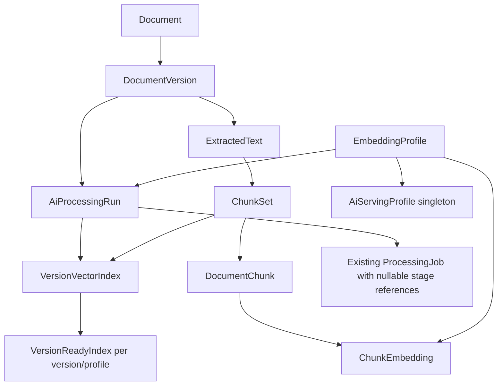

# Phase 4 T02 — persistent AI/RAG data foundation

**Phase 4 T03 orchestration, T04 PDF extraction and T05 chunking are implemented:** [durable stage contracts and lifecycle](phase-4-processing.md)
cover atomic successor scheduling, v2 transport, shared retry/recovery, worker routing,
lifecycle fencing and the owned status extension. [Durable PDF text extraction](phase-4-pdf-extraction.md)
is implemented. [Deterministic chunks and citation provenance](phase-4-chunk-generation.md)
are implemented. [T06 embedding generation and durable checkpoints](phase-4-embedding-generation.md) are implemented. [T07 Qdrant indexing, activation and cleanup](phase-4-vector-indexing.md) are implemented.
T08 opt-in enrollment, T09 retrieval, T10 RAG and T11 citation navigation are also
implemented; see [current Phase 4 contracts](phase-4-ai-rag.md). OCR remains **Planned**.

[AI/RAG contract](phase-4-ai-rag.md) | [Database](database.md) |
[Processing](phase-3-processing.md) | [Roadmap](roadmap.md)

**At the T02 checkpoint: persistence and domain contracts only, 4 October 2026.**
T04 now implements PDF extraction; T05 implements deterministic chunks; T06 implements
[embedding provider calls and durable vectors](phase-4-embedding-generation.md).
Qdrant indexing/activation/cleanup are implemented in [T07](phase-4-vector-indexing.md);
later T08–T11 slices implement enrollment, retrieval, RAG, routes and UI.
T02 enabled none of those runtime paths; T03 now supplies explicit run scheduling,
dual-version transport and unavailable-handler routing. T04 now publishes real PDF
extraction artifacts through the existing completion fence. [T08](phase-4-ingestion.md)
implements opt-in automatic enrollment and bounded backfill.

## Repository baseline and implementation boundary

Phase 3 stores documents and immutable owned versions, seven processing-job states,
generation/attempt limits, PostgreSQL retries/failure codes/leases and outbox envelopes.
RabbitMQ transports v1 integrity commands; the dedicated worker executes only
`VERIFY_STORED_FILE`. Redis progress is disposable. No tenant model or persisted
dependency relationship existed before T02.

The implementation stays in `packages/database`. Prisma-generated delegates are
the persistence interface; no new NestJS module or competing generic repository
is required before a concrete AI application use case. `src/ai.ts` exports typed
states, page-span/profile identity contracts, declarative stage prerequisites and
the versioned SHA-256 embedding-profile fingerprint helper. Generated ORM models
are exported for internal consumers, not public HTTP DTOs.

## Tables, ownership and source provenance

| Prisma entity / SQL table                       | Implemented responsibility                                                                                                                                                                                                                                                 |
| ----------------------------------------------- | -------------------------------------------------------------------------------------------------------------------------------------------------------------------------------------------------------------------------------------------------------------------------- |
| `AiProcessingRun` / `ai_processing_runs`        | Owned version, increasing generation, fixed extraction/chunk configuration fields and immutable profile FK, run status/timestamps/failure category. One `BUILDING` run per version.                                                                                        |
| `ExtractedText` / `extracted_texts`             | Immutable successful extraction artifact, exact version checksum, extractor/normalization versions, canonical text, fingerprint/hash, character/page counts and page spans. Unsupported/failed attempts belong to jobs/runs, not successful text rows.                     |
| `ChunkSet` / `chunk_sets`                       | Owned extraction FK/hash, immutable algorithm/tokenizer/configuration/fingerprint, chunk count and completion marker. Complete sets have exactly contiguous ordinals from zero.                                                                                            |
| `DocumentChunk` / `document_chunks`             | Explicit Qyvra UUID (no generated vector ID), owned version/set FKs, unique set ordinal, immutable text/hash, scalar offsets/token count, page spans and optional section label.                                                                                           |
| `EmbeddingProfile` / `embedding_profiles`       | Immutable provider, model/revision, profile version, dimensions, Cosine distance, normalization, tokenizer and compatible document/query instructions. Canonical semantic fingerprint is checked in PostgreSQL and unique. No credential/endpoint/operational JSON fields. |
| `ChunkEmbedding` / `chunk_embeddings`           | Immutable per-chunk/profile checkpoint with input hash, exact-dimension finite nonzero `double precision[]` vector and completion time. Stored vectors are explicitly required by T01.                                                                                     |
| `VersionVectorIndex` / `version_vector_indexes` | Owned run/set/profile and collection-generation identity, expected/confirmed counts, ordinal checkpoint, lifecycle status and timestamps. Complete compatible SQL inputs precede any build. No remote I/O exists.                                                          |
| `VersionAiState` / `version_ai_states`          | Owned version's desired run and latest extraction-job references. Separate from immutable original file metadata.                                                                                                                                                          |
| `VersionReadyIndex` / `version_ready_indexes`   | At most one ready index per version/profile, matching profile and owned current version. Publication requires ready manifest, desired run and eligible parent.                                                                                                             |
| `AiServingProfile` / `ai_serving_profile`       | Singleton serving-profile selection (`id=1`). No row means unconfigured; migration creates no default profile or serving row.                                                                                                                                              |

All version-derived tables repeat existing owner/document/version keys to enforce
composite provenance, as required by T01. These are constrained keys rather than
independent ownership metadata; no email or new tenant authority is introduced.
Owner/version/profile indexes support later bounded reads. A profile is operator
configuration shared by owners and contains no document data.



Text/page/chunk offsets use half-open Unicode scalar positions; PostgreSQL
`char_length` agrees with this contract, while JavaScript UTF-16 length does not.
Page spans are strict JSON arrays of `{pageNumber,startOffset,endOffset}` with
ordered one-based page numbers. Chunk text must equal the referenced extraction
substring; chunk page spans must equal its intersections with source page spans.
T02 persists IDs/hashes/fingerprints; T04 calculates extraction hashes and T05
implements deterministic UUIDv5 chunk generation and exact source-text hashes.

Storage ceilings are 5,000,000 extraction characters / 20,000,000 UTF-8 bytes,
10,000 pages, 100,000 chunks per set, 64,000 characters per chunk, 16,384 configured
tokens per chunk and 65,536 embedding dimensions. Overlap must be nonnegative and
smaller than chunk size. Later parsers/providers must enforce tighter operational
budgets/model limits before persistence; raising these storage ceilings requires
a reviewed migration and capacity evidence.

## Processing vocabulary and dependency persistence

Domain vocabulary now includes `EXTRACT_TEXT`, `GENERATE_CHUNKS`,
`GENERATE_EMBEDDINGS`, `INDEX_VECTORS` and `REMOVE_VECTOR_INDEX`, alongside
`VERIFY_STORED_FILE`. Existing SQL type strings remain extensible. V1 envelopes remain integrity-only; explicit v1 AI emission fails before writing
an outbox intent. T03 adds v2 AI intents and dual-version worker routing.

Nullable `ai_run_id`, `predecessor_job_id`, `extracted_text_id`, `chunk_set_id` and
`vector_index_id` extend existing processing jobs. Owned composite FKs prevent
foreign-version/owner dependencies. For AI stages, predecessor type and completed
state must match the declared chain; nonintegrity predecessors belong to the same
run. Inputs match their predecessor and run configuration. Completion requires the
corresponding complete extraction/set/embedding checkpoints/ready manifest. A
removal job references its retained manifest and can be completed only after its
manifest is `REMOVED`. Inputs cannot silently be rebound after scheduling; output
references can be filled once. These are persistence invariants, not a scheduler.

Job completion plus next-stage/outbox creation, lease/run fencing, cleanup claims
on ineligible parents and dual v1/v2 support are implemented in T03, as described
in its guide. T02 added no stage handler or automatic job creation. Existing job generations, retries, lifecycle
cancellation and Phase 3 repository behavior are preserved.

## Index state, reprocessing and lifecycle

Index states match T01: `BUILDING`, `READY`, `STALE`, `REMOVAL_PENDING`, `REMOVED`,
`FAILED`. No manifest/mapping means not indexed, rather than a new index enum.
READY requires exact expected/confirmed counts, final checkpoint and indexing
timestamp. SQL checks cannot prove remote writes occurred: future indexing must
confirm Qdrant application before publishing readiness.

Reprocessing advances run generations monotonically under a document lock;
successful artifact fingerprints and `(chunkId,profileId)` checkpoints prevent
uncontrolled duplicates. Identical sets retain persisted IDs; new configuration
fingerprints permit replacement sets with their own ordinals and provenance.
Publishing a future profile leaves the previous profile mapping/serving selection
intact. New versions never mutate old artifacts. No original version fields or
`extractionStatus` values/checks are changed by T02.

Deleting derived rows never cascades upward to documents or originals. Parent
document/version deletion cascades owned subordinate data. Lineage references use
`NO ACTION` and profiles use `RESTRICT`: remove dependent pointers/jobs/indexes
before deliberate artifact retention cleanup. Whole-set deletion can cascade
chunks/checkpoints; deleting an individual published chunk is rejected. Active
index checkpoints cannot be deleted until their index is retired, and a ready run
must be superseded before its manifest is deleted. Historical completed jobs retain
their outputs until an explicit coordinated retention policy removes those references.

Archive/soft delete retain original files and derived rows. Existing document APIs
continue Phase 3 cancellation behavior. T02 validates eligibility when new ready
mappings are written; it does not implement automatic mapping revocation, vector
cleanup, historical backfill or retrieval. T03/later lifecycle transactions must
revoke mappings atomically, and retrieval must still reauthorize against PostgreSQL.

## Migration and compatibility

`20261004010000_ai_data_foundation/migration.sql` adds ten tables, nullable job
fields and owned relationships/indexes without changing prior migrations or
original document fields. PostgreSQL `BEGIN`/`COMMIT` makes its DDL atomic.
Custom checks/triggers enforce invariants Prisma cannot represent; retain them in
future migrations. Prisma schema-to-database comparison reports no difference.

Run `npm --prefix packages/database run migrate:deploy` with an injected
`DATABASE_URL` against a backed-up installation. Deploy/generate the matching
client before using new delegates. No migration-time content processing occurs.
Prisma's established deploy tooling has no down-migration command. Application
rollback can retain these additive tables/columns while Phase 3 ignores them;
disable future AI producers before rolling back. Destructive SQL rollback was not
performed. Coordinated database/file restoration remains the existing backup policy.

## Verification

T02 uses installed dependencies and no new packages. Docker's Linux engine was
unavailable; real tests use an isolated PostgreSQL 17 cluster under ignored
`.tools/t02`, bound to loopback port 55434, with dedicated databases containing
`test` in their names. No developer/production database was reset or migrated.

New tests: `ai-contracts.test.cjs`, `ai-persistence.test.cjs` and
`ai-migration.test.cjs`. They cover owned lineage, Unicode/page provenance, immutable
profile identity, vector shape, dependencies/output requirements, duplicate/order
constraints, reprocessing, profile mappings, derived deletion, hard-parent cascades,
ordinary transaction rollback and preservation of Phase 3 state during upgrade.
Runtime AI acceptance is not implied.

| Command/check                                                                               | Final result                                                                                                          |
| ------------------------------------------------------------------------------------------- | --------------------------------------------------------------------------------------------------------------------- |
| Database `build`, `validate`, `lint`, `typecheck`, `format:check`                           | Pass; Prisma client regenerated, strict TS build succeeds.                                                            |
| Prisma `migrate deploy` on empty test database                                              | Pass; all 14 migrations applied, including final transactional T02 SQL.                                               |
| `npm --prefix packages/database run test:ai`                                                | Pass: 21 tests including the parent integration test.                                                                 |
| `npm --prefix packages/database run test:ai:migration`                                      | Pass: one Phase 3 upgrade/no-backfill/rollback test on a separate empty database.                                     |
| Existing database processing rules/persistence/repository tests                             | Pass: 15 tests, including claims, lease recovery, retries, outbox intent and ownership.                               |
| Prisma `migrate diff --from-config-datasource --to-schema prisma/schema.prisma --exit-code` | Pass: no difference against final migrated schema. Custom checks/triggers are outside Prisma's diff model.            |
| API `typecheck`, `build`, `lint`, `format:check`                                            | Pass after repairing stale local package junctions. No API source changed.                                            |
| API `test -- --runInBand`                                                                   | Pass: 28 suites, 253 tests passed, one optional real-Redis test skipped.                                              |
| API `test:e2e -- --runInBand`                                                               | Pass: 15 suites, 281 HTTP contract tests; database doubles are used.                                                  |
| API `test:integration` with document, processing-status, upload and version suites          | Pass: four suites, 60 tests passed, one optional real-Redis test skipped, using actual PostgreSQL and installed qpdf. |

Initial fixture failures were corrected to satisfy existing PDF page-count/archive
constraints and timestamp ordering; the final runs above pass. An initial upgrade
rollback assertion required JSON serialization of a `pg` array parameter and was
corrected without changing existing tests or production behavior.

API setup initially referenced the former Brainless workspace through ignored
`node_modules/@qyvra` junctions. An offline install failed with `ENOTCACHED`;
repairing only the two local junctions resolved type/build failures. No dependency,
lockfile or application configuration change was required.

Real RabbitMQ/Redis outage tests and Docker/Nginx/browser checks were not rerun;
Docker's engine was unavailable, and T02 changes no messaging/UI implementation.
No down-migration, destructive database reset or production deployment occurred.
Final Markdown formatting, `git diff --check` and 205 internal path/heading links
across 17 changed/new Markdown files passed. Historical release snapshots, Phase 3
acceptance/verification records, API/web source and dependency lockfiles have no diff.
The isolated test cluster is stopped after verification; its ignored data is retained.

Reproduce from the repository root after provisioning separate disposable databases:

```sh
npm --prefix packages/database run build
npm --prefix packages/database run migrate:deploy
npm --prefix packages/database run test:ai
npm --prefix packages/database run test:ai:migration
```

`test:ai` requires migrated `TEST_DATABASE_URL`; `test:ai:migration` requires a
separate empty `TEST_MIGRATION_DATABASE_URL`. Both refuse missing/non-test names.
The upgrade test applies only pre-T02 migrations first, inserts Phase 3 fixtures,
then deploys the full chain twice and verifies exact preserved state and no backfill.

## T01 concretizations and remaining scope

No architecture redesign. Fixed run fields plus an immutable profile FK implement
configuration snapshots without arbitrary JSON that could carry secrets. Page
provenance uses validated JSON rather than an additional page entity. Profile
fingerprints use `qyvra.embedding-profile.v1` ordered JSON serialization and SHA-256,
with SQL and TypeScript agreement. Cleanup initially targets one retained manifest
per existing job, not an unconstrained target payload or a parallel cleanup system.
Derived text/vector scale, operational quotas, parser/tokenizer selection and actual
retrieval/citation authorization remain later verification requirements.

T03 implemented the following recommendation: extend existing repositories/handler completion with atomic stage
outcomes and dependent outbox intents; implement compatible v2 producers/consumers,
desired-run/lease fencing, and reviewed vector-removal eligibility/lifecycle rules.
Do not start extraction/provider/Qdrant/RAG handlers as part of T03's infrastructure
slice. T02 does not begin T03.
