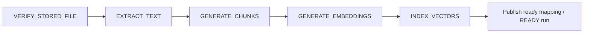

# Phase 4 T03 — Durable AI stage orchestration

**Implemented:** PostgreSQL orchestration, ordered stage intents, dual-version
transport contracts, worker routing, shared retries/recovery, lifecycle fencing,
and the owned processing-status extension. [T04 PDF extraction](phase-4-pdf-extraction.md)
and [T05 chunk generation](phase-4-chunk-generation.md) are implemented through these contracts.
[T06 embedding generation and checkpoints](phase-4-embedding-generation.md) now use the same
job/lease/outbox lifecycle. [T07 Qdrant indexing, activation and cleanup](phase-4-vector-indexing.md) use these same durable stages. [T09 retrieval](phase-4-semantic-search.md),
[T10 grounded generation and validated citations](phase-4-rag-answers.md), and
[T11 source navigation](phase-4-ai-frontend.md) are implemented. Interactive queries
do not create a second processing system. [T12 verification](phase-4-verification.md)
records the security, recovery and release assessment.
The [v1.3.0 candidate](releases/v1.3.0.md) and [T13 preparation](phase-4-release-preparation.md)
record current release status. T03's dated test limitations below are preserved as
historical evidence; T12 subsequently exercised live broker, Redis and recovery.
This guide concretizes [T01](phase-4-ai-rag.md) and uses the existing
[T02 schema](phase-4-data-foundation.md). Historical release snapshots are unchanged.

## Application and handler contracts

`ProcessingRepository.requestAiProcessing(request, reprocess = false)` is an
internal application operation, not an HTTP endpoint. It accepts trusted owner,
document/version IDs, correlation ID, bounded attempt limit and an immutable run
snapshot: extractor/normalization/chunking/tokenizer versions, size/overlap and
embedding-profile ID. It requires the highest version of an active owned document.
The persisted profile contains identity, never credentials. No default profile,
provider configuration, automatic AI upload chain or backfill is enabled in T03.
Those application entry points are now implemented in [T08](phase-4-ingestion.md).

The document row lock serializes scheduling with archive/delete and uploads. An
identical request reuses the latest run. A different active snapshot is rejected.
A terminal run requires `reprocess = true` for a new monotonically increasing run
generation; retry keeps the same run/job/artifact identities. New verification uses the request attempt limit; successors inherit their
predecessor limit, including when existing verification is reused. Completed integrity
verification is reusable, while failed/cancelled verification requires its existing
explicit replay mechanism. Integrity still executes for ordinary uploads and may
execute for historical active versions, preserving Phase 3 behavior. AI content
stages execute only for the current version's desired BUILDING run.

A successor is created only after a COMPLETED predecessor, with its exact owned
artifact references and run ID. There are no speculative blocked jobs or second
AI job tables. Job generations remain per version/task; run generations identify
intentional rebuilds. The document lock, existing generation uniqueness and one
active job per version/task prevent duplicate scheduling. Existing T02 SQL checks
also reject wrong predecessor types, foreign ownership, incompatible snapshots,
missing successful extraction/chunks/embeddings and incomplete index publication.

Future handlers implement the existing `ProcessingJobHandler` interface. A
successful handler may return a `StageCommit(tx, authoritativeJob)` callback.
`ProcessingRepository.complete` checks eligibility and the matching unexpired
lease before invoking it in a database-only transaction, publishes its output
references, completes the job and ensures the next job/outbox intent. T05 complete
chunk-set publication is bounded to at most 60 seconds and the remaining lease;
other stages retain Prisma's five-second budget. The callback must perform
database writes only: no provider calls, parsing, storage reads or remote index IO.
Long-running handlers use the shared lease/heartbeat contract and write idempotent
batch checkpoints before final publication; stage-specific checkpoint boundaries
remain T04–T07. A callback failure rolls back the entire completion and successor
intent. Repeated completion does not rerun the callback. External IO is at least
once and requires idempotent handlers; PostgreSQL cannot make remote IO atomic.

Extraction completion must supply `extractedTextId`; chunk completion must supply
a complete `chunkSetId`; embedding completion requires all compatible durable
checkpoints. After embedding succeeds, orchestration creates a BUILDING index
manifest with schema generation 1 and collection name
`qyvra_chunks_<profile UUID without hyphens>_v1`, then schedules INDEX_VECTORS.
This is a manifest, not a Qdrant collection or assertion of remote success. T07
must use/validate this canonical name and compatible collection schema. Indexing
completion requires the handler's confirmed READY manifest; only then does the
same transaction publish the per-profile ready mapping and mark the run READY.
Same-profile replacement retires the previous manifest and supersedes its ready
run. A previous ready mapping remains usable during a rebuild, until replacement
or a document lifecycle change; different profile mappings remain separate.

T07 extends `checkpoint()` to INDEX_VECTORS under the same document/job/token/lease
fences. [Verified batches and atomic publication](phase-4-vector-indexing.md#indexing-and-activation)
keep all remote IO outside SQL transactions. Internal rebuild reuses actual durable
artifacts, and cleanup replay plus ten-minute REMOVED-manifest sweeps use existing
jobs/outbox; no independent queue or workflow is introduced.

## Transport, execution and failures

The v1 envelope remains integrity-only. V2 permits the six typed processing tasks,
including REMOVE_VECTOR_INDEX, with exactly the same compact fields: schema
version, message ID/type/time, correlation ID, job/document/version IDs, task type
and dispatch sequence. No user-provided ownership, configuration, text, vectors
or secrets enter messages. Parsing rejects unknown tasks, extra fields, malformed
UUIDs/timestamps and oversized messages. Existing queue/exchange/routing names are
unchanged; their `v1` naming is topology identity, not an envelope restriction.
Integrity producers continue emitting v1; AI and cleanup intents emit v2.
Deploy dual-version consumers before enabling any producer/application that requests
AI runs. Do not roll a consuming worker back to v1-only while v2 work exists.

All intents use the existing transactional outbox and confirm-based dispatcher.
No business operation publishes directly. Duplicate confirmed publication remains
safe: PostgreSQL conditional claims, dispatch sequences, attempt numbers and lease
tokens fence execution and completion. The worker validates message identity against
the authoritative job before using its owned document/version state.

Known AI/cleanup types without a registered handler are claimed and fail durably
with `HANDLER_NOT_IMPLEMENTED`; acknowledgement follows that transaction. They
never succeed or write placeholder artifacts. An unavailable integrity handler
retains the Phase 3 dead-letter behavior. Replaying an AI run after its real handler
is installed is explicit, so polling cannot repeatedly consume unimplemented work.

T06 registers the real `GENERATE_EMBEDDINGS` handler. Intermediate vector batches use
`ProcessingRepository.checkpoint` under document/job locks and current-run/live-lease fences;
provider calls run outside transactions. Completion still uses `complete` and the existing
index successor/outbox transaction. An optional bounded retry-after hint augments persisted
availableAt using the greater of the hint and existing backoff; attempts/recovery are unchanged.
T07 registers real INDEX_VECTORS and REMOVE_VECTOR_INDEX handlers. Index batches use the same fenced checkpoint boundary; confirmed complete remote generations are activated by the existing complete transaction.

Retryable failures and expired leases use the existing bounded attempt count,
deterministic exponential backoff/jitter, RETRYING state, PostgreSQL due queries
and retry outbox sequence. Permanent/exhausted failure marks the run FAILED in
the same transaction, preserves failure history and creates no successor. An index
stage failure also marks its BUILDING manifest FAILED. Public failures remain
sanitized into the existing four client categories. Original downloads and document
catalog access remain independent from AI state.

## Recovery and lifecycle

The existing recovery coordinator additionally runs bounded `reconcilePipelines`.
It loads BUILDING runs from PostgreSQL, validates current desired-run eligibility,
repairs a missed successor after completed integrity/stage state, repairs a missing
initial outbox intent, and propagates observed permanent failure. It does not reset
failed runs or use Redis history. Healthy candidates rotate by updated timestamp
to prevent starvation. The normal completion path remains atomic; reconciliation
also supports legacy/interrupted state transitions and dispatcher outages.

Archive and soft delete atomically cancel unfinished content jobs/runs, revoke
ready mappings and mark affected manifests REMOVAL_PENDING. Upload completion
also retires AI state for superseded versions inside the existing upload transaction.
Hard parent deletion cascades subordinate PostgreSQL state under T02 constraints;
permanent original purge remains outside Phase 4. Removing derived data cannot
delete authoritative documents. T08 restore creates a new current-version run using the canonical scheduler and
reuses complete compatible artifacts. It never reactivates old points without verification.
See [restore and cleanup races](phase-4-ingestion.md#archive-restore-deletion-and-cleanup).

REMOVE_VECTOR_INDEX uses existing jobs/outbox, exact manifest ownership and its
own generations. It remains eligible for archived/deleted/historical documents,
because cleanup must survive content ineligibility. Bounded reconciliation ensures
pending manifests have cleanup intents, serializing one active cleanup per version.
Completing one cleanup schedules the next pending manifest. Completion requires
REMOVED state. Exhausted/unimplemented cleanup is preserved for operator review;
cleanup replay and periodic late-write rescans are implemented in T07.
No remote deletion is performed in T03. READY references are revoked immediately,
so absent/failed cleanup cannot authorize retrieval.

Claims, heartbeats, completion, failures and retry scheduling validate authoritative
eligibility under the document lock. Lease tokens fence stale workers after
cancellation or recovery. Recovery does not bypass those guards. At-least-once
delivery and remote late writes still require the T07 manifest-scoped cleanup
contract; a lease prevents database publication, not an already dispatched request.

## Status, progress and security

The existing owned version-processing endpoint returns the same jobs contract and
an optional `pipeline`: run ID/generation/status, current incomplete stage and the
ordered five stages. Uncreated successors have NOT_SCHEDULED status; clients can
interpret those alongside an upstream FAILED/CANCELLED run rather than treating
them as successful. AI job rows are filtered to the desired run, avoiding a previous
build's completed jobs appearing as current. Integrity-only responses remain
unchanged. No AI status route/UI is added. Swagger declares the expanded task list
and optional pipeline contract.

Disposable progress adds EXTRACTING, CHUNKING, EMBEDDING, INDEXING and CLEANING
stage labels to the existing attempt/percent/timestamp shape. There are no invented
progress values or durable decisions based on Redis. Logs retain safe identifiers,
attempt/status and sanitized failure codes, never extracted contents, prompts,
vectors, credentials or raw provider errors. PostgreSQL/storage remain private,
RabbitMQ remains internal transport and Redis remains optional. Qdrant deployment and private worker connectivity are implemented in T07. Retrieval authorization and
untrusted-document/prompt-injection protections remain required by T01 for T09/T10.

## Verification and next scope

Repository integration tests cover ordered transitions, exact artifact requirements,
compact v2 intents, concurrent requests/claims, duplicate completion, interruption,
retry scheduling, explicit run replay, reconciliation, lifecycle fencing and owned
requests. Worker/outbox tests use real PostgreSQL with a simulated broker boundary;
they cover duplicate delivery and durable unavailable-handler failure. Existing
Phase 3 repository, worker, publisher, outbox and owned HTTP tests remain required.
Database fixtures contain synthetic artifacts solely to prove orchestration; no
production AI algorithm or fake-success handler is installed.

T03 adds no migration or dependency: T02 already supplies the required durable
fields, constraints and indexes. T01/T02 boundaries remain unchanged. Live RabbitMQ
and Redis acceptance require available infrastructure; simulated boundaries do not
establish live broker guarantees. See the completion report for executed evidence.

**T04 implemented:** bounded PDF extraction behind the existing handler contract,
canonical text/page spans and deterministic extraction fingerprint; terminal
unsupported/scanned/encrypted cases, malformed/oversized inputs, safe failure
categories, lease/checkpoint handling and real artifact publication tests. Do not
start provider/Qdrant work until its ordered task. **T05 implemented:** deterministic
token-bounded chunk sets and atomic owned provenance publication, with embedding
successor intents. The T03 completion
record below describes the T03 checkpoint; T04 evidence is in its own guide.

## T03 completion record — 4 October 2026

The interrupted run completed the production orchestration/contracts, tests and
architecture guide. The continuation inspected staged/unstaged changes and existing
files, preserved that implementation, formatted the last test addition and finished
the outstanding focused integration check and this verification record. No production
logic was rewritten during continuation. T03 implementation is complete; live
RabbitMQ/Redis acceptance is pending available infrastructure. T04 was not started.

Created for T03:

- `packages/database/src/processing-pipeline.ts`
- `packages/database/test/processing-pipeline.test.cjs`
- `apps/api/test/ai-processing.integration-spec.ts`
- `docs/phase-4-processing.md`

Modified for T03 (earlier T01/T02 changes remain in the same working tree):

- `packages/database`: `src/processing-repository.ts`, `src/processing.ts`,
  `src/index.ts`, `package.json`, `test/ai-contracts.test.cjs`, `README.md`.
- `apps/api/src/infrastructure/messaging`: `message-publisher.ts`,
  `processing-message.ts`, `processing-message.spec.ts`, `rabbitmq.consumer.ts`,
  `rabbitmq.publisher.ts`.
- `apps/api/src/infrastructure/outbox`: `processing-recovery.service.ts` and its
  unit tests; `infrastructure/progress/processing-progress.ts`.
- `apps/api/src/infrastructure/worker`: `processing-message-handler.ts` and its
  unit tests.
- `apps/api/src/modules/documents`: processing-status repository, service, DTO and
  service unit tests.
- `apps/api/test`: `outbox.integration-spec.ts`, `processing-status.integration-spec.ts`.
- Documentation: root `README.md`, `docs/README.md`, `architecture.md`, `database.md`,
  `api.md`, `phase-3-processing.md`, `roadmap.md`, `phase-4-ai-rag.md`, and
  `phase-4-data-foundation.md`.

No T03 migrations, schema entities, dependencies or ADRs were added. The AI task
names were already persisted by T02; T03 enables scheduling/delivery for EXTRACT_TEXT,
GENERATE_CHUNKS, GENERATE_EMBEDDINGS and INDEX_VECTORS, plus the existing declared
REMOVE_VECTOR_INDEX cleanup task. VERIFY_STORED_FILE compatibility is preserved.
There is no architectural deviation from T01/T02. Fixed collection schema generation
1 and terminal unavailable-handler failure are the concrete T03 choices described above.

Executed verification (local disposable PostgreSQL on loopback port 55434):

| Command/check                                                                                                     | Result                                                                                                             |
| ----------------------------------------------------------------------------------------------------------------- | ------------------------------------------------------------------------------------------------------------------ |
| `npm --prefix packages/database run build`, `lint`, `typecheck`, `format:check`                                   | Passed, including the final lease fence.                                                                           |
| `npm --prefix packages/database run test:pipeline` with `TEST_DATABASE_URL`                                       | 27 passed: new pipeline plus existing persistence/repository/retry rules.                                          |
| Sequential database AI/processing suites in the interrupted run                                                   | 46 passed before the last two focused tests were added; their final pipeline suite passed above.                   |
| `npm --prefix apps/api run build`, `typecheck`, `lint`, `format:check`                                            | Passed; API build includes the worker/outbox entry points and shared package builds.                               |
| `npm --prefix apps/api run test -- --runInBand`                                                                   | 28 suites; 257 passed, 1 infrastructure-dependent test skipped.                                                    |
| `npm --prefix apps/api run test:e2e -- --runInBand`                                                               | 15 suites; 281 passed.                                                                                             |
| API PostgreSQL integration: AI processing, outbox, status, documents, upload, versions                            | 6 suites; 66 passed, 2 infrastructure-dependent tests skipped.                                                     |
| Final focused integration: `test/ai-processing.integration-spec.ts`, `test/processing-status.integration-spec.ts` | 2 suites; 9 passed, 1 Redis-dependent test skipped. Confirms final completion fencing and the owned pipeline view. |
| `migrate:deploy` on fresh T03 databases                                                                           | All 14 existing migrations applied successfully; no T03 migration required.                                        |
| Prisma `migrate diff --from-config-datasource --to-schema prisma/schema.prisma --exit-code`                       | No difference detected.                                                                                            |
| Local documentation links/anchors                                                                                 | 166 checked, zero errors before the completion record; final validation repeated for its additions.                |
| Historical release snapshots and Phase 3 acceptance/verification records                                          | No diff.                                                                                                           |

Use isolated databases and sequential database suites: the existing Phase 3 tests
assert global outbox/lease scan results and are not designed to share a database with
concurrent fixture writers. Initial shared-database failures were resolved by test
isolation; no assertions were removed or weakened.

The continuation intentionally did not rerun the already passing unit/HTTP suites,
full six-suite integration run, builds/static checks or migrations: no affecting
production changes followed those checks. It repeated only the interrupted final
focused integration result and final documentation/format/diff checks.

Live broker/Redis tests could not run: `docker --context desktop-linux ps` with
elevated access failed because `//./pipe/dockerDesktopLinuxEngine` was absent.
The successful worker/outbox integration uses real PostgreSQL with a simulated
broker boundary and does not prove live RabbitMQ confirms, redelivery or reconnects.
Redis success-path acceptance remains unverified; existing failure-tolerance tests
passed. Bring up the documented local infrastructure and run the existing messaging,
worker, upload-scheduling and Redis integration checks before release acceptance.
Remote cleanup/replay and late-write reconciliation are implemented in T07, and automatic
upload/restore/reprocess API wiring and bounded backfill are implemented in [T08](phase-4-ingestion.md). The preceding verification record describes T03 only; T04–T07 implement extraction, chunks, embeddings and indexing.

## T08 ingestion integration — Implemented

[T08 application entry points](phase-4-ingestion.md) are now implemented: transactional upload enrollment, owned idempotent stage requests, restore reuse and bounded backfill. T03 recovery still repairs enrolled pipelines; it does not scan/enroll the historical corpus. Earlier T03/T07 verification records describe their original task boundaries.

## T11 presentation and readiness — Implemented

The existing status API adds SQL-derived `aiReadiness`; the frontend consumes owned stage/status/progress metadata with the existing polling key. Readiness requires a compatible current-version serving pointer, not job/run completion alone. The T08 repair action remains idempotent and asynchronous. [Source navigation, preparation UX and state semantics](phase-4-ai-frontend.md). No orchestration, message, retry or migration change is introduced.
