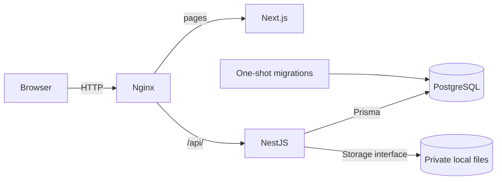

# Brainless v1.0.0

- Release: **v1.0.0**
- Release date: **2026-09-24**
- Phase: **Phase 1 - usable tracker**
- Objective: provide a usable private document catalog with authenticated ownership,
  durable originals and immutable versions before adding document processing.

This is the Phase 1 release snapshot, based on inspected source and recorded
acceptance evidence. The release designation/date are the project baseline;
private npm manifests still use `0.0.1`, and OpenAPI info uses `1`.
See [changelog](../../CHANGELOG.md) and [versioning policy](../development/conventions.md#versioning).

## Features included

- Registration, Argon2id login, hashed PostgreSQL sessions, refresh rotation/replay
  detection, logout, owned session APIs, profile/password settings and logout-all.
- Owned category/tag CRUD, normalized uniqueness and safe association deletion rules.
- Document list/filtering, detail, editable metadata, category/tag assignment,
  archive, restore and soft deletion. Search is a metadata substring query.
- Streaming PDF/JPEG/PNG uploads with signature/MIME/extension and resource checks,
  SHA-256 duplicate protection, durable idempotency and private local storage.
- Immutable additional versions, safe paginated history and current-version downloads.
- Responsive Next.js navigation/forms, upload progress/cancellation and theme selection.
- Validated API configuration, safe HTTP envelopes, structured correlation logs,
  liveness/readiness and generated Swagger/OpenAPI.

## Architecture and infrastructure at release

Node 24 images run the NestJS 10 API and Next.js 16 / React 19 frontend. Prisma 7
owns the PostgreSQL 17 schema/client. Tailwind 4, shadcn/Base UI, TanStack Query,
React Hook Form and Zod support the UI. Nginx 1.28 is the loopback HTTP entry point.

Compose has postgres, migrate, api, web and nginx services. Only Nginx publishes a
port (8080 by default); `postgres_data` and API-only `storage_data` persist data.
The dev override optionally publishes PostgreSQL to loopback. Ten checked-in SQL
migrations implement auth, organization, metadata, upload and scoped version receipts.
No worker, broker, cache, AI provider or search-index service runs in this release.

## Verification evidence

These are **recorded historical results**, not newly executed by the documentation
audit. Counts belong to the named checkpoints and are not a single combined run.

| Evidence                                                                      | Recorded result                                                                                                                                                                                                                      |
| ----------------------------------------------------------------------------- | ------------------------------------------------------------------------------------------------------------------------------------------------------------------------------------------------------------------------------------ |
| [Final browser/account verification](../phase-1-browser-verification.md)      | 174 component tests in 14 files; serial run passed after two parallel timing failures. Frontend lint/typecheck, focused formatting and Next.js build passed.                                                                         |
| Same final browser report                                                     | Three combined Chromium tests passed through Nginx: account/document workflows, ownership, file-byte comparison, persistence, expiry and active cancellation. Compose health/migrations and nginx -t passed in focused verification. |
| [Versioning backend checkpoint](../versioning-implementation.md#verification) | 211 unit, 112 PostgreSQL integration and 264 HTTP tests; 80 targeted HTTP checks after UUID routing fix. Prisma checks, all ten migrations, API/shared builds and source checks passed.                                              |
| Same versioning checkpoint                                                    | 15 Linux storage tests passed; this covers the Windows file-symlink privilege skip.                                                                                                                                                  |
| [23 September acceptance review](../phase-1-review.md)                        | Five database-launcher tests and Compose config validation passed; existing unchanged-source browser/build evidence reviewed rather than rerun.                                                                                      |

The [test guide](../development/testing.md) explains reproducible commands and the
isolation boundary. Chromium evidence is not cross-browser or physical-device
certification. No deployment CI workflow is included.

## Known limitations and deferred functionality

- Historical-version download, version promotion/edit/delete, Trash UI and permanent
  document purge are **Not Implemented**. API restore can address an owned deleted ID.
- Extraction status remains PENDING after upload; OCR, extraction, processing jobs,
  progress/retries, reminders, AI, semantic/full-text search and chat are **Planned**.
- Only local storage exists; S3-compatible storage and automated orphan/pending-file/
  session-history cleanup are **Future**. SQL and filesystem commits are not atomic.
- Same-owner checksum uniqueness includes archived/soft-deleted documents. Upload
  inspection is not malware scanning or full image-content validation.
- Downloads are current-version attachments without range support. The UI header
  probe and native download are separate requests; initiation is not completion.
- No email verification/reset/MFA/external login or individual-session management UI.
  KEYCLOAK/OIDC schema values are preparation, not working integrations.
- Client layouts are not an RSC authorization boundary. Refresh synchronization relies
  on Web Locks; deploy one canonical origin and account for unsupported browsers.
- Local Compose uses HTTP, not production TLS. Throttling is per process/socket peer;
  proxy users share budgets. Production edge policy, CI/CD, automated backup/restore
  and external exposure need separate implementation/review.

## Deployment and upgrade notes

Use the [existing Compose runbook](../compose.md) and [environment reference](../deployment/environment-variables.md).
Migrations run automatically before API startup. For host development, inject
DATABASE_URL and deploy all existing migrations before running the API.

Preserve PostgreSQL initialization values, the Compose project name and both volumes.
Back up database and files together before upgrades. Do not delete volumes or rewrite
applied migrations. Pre-version-scope installations must deploy
`20260915030000_version_upload_scope` and regenerate/build the client; do not run
old and new APIs concurrently across that receipt primary-key change.

Branding does not rename database identities or sessions: cookie defaults remain
`document_tracker_session` / `document_tracker_refresh`, the BroadcastChannel is
`document-tracker-auth`, the Web Lock is `document-tracker-auth:<api-base>`, and local
identity issuer remains `local`. No existing data/volume rename is required.

The documentation baseline introduces no application, schema, API, dependency or
runtime configuration changes. Future release snapshots should remain separate.
