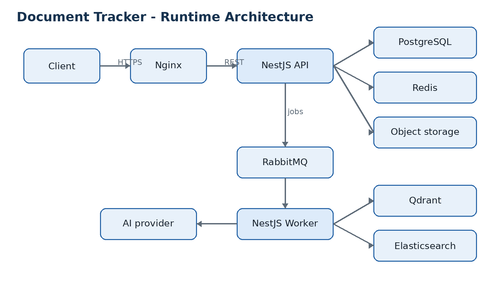
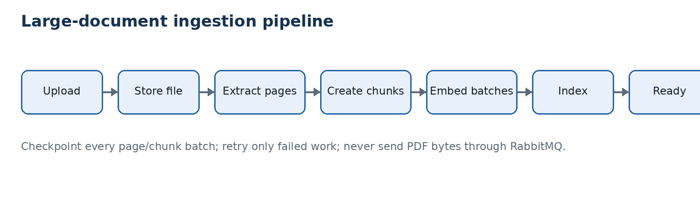

# Brainless product and technical specification

> **Planned target specification**, prepared 5 September 2026. This document preserves
> the broader product requirements and proposed architecture; it is not a list of
> shipped capabilities. All later-phase infrastructure, endpoint/page catalogs,
> processing examples and non-functional targets remain **Planned** unless confirmed
> in the [v1.0.0](releases/v1.0.0.md) or [v1.1.0](releases/v1.1.0.md) release snapshots,
> or in the current [v1.2.0 processing guide](phase-3-processing.md).
>
> Phase 1 is complete. For current behavior use the [documentation index](README.md),
> [architecture](architecture.md), [database](database.md), [API/OpenAPI guide](api.md)
> and [roadmap](roadmap.md). Uploads retain their existing UPLOADED/PENDING
> document response while scheduling a separate processing job. Local Compose
> uses HTTP, not TLS; the implemented CSRF policy
> uses an Origin check and custom header, not a token endpoint. ORM selection is
> resolved as Prisma 7. Historical MVP/MVP+ labels are planning labels, not release status.
> Phase 2 is the implemented [v1.1.0 organization/metadata release](roadmap.md#phase-2--v110-release-ready).
> Processing/reminders follow in Phase 3, AI/semantic retrieval in Phase 4 and
> advanced keyword search in Phase 5. This target catalog remains planned until
> the owning API/database guides and generated OpenAPI record implementation.
> The [v1.2.0 Phase 3 foundation](phase-3-processing.md) is narrower than the
> older Phase 3 examples in this specification: it implements durable jobs, delivery,
> recovery, progress, owned status, and stored-file integrity verification.
> Extraction/OCR, reminders, purge, and AI/search integrations remain future work.
> T02–T12 have implemented durable jobs, transport, a separate consumer,
> upload-triggered scheduling, stored-file integrity verification,
> PostgreSQL-backed retry/recovery, owned status, disposable progress and UI.

API-first reference architecture for NestJS, PostgreSQL, RabbitMQ, Redis, Elasticsearch, Qdrant, Nginx, Docker, and provider-neutral AI

| **Document**     | **Value**                                     |
| ---------------- | --------------------------------------------- |
| Status           | Planned target specification                  |
| Version          | 1.0                                           |
| Prepared         | 5 September 2026                              |
| Primary audience | Owner/developer and future contributors       |
| Architecture     | Modular monolith API plus asynchronous worker |

| **Recommended starting point:** Build the core Brainless document-management functionality first. Add RabbitMQ processing, AI, Qdrant, and Elasticsearch in deliberate phases rather than starting with every service enabled. |
| ------------------------------------------------------------------------------------------------------------------------------------------------------------------------------------------------------------------------------ |

The feature and endpoint catalogs describe the target product, not completed work.
See [the Phase 1 review](phase-1-review.md) and [roadmap](roadmap.md) for implementation status.
The detailed [API contract](api.md) governs implemented authentication behavior.

# Contents

- 1\. Product definition

- 2\. Scope and feature specification

- 3\. Roles and authorization

- 4\. Primary user journeys

- 5\. System architecture

- 6\. Data and storage specification

- 7\. API standards

- 8\. API endpoint catalog

- 9\. Web page and route catalog

- 10\. Asynchronous jobs and events

- 11\. Search and RAG design

- 12\. Security and privacy

- 13\. Non-functional requirements

- 14\. Testing strategy

- 15\. Delivery roadmap

- 16\. MVP acceptance criteria

- Appendix A. Status models

- Appendix B. Example contracts

| **Scope rule:** PostgreSQL and object storage own durable business data. Redis, RabbitMQ, Elasticsearch, and Qdrant are replaceable infrastructure and must never be the only copy of important data. |
| ----------------------------------------------------------------------------------------------------------------------------------------------------------------------------------------------------- |

# 1. Product definition

## 1.1 Vision

Brainless is a personal knowledge and document-management application. Its current implementation focuses on securely organizing, processing, searching, and discussing personal documents. It supports conventional metadata management first, then adds AI-assisted extraction, semantic retrieval, summaries, and document-grounded question answering.

## 1.2 Problem statement

Personal records are usually scattered across local folders, email, cloud drives, chat applications, and paper scans. Filenames are inconsistent, expiry dates are forgotten, and finding information inside a document is slow. The system provides one controlled catalog without making AI the source of truth.

## 1.3 Objectives

- Create a reliable catalog for PDFs and common image documents.

- Track categories, tags, important dates, versions, reminders, and verification state.

- Support keyword, semantic, and hybrid search without coupling the domain to one search engine.

- Support OpenAI initially or optionally, while allowing Ollama and local Qwen models later.

- Process large documents asynchronously, incrementally, idempotently, and resumably.

- Use PostgreSQL login initially while preserving a clean migration path to Keycloak.

## 1.4 Non-goals

- Replacing a regulated document-management, medical, legal, or accounting system.

- Allowing AI to silently approve critical dates, amounts, or identity information.

- Collaborative enterprise workflows, complex approval chains, or tenant billing in the MVP.

- Training or fine-tuning a foundation model.

- Storing original PDF binaries in PostgreSQL, Qdrant, Elasticsearch, Redis, or RabbitMQ.

## 1.5 Target document types

| **Group**  | **Examples**                                | **Typical metadata**                    |
| ---------- | ------------------------------------------- | --------------------------------------- |
| Finance    | Invoices, receipts, statements              | issuer, amount, date, reference         |
| Health     | Lab results, prescriptions, medical letters | provider, date, subject, follow-up      |
| Employment | Contracts, payslips, certificates           | employer, effective date, expiry        |
| Assets     | Warranties, purchase receipts, manuals      | brand, serial number, expiry            |
| Insurance  | Policies and renewals                       | provider, policy number, coverage dates |
| Identity   | Identity and government records             | type, issue date, expiry                |
| Other      | Education, tax, travel, household           | user-defined fields and tags            |

# 2. Scope and feature specification

| **ID** | **Feature**             | **Definition**                                             | **Release** |
| ------ | ----------------------- | ---------------------------------------------------------- | ----------- |
| F-01   | Local authentication    | Register, log in, refresh/revoke sessions, change password | MVP         |
| F-02   | Keycloak-ready identity | Map external issuer + subject to internal user             | Later       |
| F-03   | Document upload         | PDF/JPEG/PNG upload with validation and checksum           | MVP         |
| F-04   | Document catalog        | Create, edit, archive, restore, delete, filter             | MVP         |
| F-05   | Categories and tags     | User-owned organization and filtering                      | MVP         |
| F-06   | Versioning              | Upload new versions and inspect version history            | MVP+        |
| F-07   | Text extraction         | Incremental PDF extraction; OCR extension point            | Phase 3     |
| F-08   | Processing status       | Visible progress, retries, errors, cancellation            | Phase 3     |
| F-09   | AI metadata             | Classification, structured fields, confidence, review      | Phase 4     |
| F-10   | Summaries               | Generate and review a document summary                     | Phase 4     |
| F-11   | Semantic search         | Embed chunks and query Qdrant                              | Phase 4     |
| F-12   | Keyword search          | Elasticsearch matching, highlighting, filters              | Phase 5     |
| F-13   | Hybrid search           | Combine semantic and lexical results                       | Phase 5     |
| F-14   | Document Q&A            | RAG answers with page/chunk citations                      | Phase 4     |
| F-15   | Reminders               | Expiry, renewal, payment, and custom reminders             | Phase 3     |
| F-16   | Operations              | Health, queues, job retry, reindex, usage audit            | Phase 3+    |

## 2.1 Authentication and profile

- Email/password registration using Argon2id password hashing.

- HttpOnly, Secure, SameSite session cookie; session tokens are stored only as hashes.

- Profile settings for display name, locale, timezone, and default UI preferences.

- Session list and individual/all-session revocation.

- Future Keycloak login maps the OIDC issuer and subject to the existing internal user ID.

## 2.2 Document management

- Upload one document at a time in the MVP; multi-upload is a later convenience.

- Validate extension, MIME type, file signature, maximum bytes, page count, and encryption state.

- Calculate SHA-256 before accepting duplicate content for the same user.

- Maintain a logical document independently from uploaded file versions.

- Support archive and recoverable soft deletion; permanent deletion is an explicit operation.

- Store original files in S3-compatible object storage or a local development volume.

## 2.3 AI-assisted metadata

The worker can request a structured extraction containing document type, issuer, reference number, dates, amounts, suggested tags, summary, and source pages. All AI-derived critical fields begin as PENDING and must be accepted or rejected by the user.

| **Trust boundary:** An AI suggestion never automatically becomes verified business data. Verification copies accepted values into typed document columns and records who verified them. |
| --------------------------------------------------------------------------------------------------------------------------------------------------------------------------------------- |

## 2.4 Search

| **Mode**        | **Best for**                                    | **Backing service**    |
| --------------- | ----------------------------------------------- | ---------------------- |
| Database filter | Dates, status, category, owner                  | PostgreSQL             |
| Keyword         | Exact reference, issuer, phrase, typo tolerance | Elasticsearch          |
| Semantic        | Similar meaning and natural-language concepts   | Qdrant                 |
| Hybrid          | Meaning plus exact terms and filters            | Elasticsearch + Qdrant |

## 2.5 Reminders

- Create reminders manually or propose them from verified expiration dates.

- Support in-app delivery in Phase 3; email/Telegram can be added later.

- A reminder is idempotently delivered and records SENT, FAILED, or CANCELLED state.

# 3. Roles and authorization

| **Role** | **Purpose**               | **Permissions**                                                       |
| -------- | ------------------------- | --------------------------------------------------------------------- |
| USER     | Normal owner              | Manage own documents, searches, chats, reminders, profile             |
| ADMIN    | Operational administrator | View system health, jobs, AI profiles; no document content by default |
| WORKER   | Internal service identity | Consume authorized jobs and update processing/index state             |

## 3.1 Ownership policy

- Every document query is scoped by authenticated internal user_id.

- Qdrant queries require a userId payload filter.

- Elasticsearch queries require a userId term filter.

- Storage keys are resolved by the backend; clients never choose arbitrary server paths.

- Administration does not automatically grant access to document bodies or extracted text.

# 4. Primary user journeys

## 4.1 Upload and process a document

1.  User chooses a file and optional title/category.

2.  API validates the request, computes or verifies checksum, and stores the file.

3.  API creates document/version/job records in one transaction and publishes through an outbox-compatible workflow.

4.  Worker extracts text incrementally and stores chunks with checkpoints.

5.  Worker runs optional metadata extraction, summary, embeddings, and indexes.

6.  Document becomes READY or PARTIALLY_READY; the UI exposes any failed sub-step.

7.  User reviews AI suggestions and verifies important values.

## 4.2 Search and open

8.  User selects database, keyword, semantic, or hybrid mode.

9.  API applies ownership and metadata filters before returning ranked results.

10. Results include matching pages/chunks and highlight snippets when available.

11. User opens the document detail page and navigates to the cited page.

## 4.3 Ask a document

12. User selects one document or an allowed collection scope.

13. Question is embedded using the same active profile used for stored chunks.

14. Qdrant retrieves top candidate chunks with user and document filters.

15. The generation provider answers only from supplied context.

16. Response includes citations tied to PostgreSQL chunk IDs and page numbers.

17. If evidence is insufficient, the response says the answer was not found.

# 5. System architecture

_Figure 1. Recommended modular-monolith runtime topology_

## 5.1 Component responsibilities

| **Component**  | **Responsibility**                             | **Must not own**                   |
| -------------- | ---------------------------------------------- | ---------------------------------- |
| Nginx          | TLS, reverse proxy, upload limits, compression | Authentication business logic      |
| NestJS API     | REST contracts, authorization, orchestration   | Long-running extraction            |
| NestJS worker  | Extraction, OCR, AI, embeddings, indexing      | Public HTTP sessions               |
| PostgreSQL     | Authoritative metadata, chunks, audit state    | Original file binaries             |
| Object storage | Original files and derived previews            | Search or user identity            |
| RabbitMQ       | At-least-once task delivery                    | Permanent job history or PDF bytes |
| Redis          | Cache, rate limits, locks, progress            | Durable business records           |
| Qdrant         | Vector similarity and vector payload filters   | Canonical text or document records |
| Elasticsearch  | Keyword index, highlights, aggregations        | Canonical metadata                 |
| AI adapters    | Embedding and generation provider calls        | Domain rules or authorization      |

## 5.2 NestJS code organization

<table>
<colgroup>
<col style="width: 100%" />
</colgroup>
<thead>
<tr class="header">
<th>apps/ 
api/ 
worker/ 
libs/ 
auth/ 
documents/ 
processing/ 
search/ 
ai/ 
reminders/ 
persistence/ 
contracts/ 
infrastructure/ 
nginx/ 
docker/</th>
</tr>
</thead>
<tbody>
</tbody>
</table>

Begin as a modular monolith. The API and worker may be separate deployable processes in one repository and share contracts, while domain modules remain isolated behind interfaces.

## 5.3 Provider abstraction

<table>
<colgroup>
<col style="width: 100%" />
</colgroup>
<thead>
<tr class="header">
<th>EmbeddingProvider.embed(inputs) -&gt; vectors, model, dimensions, usage 
TextGenerationProvider.generate(prompt, schema?) -&gt; text/structured output, model, usage 
 
Adapters: 
OpenAIEmbeddingProvider 
OpenAITextGenerationProvider 
OllamaEmbeddingProvider 
OllamaTextGenerationProvider</th>
</tr>
</thead>
<tbody>
</tbody>
</table>

| **Embedding compatibility:** Document and query vectors must use the same embedding profile. Switching from OpenAI to Ollama/Qwen requires re-embedding, not merely changing an API URL. |
| ---------------------------------------------------------------------------------------------------------------------------------------------------------------------------------------- |

# 6. Data and storage specification

| **Entity**              | **Purpose**                                         | **Key rule**                       |
| ----------------------- | --------------------------------------------------- | ---------------------------------- |
| users                   | Internal, provider-independent application identity | email unique; soft delete          |
| user_identities         | LOCAL/KEYCLOAK/OIDC identity mapping                | provider + issuer + subject unique |
| local_credentials       | Current PostgreSQL password authentication          | one per user; Argon2id             |
| auth_sessions           | Server-side session lifecycle                       | hashed token; expiry/revocation    |
| categories              | User-owned document category                        | user + name unique                 |
| tags                    | User-owned flexible label                           | user + name unique                 |
| documents               | Logical document and verified metadata              | owned by user                      |
| document_tags           | Document/tag many-to-many join                      | composite unique                   |
| document_versions       | Immutable uploaded file revision                    | document + version unique          |
| document_chunks         | Canonical extracted chunk text                      | version + index unique             |
| ai_model_profiles       | Provider/model/capability configuration             | code unique; no secrets            |
| chunk_embeddings        | Qdrant point reference and index status             | chunk + profile unique             |
| ai_processing_runs      | AI invocation audit and usage                       | correlation and prompt version     |
| extracted_fields        | AI/OCR/user metadata candidates                     | verification lifecycle             |
| processing_jobs         | Durable job state                                   | correlation ID unique              |
| processing_job_attempts | Retry/error history                                 | job + attempt unique               |
| reminders               | Scheduled document actions                          | idempotent delivery                |
| chat_sessions           | RAG conversation scope                              | owned by user                      |
| chat_messages           | User/assistant messages and usage                   | ordered by creation                |
| message_citations       | Message-to-chunk provenance                         | citation order                     |

## 6.1 Core relationships

- users 1:N documents, categories, tags, auth_sessions, chat_sessions

- users 1:N user_identities and users 1:0..1 local_credentials

- documents 1:N document_versions, reminders, processing_jobs, extracted_fields

- document_versions 1:N document_chunks, AI runs, and processing jobs

- document_chunks 1:N chunk_embeddings and message_citations

- ai_model_profiles 1:N AI runs, embeddings, and generated chat messages

## 6.2 Required indexes

<table>
<colgroup>
<col style="width: 100%" />
</colgroup>
<thead>
<tr class="header">
<th>users(email) UNIQUE 
user_identities(provider, issuer, subject) UNIQUE 
documents(user_id, created_at DESC) 
documents(user_id, status, document_date) 
document_versions(document_id, version_number) UNIQUE 
document_versions(checksum_sha256) 
document_chunks(document_version_id, chunk_index) UNIQUE 
chunk_embeddings(document_chunk_id, ai_model_profile_id) UNIQUE 
processing_jobs(status, available_at) 
reminders(status, remind_at) 
chat_messages(chat_session_id, created_at)</th>
</tr>
</thead>
<tbody>
</tbody>
</table>

## 6.3 Storage paths

<table>
<colgroup>
<col style="width: 100%" />
</colgroup>
<thead>
<tr class="header">
<th>documents/{userId}/{documentId}/{versionId}/original.pdf 
documents/{userId}/{documentId}/{versionId}/preview/page-{n}.png 
documents/{userId}/{documentId}/{versionId}/extracted.txt</th>
</tr>
</thead>
<tbody>
</tbody>
</table>

## 6.4 Deletion contract

Soft deletion hides a record but keeps recoverable data. Permanent deletion creates a background job that removes the original file, previews, Qdrant points, Elasticsearch record, chunks, citations, and derived data before finalizing the database tombstone. Failures remain retryable and auditable.

# 7. API standards

| **Concern**    | **Standard**                                                                 |
| -------------- | ---------------------------------------------------------------------------- |
| Base path      | /api/v1                                                                      |
| Format         | JSON; multipart/form-data only for uploads                                   |
| Authentication | HttpOnly session cookie now; OIDC bearer validation later                    |
| CSRF           | Required for cookie-authenticated state-changing requests                    |
| Dates          | ISO 8601 UTC timestamps; date-only fields use YYYY-MM-DD                     |
| IDs            | UUID strings                                                                 |
| Pagination     | Cursor preferred; offset allowed for small admin tables                      |
| Idempotency    | Idempotency-Key for upload, retry, reminder creation, and permanent deletion |
| Concurrency    | ETag/If-Match or version number for mutable document metadata                |
| Errors         | Stable code, message, details, traceId                                       |

## 7.1 Success envelope

<table>
<colgroup>
<col style="width: 100%" />
</colgroup>
<thead>
<tr class="header">
<th>{ 
"data": { ... }, 
"meta": { "requestId": "uuid" } 
}</th>
</tr>
</thead>
<tbody>
</tbody>
</table>

## 7.2 Error envelope

<table>
<colgroup>
<col style="width: 100%" />
</colgroup>
<thead>
<tr class="header">
<th>{ 
"error": { 
"code": "DOCUMENT_NOT_FOUND", 
"message": "Document was not found.", 
"details": {}, 
"traceId": "uuid" 
} 
}</th>
</tr>
</thead>
<tbody>
</tbody>
</table>

## 7.3 List contract

<table>
<colgroup>
<col style="width: 100%" />
</colgroup>
<thead>
<tr class="header">
<th>GET /api/v1/documents?limit=25&amp;cursor=...&amp;status=READY&amp;categoryId=...&amp;sort=-createdAt 
 
{ 
"data": [...], 
"meta": { "nextCursor": "...", "hasMore": true } 
}</th>
</tr>
</thead>
<tbody>
</tbody>
</table>

## 7.4 HTTP status guidance

| **Status** | **Use**                                                           |
| ---------- | ----------------------------------------------------------------- |
| 200        | Successful read/update/action with immediate result               |
| 201        | Resource created                                                  |
| 202        | Accepted asynchronous operation                                   |
| 204        | Successful deletion or action without body                        |
| 400        | Malformed request                                                 |
| 401/403    | Unauthenticated / authenticated but forbidden                     |
| 404        | Missing or inaccessible resource                                  |
| 409        | Duplicate, invalid transition, or optimistic concurrency conflict |
| 413/415    | Too large / unsupported media type                                |
| 422        | Valid JSON but failed business validation                         |
| 429        | Rate limited                                                      |

# 8. API endpoint catalog

All paths below are relative to /api/v1. USER endpoints are ownership-scoped. ADMIN endpoints require an operational administrator role. Internal worker commands should not be exposed publicly.

## 8.1 Authentication and profile

| **Method** | **Path**                 | **Access** | **Purpose**                                                   | **Phase** |
| ---------- | ------------------------ | ---------- | ------------------------------------------------------------- | --------- |
| POST       | /auth/register           | Public     | Create user, LOCAL identity and credentials; login separately | MVP       |
| POST       | /auth/login              | Public     | Authenticate local credentials and create session             | MVP       |
| POST       | /auth/refresh            | Session    | Rotate/extend session according to policy                     | MVP       |
| POST       | /auth/logout             | USER       | Revoke current session                                        | MVP       |
| POST       | /auth/logout-all         | USER       | Revoke all sessions                                           | MVP       |
| GET        | /auth/keycloak/start     | Public     | Begin OIDC authorization-code flow                            | Later     |
| GET        | /auth/keycloak/callback  | Public     | Validate callback and map issuer + subject                    | Later     |
| GET        | /auth/me                 | USER       | Return the authenticated public profile                       | MVP       |
| GET        | /me                      | USER       | Return the authenticated public profile (alias)               | MVP       |
| PATCH      | /me                      | USER       | Update display name, timezone and locale                      | MVP       |
| PATCH      | /me/password             | USER       | Change local password and revoke other sessions               | MVP       |
| GET        | /me/sessions             | USER       | List active application sessions                              | MVP+      |
| DELETE     | /me/sessions/others      | USER       | Revoke owned sessions except the current session              | MVP+      |
| DELETE     | /me/sessions/{sessionId} | USER       | Revoke selected session                                       | MVP+      |

## 8.2 Categories and tags

The implemented Tags contract is detailed in docs/api.md: Categories-compatible
NFKC/whitespace normalization, per-owner lower(name) uniqueness, UUID cursor paging,
optional literal case-insensitive q search, and permanent owned deletion. Document
join cleanup is implemented and covered by document/organization tests.

| **Method** | **Path**                 | **Access** | **Purpose**                            | **Phase** |
| ---------- | ------------------------ | ---------- | -------------------------------------- | --------- |
| GET        | /categories              | USER       | List categories                        | MVP       |
| POST       | /categories              | USER       | Create category                        | MVP       |
| PATCH      | /categories/{categoryId} | USER       | Rename/re-style category               | MVP       |
| DELETE     | /categories/{categoryId} | USER       | Delete if unused or reassign documents | MVP       |
| GET        | /tags                    | USER       | List/search tags                       | MVP       |
| POST       | /tags                    | USER       | Create tag                             | MVP       |
| PATCH      | /tags/{tagId}            | USER       | Rename tag                             | MVP       |
| DELETE     | /tags/{tagId}            | USER       | Remove tag and joins                   | MVP       |

## 8.3 Documents

| **Method** | **Path**                         | **Access** | **Purpose**                                          | **Phase** |
| ---------- | -------------------------------- | ---------- | ---------------------------------------------------- | --------- |
| GET        | /documents                       | USER       | List/filter/sort owned documents                     | MVP       |
| POST       | /documents                       | USER       | Upload and create document/version                   | MVP       |
| GET        | /documents/{documentId}          | USER       | Get detail, verified metadata and processing summary | MVP       |
| PATCH      | /documents/{documentId}          | USER       | Update title/category/dates/reference/tags           | MVP       |
| POST       | /documents/{documentId}/archive  | USER       | Archive document                                     | MVP       |
| POST       | /documents/{documentId}/restore  | USER       | Restore archived/soft-deleted document               | MVP+      |
| DELETE     | /documents/{documentId}          | USER       | Soft delete document                                 | MVP       |
| POST       | /documents/{documentId}/purge    | USER       | Queue permanent deletion                             | Phase 3   |
| GET        | /documents/{documentId}/download | USER       | Authorized original-file download                    | MVP       |
| GET        | /documents/{documentId}/preview  | USER       | Return preview manifest or signed links              | MVP+      |
| GET        | /documents/{documentId}/activity | USER       | Audit processing and user changes                    | Phase 3   |

## 8.4 Versions, processing and extracted fields

| **Method** | **Path**                                          | **Access** | **Purpose**                     | **Phase** |
| ---------- | ------------------------------------------------- | ---------- | ------------------------------- | --------- |
| GET        | /documents/{id}/versions                          | USER       | List versions                   | MVP+      |
| POST       | /documents/{id}/versions                          | USER       | Upload new immutable version    | MVP+      |
| GET        | /documents/{id}/versions/{versionId}              | USER       | Version detail                  | MVP+      |
| GET        | /documents/{id}/versions/{versionId}/chunks       | USER       | Paged extracted chunks          | Phase 3   |
| GET        | /documents/{id}/processing                        | USER       | Current job states and progress | Phase 3   |
| POST       | /documents/{id}/reprocess                         | USER       | Queue selected processing steps | Phase 3   |
| POST       | /documents/{id}/processing/cancel                 | USER       | Request cancellation            | Phase 3   |
| GET        | /documents/{id}/extracted-fields                  | USER       | List AI/OCR suggestions         | Phase 4   |
| POST       | /documents/{id}/extracted-fields/{fieldId}/verify | USER       | Accept and promote field        | Phase 4   |
| POST       | /documents/{id}/extracted-fields/{fieldId}/reject | USER       | Reject candidate                | Phase 4   |
| POST       | /documents/{id}/summary/regenerate                | USER       | Queue summary regeneration      | Phase 4   |

## 8.5 Search

| **Method** | **Path**            | **Access** | **Purpose**                             | **Phase** |
| ---------- | ------------------- | ---------- | --------------------------------------- | --------- |
| GET        | /search/documents   | USER       | Unified keyword/semantic/hybrid search  | Phase 4/5 |
| POST       | /search/semantic    | USER       | Semantic search with structured filters | Phase 4   |
| POST       | /search/hybrid      | USER       | Hybrid retrieval and rank fusion        | Phase 5   |
| GET        | /search/suggestions | USER       | Autocomplete issuers, tags and titles   | Phase 5   |

## 8.6 RAG chat

| **Method** | **Path**                             | **Access** | **Purpose**                           | **Phase** |
| ---------- | ------------------------------------ | ---------- | ------------------------------------- | --------- |
| GET        | /chat-sessions                       | USER       | List chat sessions                    | Phase 4   |
| POST       | /chat-sessions                       | USER       | Create scoped chat                    | Phase 4   |
| GET        | /chat-sessions/{sessionId}           | USER       | Get session and messages              | Phase 4   |
| PATCH      | /chat-sessions/{sessionId}           | USER       | Rename/change allowed scope           | Phase 4   |
| DELETE     | /chat-sessions/{sessionId}           | USER       | Soft delete chat                      | Phase 4   |
| POST       | /chat-sessions/{sessionId}/messages  | USER       | Ask question and return/stream answer | Phase 4   |
| GET        | /chat-messages/{messageId}/citations | USER       | Resolve cited chunks/pages            | Phase 4   |
| POST       | /chat-messages/{messageId}/feedback  | USER       | Store helpful/not-helpful feedback    | Later     |

## 8.7 Reminders

| **Method** | **Path**                        | **Access** | **Purpose**                | **Phase** |
| ---------- | ------------------------------- | ---------- | -------------------------- | --------- |
| GET        | /reminders                      | USER       | List upcoming/history      | Phase 3   |
| POST       | /reminders                      | USER       | Create reminder            | Phase 3   |
| GET        | /reminders/{reminderId}         | USER       | Reminder detail            | Phase 3   |
| PATCH      | /reminders/{reminderId}         | USER       | Reschedule/update reminder | Phase 3   |
| POST       | /reminders/{reminderId}/dismiss | USER       | Dismiss reminder           | Phase 3   |
| POST       | /reminders/{reminderId}/snooze  | USER       | Create next delivery time  | Later     |
| DELETE     | /reminders/{reminderId}         | USER       | Cancel reminder            | Phase 3   |

## 8.8 Operations and configuration

| **Method** | **Path**                       | **Access** | **Purpose**                           | **Phase** |
| ---------- | ------------------------------ | ---------- | ------------------------------------- | --------- |
| GET        | /health/live                   | Internal   | Process liveness                      | MVP       |
| GET        | /health/ready                  | Internal   | Required dependency readiness         | MVP       |
| GET        | /admin/jobs                    | ADMIN      | Filter job and attempt history        | Phase 3   |
| POST       | /admin/jobs/{jobId}/retry      | ADMIN      | Retry eligible failed job             | Phase 3   |
| POST       | /admin/search/reindex          | ADMIN      | Queue Elasticsearch rebuild           | Phase 5   |
| POST       | /admin/vectors/reindex         | ADMIN      | Queue embedding profile rebuild       | Phase 4   |
| GET        | /admin/ai-profiles             | ADMIN      | List provider-neutral profiles        | Phase 4   |
| POST       | /admin/ai-profiles             | ADMIN      | Create profile without secret         | Phase 4   |
| PATCH      | /admin/ai-profiles/{profileId} | ADMIN      | Activate/update safe profile settings | Phase 4   |
| GET        | /admin/usage/ai                | ADMIN      | Usage, latency and estimated cost     | Phase 4   |

## 8.9 Important endpoint behavior

- POST /documents returns 201 after durable file and database creation, even though processing continues asynchronously.

- Reprocessing accepts explicit steps such as TEXT_EXTRACTION, AI_METADATA, EMBEDDINGS, and SEARCH_INDEX.

- Search results return document IDs plus page/chunk references; authorization is checked again when opening a result.

- Chat scope is immutable once messages exist unless the product explicitly warns that context is changing.

- Permanent deletion returns 202 and remains visible as DELETING until every derived store is cleaned.

# 9. Web page and route catalog

| **Route**                 | **Page**          | **Primary content**                                      | **Phase** |
| ------------------------- | ----------------- | -------------------------------------------------------- | --------- |
| /login                    | Login             | Local login; future Keycloak button                      | MVP       |
| /register                 | Register          | Create local account                                     | MVP       |
| /                         | Dashboard         | Counts, recent documents, upcoming reminders, processing | MVP/2     |
| /documents                | Documents         | List/grid, filters, sort, bulk selection                 | MVP       |
| /documents/upload         | Upload            | File drop, metadata, validation, progress                | MVP       |
| /documents/:id            | Document detail   | Preview, verified fields, tags, status, actions          | MVP       |
| /documents/:id/edit       | Edit metadata     | Trusted metadata editing                                 | MVP       |
| /documents/:id/versions   | Version history   | Compare version metadata and processing                  | MVP+      |
| /documents/:id/review     | AI review         | Accept/reject extracted fields and summary               | Phase 4   |
| /documents/:id/processing | Processing detail | Steps, attempts, progress, retry                         | Phase 3   |
| /search                   | Search            | Keyword, semantic, hybrid modes and filters              | Phase 4/5 |
| /chat                     | Document chat     | Session list and scoped Q&A                              | Phase 4   |
| /chat/:sessionId          | Chat session      | Answers, citations, source navigation                    | Phase 4   |
| /reminders                | Reminders         | Upcoming, overdue, dismissed, history                    | Phase 3   |
| /settings/profile         | Profile           | Name, timezone, locale                                   | MVP       |
| /settings/security        | Security          | Password and session management                          | MVP+      |
| /settings/ai              | AI preferences    | Available profiles and privacy choices                   | Phase 4   |
| /admin/jobs               | Job operations    | Failures, attempts and retries                           | Phase 3   |
| /admin/ai-profiles        | AI profiles       | Provider/model/index configuration                       | Phase 4   |
| /admin/system             | System health     | Dependency status and queue metrics                      | Phase 3   |

## 9.1 Dashboard widgets

- Total and recently added documents

- Documents by category and type

- Upcoming expirations and overdue reminders

- Processing now, failed, and awaiting review

- Storage usage and optional AI usage

## 9.2 Document detail layout

| **Area**  | **Content**                                         |
| --------- | --------------------------------------------------- |
| Header    | Title, type, status, category, actions              |
| Preview   | PDF/image viewer with page navigation               |
| Metadata  | Verified fields and user-entered values             |
| AI review | Pending suggestions with confidence and source page |
| Activity  | Versions, jobs, retries, changes                    |
| Related   | Semantically similar documents                      |
| Ask       | Question input scoped to this document              |

# 10. Asynchronous jobs and events

_Figure 2. Resumable large-file ingestion_

## 10.1 Queue catalog

| **Queue**                | **Input reference**           | **Output**                 |
| ------------------------ | ----------------------------- | -------------------------- |
| document.text-extraction | documentVersionId             | chunks and page count      |
| document.thumbnail       | documentVersionId             | preview files              |
| document.ai-extraction   | documentVersionId + profileId | candidate fields           |
| document.summary         | documentVersionId + profileId | candidate summary          |
| document.embedding       | documentVersionId + profileId | Qdrant points              |
| document.search-index    | documentId                    | Elasticsearch projection   |
| reminder.delivery        | reminderId                    | delivery status            |
| document.deletion        | documentId                    | removed derived data/files |

## 10.2 Message envelope

<table>
<colgroup>
<col style="width: 100%" />
</colgroup>
<thead>
<tr class="header">
<th>{ 
"messageId": "uuid", 
"type": "document.embedding.requested", 
"occurredAt": "2026-09-05T10:00:00Z", 
"correlationId": "uuid", 
"causationId": "uuid", 
"attempt": 1, 
"payload": { 
"documentId": "uuid", 
"documentVersionId": "uuid", 
"profileId": "uuid" 
} 
}</th>
</tr>
</thead>
<tbody>
</tbody>
</table>

| **Message-size rule:** RabbitMQ messages carry identifiers and safe metadata only. Workers retrieve files and chunks from durable storage. Never publish PDF bytes, Base64 files, complete extracted text, or vector arrays. |
| ---------------------------------------------------------------------------------------------------------------------------------------------------------------------------------------------------------------------------- |

## 10.3 Retry policy

- Acknowledge only after durable state and downstream writes succeed.

- Use exponential backoff with jitter for temporary provider/network failures.

- Do not retry validation errors, unsupported files, or invalid model configuration indefinitely.

- Move exhausted messages to a dead-letter queue and mark the durable job FAILED.

- Use deterministic Qdrant point IDs and idempotency keys for repeat delivery.

- Resume missing chunks instead of reprocessing completed chunks.

## 10.4 Redis key conventions

| **Pattern**                      | **Purpose**                 | **TTL**         |
| -------------------------------- | --------------------------- | --------------- |
| rate:{userId}:{route}            | API rate limit              | window duration |
| job-progress:{jobId}             | Fast progress polling       | 24 hours        |
| lock:document:{versionId}:{step} | Duplicate worker prevention | bounded lease   |
| cache:dashboard:{userId}         | Dashboard summary           | 1-5 minutes     |
| upload:{uploadId}                | Temporary multipart state   | 1 hour          |

# 11. Search and RAG design

## 11.1 Qdrant point model

<table>
<colgroup>
<col style="width: 100%" />
</colgroup>
<thead>
<tr class="header">
<th>{ 
"id": "deterministic-uuid", 
"vector": [0.012, -0.034, 0.056], 
"payload": { 
"userId": "uuid", 
"documentId": "uuid", 
"documentVersionId": "uuid", 
"chunkId": "uuid", 
"pageFrom": 3, 
"pageTo": 4, 
"embeddingProfile": "ollama-qwen-v1", 
"contentHash": "sha256" 
} 
}</th>
</tr>
</thead>
<tbody>
</tbody>
</table>

- Create payload indexes only for fields used in filters, especially userId, documentId, documentType, and categoryId.

- Keep canonical chunk text in PostgreSQL; Qdrant payload should stay compact.

- Use one collection per incompatible embedding profile during early implementation, or explicitly designed named vectors later.

- Query and stored vectors must come from the same model/profile.

## 11.2 Elasticsearch projection

<table>
<colgroup>
<col style="width: 100%" />
</colgroup>
<thead>
<tr class="header">
<th>{ 
"documentId": "uuid", 
"userId": "uuid", 
"title": "ASUS Laptop Warranty", 
"documentType": "WARRANTY", 
"categoryId": "uuid", 
"tags": ["laptop", "warranty"], 
"issuer": "ASUS", 
"referenceNumber": "WR-123", 
"documentDate": "2026-08-10", 
"expirationDate": "2028-08-10", 
"summary": "...", 
"content": "...", 
"status": "READY" 
}</th>
</tr>
</thead>
<tbody>
</tbody>
</table>

## 11.3 Hybrid ranking

18. Run keyword and semantic retrieval independently with the same ownership and metadata filters.

19. Normalize or rank-fuse results rather than directly adding incomparable raw scores.

20. Optionally rerank a small candidate set after initial retrieval.

21. Return explainable result metadata: source mode, page, snippet, and matched filters.

## 11.4 RAG guardrails

- Retrieve only chunks authorized for the current internal user.

- Treat document text as untrusted data, not system instructions.

- Instruct the model to answer only from supplied context.

- Return an explicit insufficient-evidence response when context does not support an answer.

- Persist citations before showing the response as complete.

- Do not expose hidden system prompts, secrets, storage keys, or another user's identifiers.

## 11.5 Model migration

22. Create a new ai_model_profile and Qdrant collection.

23. Dual-write new chunks when appropriate.

24. Backfill existing chunks in resumable batches.

25. Evaluate retrieval quality using a fixed test set.

26. Switch the active profile and retain rollback temporarily.

27. Remove the old collection only after verification.

# 12. Security and privacy

| **Area**       | **Requirement**                                                               |
| -------------- | ----------------------------------------------------------------------------- |
| Passwords      | Argon2id hash; never reversible encryption                                    |
| Sessions       | Hashed server token, Secure/HttpOnly/SameSite cookie, rotation and revocation |
| CSRF           | Token validation for cookie-authenticated mutations                           |
| Uploads        | Signature/MIME validation, byte/page limits, malware scanning extension       |
| Authorization  | Internal user ownership enforced in every repository/query                    |
| AI secrets     | Environment or secret manager; never database/log/frontend                    |
| Sensitive text | Do not log prompts, extracted text, chat context, or vectors by default       |
| Transport      | TLS at Nginx; private container network internally                            |
| Storage        | Encryption at rest in production and private object buckets                   |
| Deletion       | Propagate permanent deletion to every derived store                           |
| Audit          | Security events and administrative operations without content leakage         |
| Backups        | Encrypted PostgreSQL/object snapshots; tested restoration                     |

## 12.1 Keycloak migration boundary

Keycloak later owns authentication, federation, login UI, password policy, MFA, and token issuance. The application continues to own its internal user, documents, preferences, and domain authorization. Match external users by (provider, issuer, subject), not by email alone.

## 12.2 AI privacy choices

- Allow an account-level choice between disabled AI, local-only AI, and approved hosted AI.

- Display which provider/model will receive document text before enabling hosted processing.

- Allow reprocessing with a different provider and deletion of derived vectors/summaries.

- Record provider/model/prompt version and usage without storing hidden credentials.

# 13. Non-functional requirements

| **Category**   | **Initial target**                                                      |
| -------------- | ----------------------------------------------------------------------- |
| Availability   | Personal deployment; graceful degradation when AI/search is unavailable |
| Upload         | Configurable 50-200 MB maximum; resumable processing after upload       |
| API latency    | p95 under 500 ms for metadata CRUD on a healthy local deployment        |
| Search latency | p95 under 1.5 s for personal-scale index, excluding cold model startup  |
| Processing     | No whole-document memory requirement; bounded page/chunk batches        |
| Reliability    | At-least-once jobs with idempotent consumers and dead-letter handling   |
| Recovery       | Indexes rebuildable from PostgreSQL and object storage                  |
| Observability  | Structured logs, correlation IDs, metrics and dependency health         |
| Accessibility  | Keyboard navigation, visible focus, labels, adequate contrast           |
| Portability    | Docker Compose local environment; provider adapters selected by config  |

## 13.1 Graceful degradation

| **Unavailable dependency** | **Expected behavior**                                                                          |
| -------------------------- | ---------------------------------------------------------------------------------------------- |
| Redis                      | Core reads/writes continue where safe; cache and rate-limit behavior fails according to policy |
| RabbitMQ                   | Upload remains durable; processing status stays queued and publisher retries                   |
| Qdrant                     | Metadata and keyword search continue; semantic/RAG temporarily unavailable                     |
| Elasticsearch              | Metadata and semantic search continue; keyword mode unavailable                                |
| AI provider                | Documents remain usable; AI jobs retry or become visibly failed                                |
| Object storage             | Reject new upload; metadata reads continue; downloads unavailable                              |

## 13.2 Large-document rules

- Extract and OCR pages incrementally.

- Checkpoint processed page/chunk ranges.

- Embed batches rather than one request per chunk.

- Limit concurrent OCR and embedding work by available CPU/GPU and provider quotas.

- Expose progress and allow cancellation between safe checkpoints.

- Do not treat compressed upload bytes as the only resource limit; inspect page count and decompressed work.

# 14. Testing strategy

| **Layer**   | **Coverage**                                                                               |
| ----------- | ------------------------------------------------------------------------------------------ |
| Unit        | Domain rules, status transitions, chunking, authorization predicates, rank fusion          |
| Integration | PostgreSQL repositories, RabbitMQ consumers, Redis locks, Qdrant/Elasticsearch adapters    |
| Contract    | OpenAPI response shapes, provider interfaces, event envelope compatibility                 |
| End-to-end  | Register, upload, process, review, search, ask, remind, delete                             |
| Security    | Cross-user access, path traversal, MIME spoofing, CSRF, session fixation, prompt injection |
| Performance | Large PDF, many chunks, concurrent searches, slow AI provider, queue backlog               |
| Recovery    | Worker crash, duplicate message, reindex, embedding migration, backup restore              |

## 14.1 Required test documents

- Small text PDF

- Large multi-hundred-page text PDF

- Scanned image-only PDF

- Mixed text-and-image PDF

- Encrypted/password-protected PDF

- Corrupted PDF

- MIME-spoofed executable

- Duplicate file with different filename

- Indonesian and English documents

## 14.2 Retrieval evaluation set

Maintain a small version-controlled evaluation dataset containing representative questions, expected documents/chunks, and answerability labels. Compare recall@k, citation correctness, insufficient-evidence behavior, latency, and provider cost before changing chunking or embedding models.

# 15. Delivery roadmap

| **Phase** | **Deliverable**           | **Enabled stack**                  | **Exit condition**                                      |
| --------- | ------------------------- | ---------------------------------- | ------------------------------------------------------- |
| 0         | Foundation                | NestJS, PostgreSQL, Docker         | Migrations, modules, CI tests, health                   |
| 1         | Usable tracker            | \+ Nginx, object storage           | Auth, CRUD, upload/download, categories/tags            |
| 2         | Organization and metadata | Existing stack                     | Description, current-file metadata, filters and sorting |
| 3         | Processing                | \+ RabbitMQ, Redis where justified | Extraction, progress, retries, reminders                |
| 4         | Local/hosted AI           | \+ Ollama/OpenAI, Qdrant           | Reviewable extraction, semantic search, cited Q&A       |
| 5         | Advanced search           | \+ Elasticsearch                   | Keyword, highlights, autocomplete, hybrid ranking       |
| 6         | Identity upgrade          | \+ Keycloak                        | OIDC migration without changing domain ownership        |

## 15.1 Suggested first development backlog

28. Create monorepo, Docker Compose, configuration validation and health endpoints.

29. Implement users, local credentials, identities and session authentication.

30. Implement categories, tags and document metadata migrations.

31. Add object storage adapter and validated single-file upload.

32. Build document list, upload and detail pages.

33. Add versioning, checksum duplicate detection and authorized download.

34. Add worker, RabbitMQ job records and incremental text extraction.

35. Add processing status UI, retries and Redis progress.

36. Add provider-neutral AI interfaces, Ollama/OpenAI adapters and profiles.

37. Add chunks, embeddings, Qdrant search and document-scoped RAG.

38. Add Elasticsearch only after semantic search and core workflows are stable.

# 16. MVP acceptance criteria

| **Area**       | **Acceptance criterion**                                                                                                       |
| -------------- | ------------------------------------------------------------------------------------------------------------------------------ |
| Authentication | A user can register, log in, remain authenticated through an HttpOnly session, log out, and cannot access another user's data. |
| Upload         | A valid supported file is stored durably with checksum and version metadata; invalid or oversized files are rejected clearly.  |
| Catalog        | A user can list, filter, open, edit, categorize, tag, archive, restore, and soft-delete owned documents.                       |
| Download       | Only the owner can obtain the original file; storage paths are never accepted directly from the client.                        |
| Versioning     | A new file version does not overwrite the prior immutable version.                                                             |
| Failure        | Database or storage failure does not leave a falsely successful document record.                                               |
| Deployment     | The MVP starts through documented Docker Compose commands and is reached through Nginx.                                        |
| Tests          | Critical ownership, upload, and document CRUD paths pass automated integration tests.                                          |

## 16.1 Phase 4 AI acceptance criteria

- Every AI result records provider, model, prompt version, duration, and status.

- Extracted critical values are pending until explicitly verified.

- Semantic queries use the same embedding profile as indexed chunks.

- Every RAG answer contains valid owned-document citations or reports insufficient evidence.

- A failed provider call does not make the original document inaccessible.

- Existing chunks can be re-embedded into a new Qdrant collection without re-uploading the PDF.

# Appendix A. Status models

| **Object**      | **States**                                                                  |
| --------------- | --------------------------------------------------------------------------- |
| Document        | UPLOADED, PROCESSING, READY, PARTIALLY_READY, FAILED, ARCHIVED, DELETING    |
| Extraction      | PENDING, PROCESSING, COMPLETED, PARTIAL, FAILED, CANCELLED                  |
| Job             | PENDING, QUEUED, PROCESSING, COMPLETED, FAILED, CANCEL_REQUESTED, CANCELLED |
| Embedding       | PENDING, PROCESSING, READY, FAILED, STALE                                   |
| Extracted field | PENDING, VERIFIED, REJECTED, SUPERSEDED                                     |
| Reminder        | SCHEDULED, SENT, FAILED, DISMISSED, CANCELLED                               |
| Session         | ACTIVE, EXPIRED, REVOKED                                                    |

# Appendix B. Example contracts

## B.1 Create document

<table>
<colgroup>
<col style="width: 100%" />
</colgroup>
<thead>
<tr class="header">
<th>POST /api/v1/documents 
Content-Type: multipart/form-data 
Idempotency-Key: uuid 
 
file: &lt;binary&gt; 
title: Laptop Warranty 
categoryId: uuid 
tags: [laptop, warranty] 
documentDate: 2026-08-10</th>
</tr>
</thead>
<tbody>
</tbody>
</table>

<table>
<colgroup>
<col style="width: 100%" />
</colgroup>
<thead>
<tr class="header">
<th>{ 
"data": { 
"id": "document-uuid", 
"status": "UPLOADED", 
"version": { "id": "version-uuid", "versionNumber": 1 }, 
"processing": { "state": "QUEUED" } 
} 
}</th>
</tr>
</thead>
<tbody>
</tbody>
</table>

## B.2 Reprocess document

<table>
<colgroup>
<col style="width: 100%" />
</colgroup>
<thead>
<tr class="header">
<th>{ 
"steps": ["AI_METADATA", "EMBEDDINGS", "SEARCH_INDEX"], 
"aiProfileCode": "ollama-qwen-generation-v1", 
"embeddingProfileCode": "ollama-qwen-embedding-v1" 
}</th>
</tr>
</thead>
<tbody>
</tbody>
</table>

## B.3 Semantic search

<table>
<colgroup>
<col style="width: 100%" />
</colgroup>
<thead>
<tr class="header">
<th>{ 
"query": "documents related to laptop repair", 
"embeddingProfileCode": "ollama-qwen-embedding-v1", 
"filters": { 
"documentTypes": ["WARRANTY", "RECEIPT"], 
"dateFrom": "2025-01-01" 
}, 
"limit": 20 
}</th>
</tr>
</thead>
<tbody>
</tbody>
</table>

## B.4 Ask a document

<table>
<colgroup>
<col style="width: 100%" />
</colgroup>
<thead>
<tr class="header">
<th>{ 
"content": "When does the warranty expire?", 
"generationProfileCode": "ollama-qwen-generation-v1", 
"embeddingProfileCode": "ollama-qwen-embedding-v1" 
}</th>
</tr>
</thead>
<tbody>
</tbody>
</table>

<table>
<colgroup>
<col style="width: 100%" />
</colgroup>
<thead>
<tr class="header">
<th>{ 
"data": { 
"messageId": "uuid", 
"answer": "The warranty expires on 10 August 2028.", 
"citations": [ 
{ 
"documentId": "uuid", 
"chunkId": "uuid", 
"pageFrom": 2, 
"pageTo": 2 
} 
] 
} 
}</th>
</tr>
</thead>
<tbody>
</tbody>
</table>

# Appendix C. Decisions to revisit

| **Decision**  | **Baseline**                                             | **Revisit when**                                  |
| ------------- | -------------------------------------------------------- | ------------------------------------------------- |
| ORM           | Prisma or TypeORM; choose once before migrations         | Repository style and team preference are clear    |
| File storage  | Local volume in development; S3-compatible in production | Deployment environment chosen                     |
| OCR           | Extension point only                                     | Scanned PDFs become common                        |
| Elasticsearch | Deferred                                                 | Keyword requirements exceed PostgreSQL            |
| AI default    | Configurable Ollama/OpenAI adapter                       | Hardware, privacy, and cost measured              |
| Keycloak      | Schema-ready but deferred                                | MFA, federation, SSO, or multi-app auth is needed |
| Multitenancy  | Single-owner user scoping                                | Household/team sharing becomes a real requirement |

| **Implementation principle:** Finish useful Brainless document-management functionality before optimizing it into a distributed system. Each added service must unlock a concrete capability and have a defined failure mode. |
| ----------------------------------------------------------------------------------------------------------------------------------------------------------------------------------------------------------------------------- |
